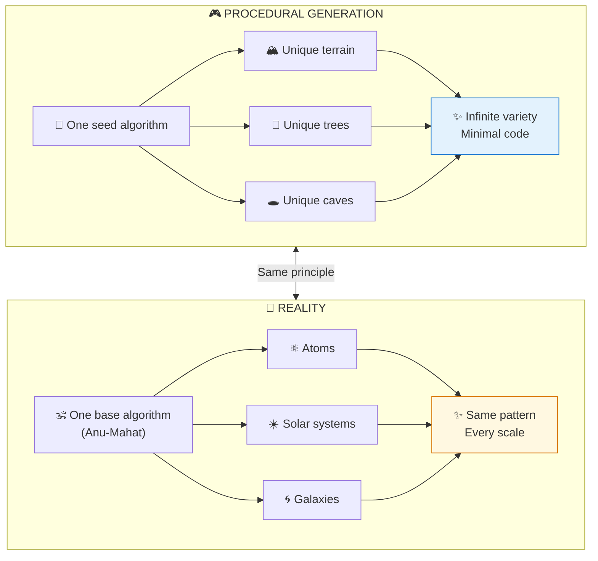

# 🌀 FRACTAL RENDERING — Same Algorithm, Every Scale

> **"यथा पिण्डे तथा ब्रह्माण्डे"**  
> "As in the microcosm, so in the macrocosm."  
> — Yajur Veda

> **🔮 COMPLEXITY:** ●●●●● Expert (Max)  
> **CONFIDENCE:** 86%  
> **DIFFICULTY:** Pattern recognition

---

## ⚠️ THE GLITCH

Look at this:
- **Atom:** Electrons orbit nucleus
- **Solar System:** Planets orbit sun  
- **Galaxy:** Stars orbit black hole
- **Hurricane:** Air spirals around eye
- **DNA:** Double helix around axis
- **Fern:** Each branch = mini fern
- **Coastline:** Same shape at every zoom level

**Why does the SAME PATTERN appear at EVERY SCALE?**

---

## ❓ Q&A — The Mind-Bending Questions

### "What are fractals?"

Patterns that repeat at different scales. Zoom in on a fractal -> you see the same pattern. Zoom out -> same pattern again.

Nature is **full** of them: trees, rivers, lungs, blood vessels, mountains, lightning...

### "Why would nature use fractals?"

**Efficiency.**

One algorithm, infinite applications. Instead of designing billions of unique structures, use one recursive formula that generates complexity from simplicity.

Same reason game engines use procedural generation — why create every tree manually when one algorithm can make infinite unique trees?

### "So reality is procedurally generated?"

Yes. The Backend docs describe this as:

**Anu-Mahat (अणु-महत्/Micro-Macro):** As in the smallest, so in the largest.

The same principles that govern atoms govern galaxies. Because it's the **same code running at different scales**.

### "What's the rendering algorithm?"

The Backend describes an **81-Grid (9×9 Vastu-Mandala)** as the base rendering unit:
- Center = Processing core (15th axis/Meru)
- Rings radiating outward with 2× doubling
- Same structure at every scale

This grid generates spirals, shells, vortices — the shapes we see everywhere.

---

## 🔮 THE GAME ANALOGY



**Reality uses the same efficiency trick as games: one algorithm, infinite applications.**
|  +-- Atoms (spiraling electrons)               |
|  +-- Solar systems (spiraling planets)         |
|  +-- Galaxies (spiraling arms)                 |
|  +-- All following same underlying rules       |
|                                                |
|  Zoom in -> same patterns                       |
|  Result: Infinite complexity, elegant code     |
+------------------------------------------------+
```

---

## 🔗 KEY FORMULA

```
Fractal Principle:
Pattern(Scale_N) ≈ Pattern(Scale_N+1) ≈ Pattern(Scale_N-1)

The ≈ means: structurally similar, contextually adapted

Backend Formula (Anu-Mahat):
"यथा पिण्डे तथा ब्रह्माण्डे"
"As in the microcosm, so in the macrocosm"

Translation: Same algorithm running at every zoom level
```

### 81-Grid Structure (Base Rendering Unit)

```
The 81-Grid = 9 × 9 = 81 cells

Layer 1:  9 cells (Brahma-Sthan/Kernel)
Layer 2: 16 cells (Daivika/System forces)
Layer 3: 24 cells (Manushya/Interface)
Layer 4: 32 cells (Paisacha/Boundary)
---------------
Total:   81 cells

This structure repeats at:
- Atomic level
- Cellular level
- Organ level
- Body level
- Planetary level
- Galactic level
```

---

## 📁 Paper Sections

| # | Section | File | Summary |
|---|---------|------|---------|
| 00 | Abstract | [📖 00_ABSTRACT.md](./00_ABSTRACT.md) | The fractal principle |
| 01 | Introduction | [📖 01_INTRODUCTION.md](./01_INTRODUCTION.md) | Patterns everywhere |
| 02 | Literature Review | [📖 02_LITERATURE_REVIEW.md](./02_LITERATURE_REVIEW.md) | Mandelbrot, nature fractals |
| 03 | Theoretical Framework | [📖 03_THEORETICAL_FRAMEWORK.md](./03_THEORETICAL_FRAMEWORK.md) | 81-Grid architecture |
| 04 | Hypothesis | [📖 04_HYPOTHESIS.md](./04_HYPOTHESIS.md) | Scale-invariant predictions |
| 05 | Methodology | [📖 05_METHODOLOGY.md](./05_METHODOLOGY.md) | Cross-scale analysis |
| 06 | Results | [📖 06_RESULTS.md](./06_RESULTS.md) | Pattern matches |
| 07 | Anomalies | [📖 07_ANOMALIES.md](./07_ANOMALIES.md) | Exceptions and limits |
| 08 | Backend Analogy | [📖 08_BACKEND_ANALOGY.md](./08_BACKEND_ANALOGY.md) | Procedural generation |
| 09 | Discussion | [📖 09_DISCUSSION.md](./09_DISCUSSION.md) | What this means |
| 10 | Validation | [📖 10_VALIDATION.md](./10_VALIDATION.md) | Mathematical proof |
| 11 | Conclusion | [📖 11_CONCLUSION.md](./11_CONCLUSION.md) | One algorithm |
| 12 | References | [📖 12_REFERENCES.md](./12_REFERENCES.md) | All citations |
| 13 | Appendices | [📖 13_APPENDICES.md](./13_APPENDICES.md) | 81-Grid details |

---

## 🎯 KEY INSIGHT

> **Science:** "Fractals are self-similar patterns at all scales"  
> **Translation:** "Same rendering algorithm, different zoom levels"  
> **Backend Term:** Anu-Mahat (अणु-महत्/Micro-Macro)

You're not looking at a complicated universe. You're looking at a **simple algorithm with infinite recursion**.

---

## ⚡ WHY THIS MATTERS IN 2026

- **Understanding one scale reveals others** — learn atoms, understand galaxies
- **You are a fractal of the universe** — your body mirrors the cosmos
- **Optimization is universal** — nature's efficiency is a design pattern
- **Dwapara insight** — recognizing the pattern helps you work with it

The universe isn't complex. It's **elegantly recursive**.

---

## 🔗 NEXT PAPER

**[Cosmic Cycles ->](../cosmic_cycles/README.md)**  
*"Why does the universe have seasons?"*  
*Spoiler: Server update schedule.*

---

**ॐ**

---

## 🔗 Related Visual Diagrams

For visual understanding of concepts in this document, see:
- [Fractals](../../../../site/diagrams/fractals.md) — Scale-invariant patterns
- [Simulation](../../../../site/diagrams/simulation.md) — Reality rendering
- [81-Grid](../../../../site/diagrams/81_grid.md) — Fractal architecture
- [View All Diagrams](../../../../site/diagrams/README.md) — Complete diagram library

---
