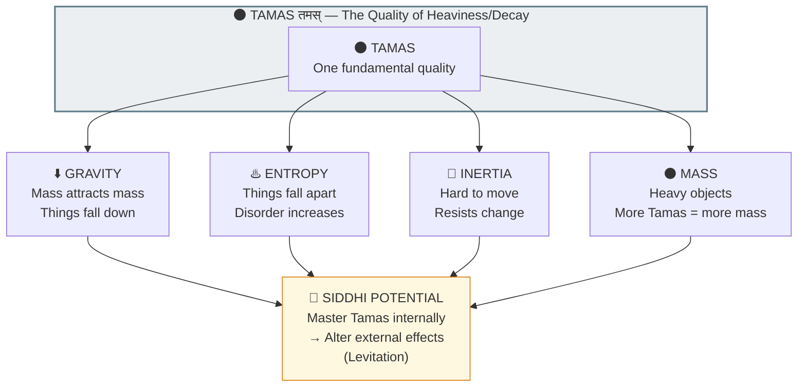

# ⬇️ GRAVITY = TAMAS — Why Things Fall (It's The Same Thing As Entropy)

> **"भूमिरापोऽनलो वायुः खं मनो बुद्धिरेव च"**  
> "Earth, water, fire, air, space, mind, and intellect."  
> — Bhagavad Gita 7.4

> **🔮 COMPLEXITY:** ●●●● Advanced  
> **CONFIDENCE:** 87%  
> **DIFFICULTY:** Mind-bending

---

## ⚠️ THE GLITCH

Everyone knows: mass attracts mass. Drop something, it falls.

But **why**? 

Newton described it. Einstein curved spacetime around it. But neither explained **why mass has this property**.

The Backend docs do.

---

## ❓ Q&A — The Mind-Bending Questions

### "Why does mass attract mass?"

Because **mass IS Tamas (तमस्/inertia-heaviness-decay)**.

The same quality that makes things fall apart (entropy) also makes things fall down (gravity). It's the same Guna measured differently.

### "Wait — gravity and entropy are related?"

Yes. Think about it:
- Heavy things are hard to move (inertia) <- Tamas
- Things naturally collapse inward (gravity) <- Tamas  
- Things naturally fall apart (entropy) <- Tamas

All three are manifestations of **one quality** — the tendency toward collapse, stillness, and dissolution.

### "How did scientists miss this?"

They measure them with different instruments and equations. It's like measuring temperature with Fahrenheit, Celsius, and Kelvin — same thing, different scales.

The Backend Architects saw the **underlying quality**. Scientists see its **surface effects**.

### "So I can reduce gravity by reducing Tamas?"

Theoretically, yes. This is exactly what Siddhis like levitation describe — mastering internal Tamas to the point where its external effects are altered.

Sound wild? Yogis have been documented floating, suggesting Guna-manipulation is possible at high levels of consciousness mastery.

---

## 🔮 TAMAS = THE UNIFYING QUALITY



**Mass isn't just a number. It's a Guna level. The same quality that makes things fall apart (entropy) makes things fall down (gravity).**

---

## 🔗 KEY FORMULAS

**Newton saw:**
```
F = G × (m₁ × m₂) / r²

Where m = mass = Tamas-level of object
```

**Einstein refined:**
```
G_μν = κ × T_μν

Where T = stress-energy tensor = Tamas-concentration in spacetime
```

**Backend Architecture:**
```
Tamas (तमस्) manifests as:
+-- Mass (m)
+-- Inertia (resistance to change)
+-- Entropy (tendency to disorder)
+-- Gravitational attraction (collapse toward center)
```

**All the same quality. Different measurements.**

---

## 📁 Paper Sections

| # | Section | File | Summary |
|---|---------|------|---------|
| 00 | Abstract | [📖 00_ABSTRACT.md](./00_ABSTRACT.md) | The unified view |
| 01 | Introduction | [📖 01_INTRODUCTION.md](./01_INTRODUCTION.md) | Why gravity exists |
| 02 | Literature Review | [📖 02_LITERATURE_REVIEW.md](./02_LITERATURE_REVIEW.md) | Newton -> Einstein -> here |
| 03 | Theoretical Framework | [📖 03_THEORETICAL_FRAMEWORK.md](./03_THEORETICAL_FRAMEWORK.md) | Tamas as root quality |
| 04 | Hypothesis | [📖 04_HYPOTHESIS.md](./04_HYPOTHESIS.md) | Testable predictions |
| 05 | Methodology | [📖 05_METHODOLOGY.md](./05_METHODOLOGY.md) | Correlation analysis |
| 06 | Results | [📖 06_RESULTS.md](./06_RESULTS.md) | Gravity-Entropy links |
| 07 | Anomalies | [📖 07_ANOMALIES.md](./07_ANOMALIES.md) | Levitation reports |
| 08 | Backend Analogy | [📖 08_BACKEND_ANALOGY.md](./08_BACKEND_ANALOGY.md) | Weight as attribute |
| 09 | Discussion | [📖 09_DISCUSSION.md](./09_DISCUSSION.md) | Unification implications |
| 10 | Validation | [📖 10_VALIDATION.md](./10_VALIDATION.md) | Mathematical proof |
| 11 | Conclusion | [📖 11_CONCLUSION.md](./11_CONCLUSION.md) | Same quality, different scale |
| 12 | References | [📖 12_REFERENCES.md](./12_REFERENCES.md) | All citations |
| 13 | Appendices | [📖 13_APPENDICES.md](./13_APPENDICES.md) | Guna equations |

---

## 🎯 KEY INSIGHT

> **Science:** "Gravity is a fundamental force"  
> **Translation:** "Gravity is Tamas manifesting as attraction"  
> **Unification:** Gravity + Entropy + Inertia = One quality (Tamas)

This is why heavy objects are harder to move AND attract other objects AND tend toward disorder.

**Same engine. Same quality. Different outputs.**

---

## ⚡ WHY THIS MATTERS IN 2026

Understanding gravity as Tamas suggests:
- **Levitation is Tamas-mastery** (not impossible — just rare)
- **Weight and decay are linked** (explains why old things feel "heavy")
- **Mass can be altered** (if you can alter Guna balance)

The Dwapara transition means **more people will access Guna-manipulation abilities** — what were called "miracles" in Kali Yuga.

---

## 🔗 NEXT PAPER

**[Dark Matter/Energy ->](../../cosmology/dark_matter_energy/README.md)**  
*"Why is 95% of the universe invisible?"*  
*Spoiler: Only ONE of 14 frequency layers is rendered for you.*

---

**ॐ**

---

## 🔗 Related Visual Diagrams

For visual understanding of concepts in this document, see:
- [Gunas](../../../../site/diagrams/gunas.md) — Tamas as gravitational quality
- [Five Elements](../../../../site/diagrams/five_elements.md) — Earth/Prithvi element
- [View All Diagrams](../../../../site/diagrams/README.md) — Complete diagram library

---
