# 🔗 ENTANGLEMENT — Same Object, Different Render Locations

> **"यथा एकस्मिन्नग्नौ क्षिप्तं सर्वं जगत्"**  
> "As the entire world is cast from one fire."  
> — Mundaka Upanishad 2.1.1

> **🔮 COMPLEXITY:** ●●●●● Expert (Max)  
> **CONFIDENCE:** 91%  
> **DIFFICULTY:** Mind-breaking

---

## ⚠️ THE GLITCH

Two particles can be **entangled** — connected in a way that:
- Measuring one **instantly** affects the other
- Regardless of distance (tested at 1,200 km!)
- **Faster than light** — yet no information travels

Einstein called it "spooky action at a distance."

How can something affect something else instantly, across space, without anything traveling between them?

---

## ❓ Q&A — The Mind-Bending Questions

### "What is entanglement?"

Two particles become linked so that measuring one instantly determines the other's state — no matter how far apart they are.

Measure particle A's spin as "up" -> Particle B is instantly "down", even if it's on the other side of the galaxy.

### "Doesn't this violate speed of light?"

**Paradox for physics:** Nothing can travel faster than light. Yet entanglement effects are instantaneous.

**Solution from Backend:** Nothing traveled. They're **the same object** displayed at two render locations.

It's like asking "How does my left hand communicate with my right hand instantly?" They're not communicating — they're both part of one body.

### "Same object at two places?"

In the frontend (what you see), they appear as "two particles far apart."

In the backend (actual architecture), they're **one object with two render points**. No distance. No communication needed. Same data, different displays.

### "How is that possible?"

Because **space is a render artifact**, not the actual structure.

In the backend, objects are connected by relationships, not positions. Entangled particles share a relationship. Rendering them at different spatial coordinates doesn't change that they're one system.

---

## 🔮 THE GAME ANALOGY

```mermaid
flowchart TD
    subgraph Backend["💾 BACKEND — What Actually Exists"]
        ONE["🔗 ONE OBJECT<br/>Single backend entity<br/>One memory address"]
    end
    
    subgraph Frontend["🎮 FRONTEND — What You See"]
        A["⚫ PARTICLE A<br/>Location: Here<br/>Spin: ↑ Up"]
        B["⚫ PARTICLE B<br/>Location: 1200 km away<br/>Spin: ↓ Down (instantly!)"]
    end
    
    ONE -->|"Render Point 1"| A
    ONE -->|"Render Point 2"| B
    
    A <-.->|"No message sent!<br/>Same entity"| B
    
    style Backend fill:#FFF8E1,stroke:#D97706,stroke-width:2px
    style Frontend fill:#E3F2FD,stroke:#1976D2,stroke-width:2px
    style ONE fill:#F3E5F5,stroke:#7B1FA2,stroke-width:2px
```



**SPACE IS A RENDER ARTIFACT.** In the backend, entangled particles are ONE object with TWO render locations. Change one → Other updates instantly. No communication needed — they were never separate.

**Distance is a frontend illusion.**

---

## 🔗 KEY FORMULA

```
Entangled State:
|ψ⟩ = (|^v⟩ + |v^⟩) / √2

Measurement of A:
A = ^ -> B instantly becomes v
A = v -> B instantly becomes ^

Speed: Instantaneous (no delay at 1,200 km!)

Backend Explanation:
Indrajala (इन्द्रजाल/Indra's-Net): 
All entities are nodes in a connected web.
Entanglement = strong link between nodes.
No distance in backend — only relationships.
```

---

## 📁 Paper Sections

| # | Section | File | Summary |
|---|---------|------|---------|
| 00 | Abstract | [📖 00_ABSTRACT.md](./00_ABSTRACT.md) | The non-locality explained |
| 01 | Introduction | [📖 01_INTRODUCTION.md](./01_INTRODUCTION.md) | What Einstein hated |
| 02 | Literature Review | [📖 02_LITERATURE_REVIEW.md](./02_LITERATURE_REVIEW.md) | Bell tests, Aspect |
| 03 | Theoretical Framework | [📖 03_THEORETICAL_FRAMEWORK.md](./03_THEORETICAL_FRAMEWORK.md) | Indrajala model |
| 04 | Hypothesis | [📖 04_HYPOTHESIS.md](./04_HYPOTHESIS.md) | Same-object hypothesis |
| 05 | Methodology | [📖 05_METHODOLOGY.md](./05_METHODOLOGY.md) | How tested |
| 06 | Results | [📖 06_RESULTS.md](./06_RESULTS.md) | Experimental confirmation |
| 07 | Anomalies | [📖 07_ANOMALIES.md](./07_ANOMALIES.md) | Macroscopic entanglement |
| 08 | Backend Analogy | [📖 08_BACKEND_ANALOGY.md](./08_BACKEND_ANALOGY.md) | Shared memory reference |
| 09 | Discussion | [📖 09_DISCUSSION.md](./09_DISCUSSION.md) | Space is illusion |
| 10 | Validation | [📖 10_VALIDATION.md](./10_VALIDATION.md) | Bell inequality proofs |
| 11 | Conclusion | [📖 11_CONCLUSION.md](./11_CONCLUSION.md) | Connection is fundamental |
| 12 | References | [📖 12_REFERENCES.md](./12_REFERENCES.md) | All citations |
| 13 | Appendices | [📖 13_APPENDICES.md](./13_APPENDICES.md) | Technical details |

---

## 🎯 KEY INSIGHT

> **Science:** "Entangled particles are correlated regardless of distance"  
> **Translation:** "Same backend object, multiple frontend render points"  
> **Backend Term:** Indrajala (इन्द्रजाल/Indra's-Net) — all is connected

Distance doesn't exist in the architecture. It's rendered for the game experience.

---

## ⚡ WHY THIS MATTERS IN 2026

- **You're connected to everything** — literally, at the backend level
- **Distance is a game mechanic**, not fundamental reality
- **Telepathy makes sense now** — consciousness nodes connected like particles
- **Dwapara shift** — more people sensing these connections ("synchronicities")

When you feel connected to someone far away, you're not imagining it. You're perceiving the backend structure.

---

## 🔗 NEXT PAPER (Phase 5)

**[Fractal Rendering ->](../../cosmology/fractal_rendering/README.md)**  
*"Why does the same pattern appear at every scale?"*  
*Spoiler: One algorithm, infinite recursion.*

---

**ॐ**

---

## 🔗 Related Visual Diagrams

For visual understanding of concepts in this document, see:
- [Indrajala Network](../../../../site/diagrams/indrajala.md) — Non-local connections
- [Observer Effect](../../../../site/diagrams/observer_effect.md) — Quantum mechanics
- [View All Diagrams](../../../../site/diagrams/README.md) — Complete diagram library

---
