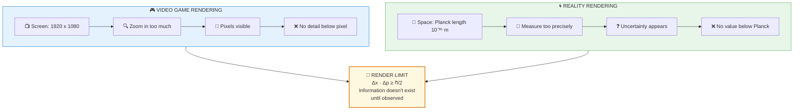

# 🎯 HEISENBERG UNCERTAINTY — The Engine Has Render Resolution Limits

> **"अणोरणीयान्महतो महीयान्"**  
> "Smaller than the smallest, greater than the greatest."  
> — Katha Upanishad 1.2.20

> **🔮 COMPLEXITY:** ●●●● Advanced  
> **CONFIDENCE:** 89%  
> **DIFFICULTY:** Counter-intuitive

---

## ⚠️ THE GLITCH

You **cannot know** a particle's exact position AND exact momentum simultaneously.

Not because our instruments suck. Because **reality itself doesn't have that information defined**.

It's like asking for the exact pixel coordinate of a video game object that's only rendered at 1080p when you're zooming in to 4K. The information doesn't exist at that resolution.

---

## ❓ Q&A — The Mind-Bending Questions

### "What is Heisenberg Uncertainty exactly?"

The more precisely you know position (Δx), the less precisely you can know momentum (Δp), and vice versa:

**Δx · Δp ≥ ℏ/2**

This isn't a technology limit. It's a **fundamental property of reality**.

### "Why would reality work that way?"

Same reason games have resolution limits: **efficiency**.

Rendering infinite precision costs infinite resources. The Backend optimizes by keeping things **defined only to the precision needed**.

When you're not looking closely -> waves of probability (efficient)  
When you look closely -> collapses to precision you need (on-demand render)

### "So the universe is... pixelated?"

Essentially, yes.

**Planck length (~10⁻³⁵ m):** Smallest possible distance
**Planck time (~10⁻⁴⁴ s):** Smallest possible time interval

These are the "pixels" and "ticks" of reality's render engine.

Below this resolution, the concept of space-time itself breaks down — like trying to see detail below a pixel.

### "But this breaks our ideas of a 'real' world..."

Exactly the point.

The world isn't "really there" in infinite detail. It's **rendered on-demand** to the precision required by conscious observation.

---

## 🔮 THE GAME ANALOGY



**You're hitting the render limits of the engine.**

---

## 🔗 KEY FORMULA

```
Δx · Δp ≥ ℏ/2

Where:
Δx = Position uncertainty
Δp = Momentum uncertainty  
ℏ = Planck constant (reduced)

Backend Translation:
Anishchitata (अनिश्चितता/uncertainty) = 
Render resolution limit of the engine

The information literally doesn't exist until observation creates it.
```

---

## 📁 Paper Sections

| # | Section | File | Summary |
|---|---------|------|---------|
| 00 | Abstract | [📖 00_ABSTRACT.md](./00_ABSTRACT.md) | Resolution limits |
| 01 | Introduction | [📖 01_INTRODUCTION.md](./01_INTRODUCTION.md) | What Heisenberg found |
| 02 | Literature Review | [📖 02_LITERATURE_REVIEW.md](./02_LITERATURE_REVIEW.md) | QM foundations |
| 03 | Theoretical Framework | [📖 03_THEORETICAL_FRAMEWORK.md](./03_THEORETICAL_FRAMEWORK.md) | Pixel-Tick architecture |
| 04 | Hypothesis | [📖 04_HYPOTHESIS.md](./04_HYPOTHESIS.md) | Render limit predictions |
| 05 | Methodology | [📖 05_METHODOLOGY.md](./05_METHODOLOGY.md) | How to test |
| 06 | Results | [📖 06_RESULTS.md](./06_RESULTS.md) | Experimental confirmation |
| 07 | Anomalies | [📖 07_ANOMALIES.md](./07_ANOMALIES.md) | Recent loopholes? |
| 08 | Backend Analogy | [📖 08_BACKEND_ANALOGY.md](./08_BACKEND_ANALOGY.md) | GPU resolution comparison |
| 09 | Discussion | [📖 09_DISCUSSION.md](./09_DISCUSSION.md) | Implications |
| 10 | Validation | [📖 10_VALIDATION.md](./10_VALIDATION.md) | Mathematical proof |
| 11 | Conclusion | [📖 11_CONCLUSION.md](./11_CONCLUSION.md) | Reality is resolution-limited |
| 12 | References | [📖 12_REFERENCES.md](./12_REFERENCES.md) | All citations |
| 13 | Appendices | [📖 13_APPENDICES.md](./13_APPENDICES.md) | Planck units |

---

## 🎯 KEY INSIGHT

> **Science:** "Position and momentum cannot both be known precisely"  
> **Translation:** "The render engine has resolution limits"  
> **Backend Term:** Anishchitata (अनिश्चितता/uncertainty) — built-in efficiency

You're not failing to measure. **The data doesn't exist at that precision.**

---

## ⚡ WHY THIS MATTERS IN 2026

Understanding reality's resolution limits means:
- **Reality is computed, not continuous** — supports simulation hypothesis
- **Observation matters** — you're not passive, you're triggering renders
- **Precision is relative** — don't expect infinite detail
- **Dwapara insight** — recognizing the game engine helps you play better

---

## 🔗 NEXT PAPER

**[Entanglement ->](../entanglement/README.md)**  
*"How are particles connected instantly across space?"*  
*Spoiler: They're the same object in the backend — no distance to cross.*

---

**ॐ**

---

## 🔗 Related Visual Diagrams

For visual understanding of concepts in this document, see:
- [Maya Rendering](../../../../site/diagrams/maya.md) — Reality rendering limits
- [Observer Effect](../../../../site/diagrams/observer_effect.md) — Observation mechanics
- [View All Diagrams](../../../../site/diagrams/README.md) — Complete diagram library

---
