# 👁️ OBSERVER EFFECT — The Game Only Renders What You're Looking At

> **"यद्दृष्टं तद्भवति"**  
> "What is seen, becomes (manifest)."  
> — Yoga Vasishtha

> **🔮 COMPLEXITY:** ●●●●● Expert (Max)  
> **CONFIDENCE:** 92%  
> **DIFFICULTY:** Beginner-friendly

---

## ⚠️ THE GLITCH

You know how in video games, the world behind you isn't fully rendered until you turn around? 

**Quantum physics proved reality does the exact same thing.**

---

## ❓ Q&A — The Mind-Bending Questions

### "What happens to a particle when nobody's looking?"

It literally **doesn't exist as a particle**. It's a wave of probability — a cloud of "maybe here, maybe there." The moment you observe it, it **collapses** into a definite position.

*Like how in Minecraft, far-away chunks are just stored as data until you get close enough for them to render.*

### "You're saying reality doesn't exist until I look at it?"

Not exactly. The **backend data** exists. But the **frontend render** — the thing you experience as "solid reality" — is generated on-demand when a conscious observer is present.

### "Why would reality work like that?"

Same reason games do it: **efficiency**. Why render what no one's experiencing? 

The Backend Architects called this Maya (माया/render-engine): only generating the Drishya (दृश्य/seen) when the Drashta (द्रष्टा/seer) is active.

### "This is proven?"

The double-slit experiment has been replicated **thousands of times** since 1801. In 2022, physicists won the Nobel Prize for confirming that "local hidden variables" can't explain it — observation fundamentally changes reality.

---

## 🔮 THE GAME ANALOGY

```mermaid
flowchart TD
    subgraph Game["🎮 VIDEO GAME"]
        G1["👤 Player looks left"]
        G2["✨ Left side renders"]
        G3["👤 Player looks right"]
        G4["✨ Right side renders"]
        G5["🙈 Behind player"]
        G6["💾 Stored as data<br/>Not rendered"]
        
        G1 --> G2
        G3 --> G4
        G5 --> G6
    end
    
    subgraph Reality["🌀 QUANTUM REALITY"]
        R1["👁️ Observer looks"]
        R2["⚫ Wave collapses<br/>to particle"]
        R3["🙈 No observer"]
        R4["🌊 Wave function<br/>(probability)"]
        R5["❓ Unobserved"]
        R6["💾 Data exists<br/>Not rendered"]
        
        R1 --> R2
        R3 --> R4
        R5 --> R6
    end
    
    style G2 fill:#E8F5E9,stroke:#4CAF50
    style G4 fill:#E8F5E9,stroke:#4CAF50
    style G6 fill:#ECEFF1,stroke:#607D8B
    style R2 fill:#E8F5E9,stroke:#4CAF50
    style R4 fill:#E3F2FD,stroke:#1976D2
    style R6 fill:#ECEFF1,stroke:#607D8B
```



**Same architecture. Reality is optimized too.**

---

## 🔗 KEY FORMULA

```
|ψ|² = P

Where:
ψ = Wave function (backend state)
P = Probability of rendering at that location (frontend output)
|ψ|² = Observation squares the amplitude
```

**Translation:** The act of looking converts probability into actuality.

---

## 📁 Paper Sections

| # | Section | File | Summary |
|---|---------|------|---------|
| 00 | Abstract | [📖 00_ABSTRACT.md](./00_ABSTRACT.md) | 250-word summary |
| 01 | Introduction | [📖 01_INTRODUCTION.md](./01_INTRODUCTION.md) | The mystery explained |
| 02 | Literature Review | [📖 02_LITERATURE_REVIEW.md](./02_LITERATURE_REVIEW.md) | 50+ scientific sources |
| 03 | Theoretical Framework | [📖 03_THEORETICAL_FRAMEWORK.md](./03_THEORETICAL_FRAMEWORK.md) | Backend architecture |
| 04 | Hypothesis | [📖 04_HYPOTHESIS.md](./04_HYPOTHESIS.md) | Testable predictions |
| 05 | Methodology | [📖 05_METHODOLOGY.md](./05_METHODOLOGY.md) | How we validated |
| 06 | Results | [📖 06_RESULTS.md](./06_RESULTS.md) | What we found |
| 07 | Anomalies | [📖 07_ANOMALIES.md](./07_ANOMALIES.md) | Edge cases explained |
| 08 | Backend Analogy | [📖 08_BACKEND_ANALOGY.md](./08_BACKEND_ANALOGY.md) | Full game comparison |
| 09 | Discussion | [📖 09_DISCUSSION.md](./09_DISCUSSION.md) | Implications |
| 10 | Validation | [📖 10_VALIDATION.md](./10_VALIDATION.md) | Formulas & proofs |
| 11 | Conclusion | [📖 11_CONCLUSION.md](./11_CONCLUSION.md) | The bottom line |
| 12 | References | [📖 12_REFERENCES.md](./12_REFERENCES.md) | All citations |
| 13 | Appendices | [📖 13_APPENDICES.md](./13_APPENDICES.md) | Extra material |

---

## 🎯 KEY INSIGHT

> **Science:** "Observation collapses the wave function"  
> **Translation:** "Reality renders on-demand"  
> **Backend Term:** Drashta-Drishya (द्रष्टा-दृश्य/Seer-Seen)

---

## ⚡ WHY THIS MATTERS IN 2026

You're alive during the Dwapara transition — when more people are noticing the glitches.

This paper explains the **most fundamental glitch**: reality requires you.

Without observers, there's nothing but probability waves.

**You're not IN the universe. You're what makes it render.**

---

## 🔗 NEXT PAPER

**[Heisenberg Uncertainty ->](../heisenberg_uncertainty/README.md)**  
*"Why can't we know everything at once?"*  
*Spoiler: Render resolution has limits.*

---

**ॐ**

---

## 🔗 Related Visual Diagrams

For visual understanding of concepts in this document, see:
- [Observer Effect Diagrams](../../../../site/diagrams/observer_effect.md) — Quantum observation mechanics
- [Consciousness](../../../../site/diagrams/consciousness.md) — Observer states
- [Purusha vs Prakriti](../../../../site/diagrams/purusha_prakriti.md) — Observer-Matter duality
- [View All Diagrams](../../../../site/diagrams/README.md) — Complete diagram library

---
