# ♨️ ENTROPY = TAMAS — Why Everything Falls Apart (It's A Feature, Not A Bug)

> **"जरामरणमोक्षाय"**  
> "For liberation from decay and death."  
> — Bhagavad Gita 7.29

> **🔮 COMPLEXITY:** ●●●● Advanced  
> **CONFIDENCE:** 91%  
> **DIFFICULTY:** Some physics helps

---

## ⚠️ THE GLITCH

Ever notice how:
- Your room gets messy on its own but never cleans itself?
- Ice melts but water doesn't spontaneously freeze?
- Your phone battery dies but never charges itself?

Physics calls this **entropy** — the universe's tendency toward disorder.

**But why does disorder always WIN?**

---

## ❓ Q&A — The Mind-Bending Questions

### "Why does everything eventually fall apart?"

Because **Tamas (तमस्/decay-inertia)** is a fundamental quality of reality's engine.

The Backend Architects identified three qualities (Gunas) that make up everything:
- **Sattva (सत्त्व)** — Order, information, light
- **Rajas (रजस्)** — Motion, change, energy  
- **Tamas (तमस्)** — Decay, inertia, mass

In any closed system, **Tamas naturally dominates** unless consciousness actively maintains Sattva.

### "So entropy isn't random — it's a specific quality?"

Exactly. Scientists measure it with the equation S = k·ln(W). 

**They're measuring Tamas.**

### "Why would the game be designed to decay?"

Same reason games have durability, hunger bars, and timers: **to create stakes**.

If nothing decayed, there'd be no urgency. No choices would matter. The game would be pointless.

Tamas creates the **pressure to act** — which is where learning happens.

### "Can you fight entropy/Tamas?"

Yes. That's literally what life is.

Living things are **Sattva-concentration machines** — they import order (food, sunlight) and export disorder (waste, heat). 

You're fighting Tamas right now by reading this instead of falling unconscious.

---

## 🔮 THE GUNA DYNAMICS

```mermaid
flowchart LR
    subgraph Gunas["⚖️ THE THREE GUNAS — S + R + T = 1"]
        direction TB
        S["☀️ SATTVA सत्त्व<br/>Order • Light • Information<br/>Consciousness maintains"]
        R["🔥 RAJAS रजस्<br/>Motion • Energy • Change<br/>Action happens"]
        T["🌑 TAMAS तमस्<br/>Decay • Inertia • Mass<br/>Entropy = This"]
    end
    
    subgraph Direction["🔄 NATURAL FLOW"]
        D1["Without consciousness<br/>Tamas dominates"] --> D2["Disorder increases<br/>dS/dt ≥ 0"]
        D3["With consciousness<br/>Sattva cultivated"] --> D4["Order maintained<br/>Life fights entropy"]
    end
    
    S --> D3
    T --> D1
    
    style S fill:#FFF8E1,stroke:#FFD700,stroke-width:2px
    style R fill:#FFF3E0,stroke:#FF9800,stroke-width:2px
    style T fill:#ECEFF1,stroke:#607D8B,stroke-width:2px
    style D2 fill:#FFEBEE,stroke:#F44336
    style D4 fill:#E8F5E9,stroke:#4CAF50
```



**ENTROPY (S = k·ln W) = MEASUREMENT OF TAMAS**  
Same mechanic. Decay is engineered to create stakes and urgency.

---

## 🔗 KEY FORMULA

```
S = k·ln(W)

Where:
S = Entropy (Tamas measurement)
k = Boltzmann constant
W = Number of microstates

TRANSLATION: S is the scientific way to measure Tamas (तमस्)
```

The Second Law of Thermodynamics says S always increases in isolated systems.

**Backend Translation:** Tamas naturally dominates without conscious intervention.

---

## 📁 Paper Sections

| # | Section | File | Summary |
|---|---------|------|---------|
| 00 | Abstract | [📖 00_ABSTRACT.md](./00_ABSTRACT.md) | 250-word summary |
| 01 | Introduction | [📖 01_INTRODUCTION.md](./01_INTRODUCTION.md) | Why entropy exists |
| 02 | Literature Review | [📖 02_LITERATURE_REVIEW.md](./02_LITERATURE_REVIEW.md) | Thermodynamics history |
| 03 | Theoretical Framework | [📖 03_THEORETICAL_FRAMEWORK.md](./03_THEORETICAL_FRAMEWORK.md) | Guna dynamics |
| 04 | Hypothesis | [📖 04_HYPOTHESIS.md](./04_HYPOTHESIS.md) | Testable predictions |
| 05 | Methodology | [📖 05_METHODOLOGY.md](./05_METHODOLOGY.md) | Validation approach |
| 06 | Results | [📖 06_RESULTS.md](./06_RESULTS.md) | Entropy = Tamas proof |
| 07 | Anomalies | [📖 07_ANOMALIES.md](./07_ANOMALIES.md) | Life as anti-entropy |
| 08 | Backend Analogy | [📖 08_BACKEND_ANALOGY.md](./08_BACKEND_ANALOGY.md) | Game durability systems |
| 09 | Discussion | [📖 09_DISCUSSION.md](./09_DISCUSSION.md) | Implications |
| 10 | Validation | [📖 10_VALIDATION.md](./10_VALIDATION.md) | Mathematical proof |
| 11 | Conclusion | [📖 11_CONCLUSION.md](./11_CONCLUSION.md) | The bottom line |
| 12 | References | [📖 12_REFERENCES.md](./12_REFERENCES.md) | All citations |
| 13 | Appendices | [📖 13_APPENDICES.md](./13_APPENDICES.md) | Guna equations |

---

## 🎯 KEY INSIGHT

> **Science:** "Entropy always increases"  
> **Translation:** "Tamas naturally wins"  
> **Backend Term:** Tamas-Vriddhi (तमस्-वृद्धि/Tamas-increase)

The Second Law isn't describing randomness. It's describing a **quality** built into the engine.

---

## ⚡ WHY THIS MATTERS IN 2026

Understanding Tamas explains:
- Why meditation and healthy habits require effort (fighting Tamas)
- Why bad habits are easy (going with Tamas)
- Why civilizations collapse without active maintenance
- Why death is the default outcome without life force

**You're not fighting entropy. You're playing against a built-in game mechanic.**

And knowing the rules gives you an advantage.

---

## 🔗 NEXT PAPER

**[Gravity = Tamas ->](../../gravity/gravity_tamas/README.md)**  
*"Why does mass attract mass?"*  
*Spoiler: Same quality, different measurement.*

---

**ॐ**

---

## 🔗 Related Visual Diagrams

For visual understanding of concepts in this document, see:
- [Gunas](../../../../site/diagrams/gunas.md) — Tamas as entropy quality
- [Pralaya](../../../../site/diagrams/pralaya.md) — Cosmic dissolution
- [View All Diagrams](../../../../site/diagrams/README.md) — Complete diagram library

---
