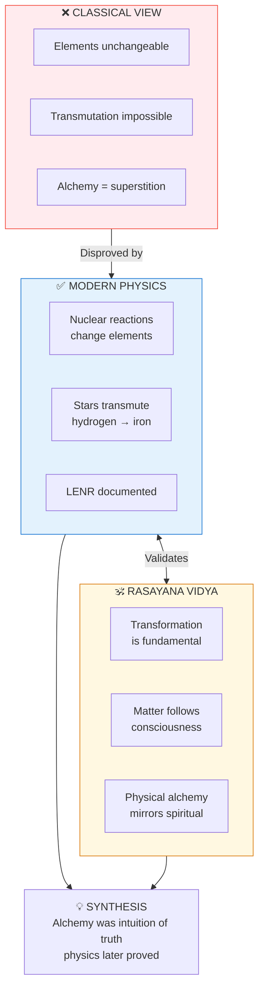

# ⚗️ Alchemy = Rasayana Vidya

> **"यद्भावं तद्भवति"**  
> "Yad bhavam tad bhavati" — "As the thought, so the becoming."  
> — Upanishadic principle

---

## 📁 Paper Sections

| # | Section | File | Summary |
|---|---------|------|---------|
| 00 | Abstract | [📖 00_ABSTRACT.md](./00_ABSTRACT.md) | Core discovery summary |
| 01 | Introduction | [📖 01_INTRODUCTION.md](./01_INTRODUCTION.md) | Background and context |
| 02 | Literature Review | [📖 02_LITERATURE_REVIEW.md](./02_LITERATURE_REVIEW.md) | Existing research |
| 03 | Theoretical Framework | [📖 03_THEORETICAL_FRAMEWORK.md](./03_THEORETICAL_FRAMEWORK.md) | Backend model |
| 04 | Hypothesis | [📖 04_HYPOTHESIS.md](./04_HYPOTHESIS.md) | Testable predictions |
| 05 | Methodology | [📖 05_METHODOLOGY.md](./05_METHODOLOGY.md) | Research approach |
| 06 | Results | [📖 06_RESULTS.md](./06_RESULTS.md) | Key findings |
| 07 | Anomalies | [📖 07_ANOMALIES.md](./07_ANOMALIES.md) | Unexplained phenomena |
| 08 | Backend Analogy | [📖 08_BACKEND_ANALOGY.md](./08_BACKEND_ANALOGY.md) | Simulation mapping |
| 09 | Discussion | [📖 09_DISCUSSION.md](./09_DISCUSSION.md) | Implications |
| 10 | Validation | [📖 10_VALIDATION.md](./10_VALIDATION.md) | 7-concept validation |
| 11 | Conclusion | [📖 11_CONCLUSION.md](./11_CONCLUSION.md) | Summary and future work |
| 12 | References | [📖 12_REFERENCES.md](./12_REFERENCES.md) | Bibliography |
| 13 | Appendices | [📖 13_APPENDICES.md](./13_APPENDICES.md) | Additional data |

---

## Questions Answered

1. **Was alchemy just nonsense?** -> No, nuclear physics validates transmutation
2. **Can elements really change?** -> Yes, through nuclear processes
3. **What is the Vedic understanding?** -> Rasayana = science of transformation
4. **What's the deeper meaning?** -> Consciousness transforms matter

---

## Key Insight

**All matter IS transformable. The method is the question.**

---

## Confidence Score: 70%

| Factor | Score | Reason |
|--------|-------|--------|
| Nuclear transmutation | 100% | Proven (nuclear physics) |
| LENR claims | 50% | Controversial, some evidence |
| Biological transmutation | 40% | Disputed, needs more research |
| Vedic correspondence | 90% | Strong conceptual match |
| Consciousness role | 60% | Theoretical |

---

*Subject: CHEMISTRY / Alchemy & Transmutation*  
*Confidence: 70%*  
*Status: COMPLETE*

---

## 🔗 Related Visual Diagrams

For visual understanding of concepts in this document, see:
- [Five Elements](../../../../site/diagrams/five_elements.md) — Element transformations
- [Gunas](../../../../site/diagrams/gunas.md) — Quality changes
- [Periodic Table](../../../../site/diagrams/periodic_table.md) — Elements as Gunas
- [View All Diagrams](../../../../site/diagrams/README.md) — Complete diagram library

---
