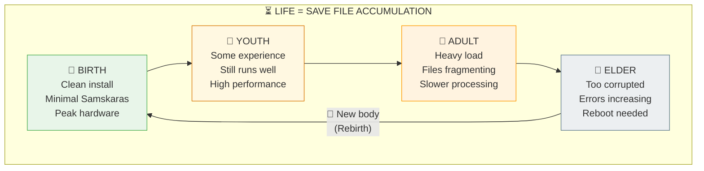

# ⏳ AGING = SAMSKARA ACCUMULATION — Your Save File Is Getting Corrupted

> **"जरामरणमोक्षाय मामाश्रित्य यतन्ति ये"**
> "Jaramaranamokshaya mamashritya yatanti ye"
> "Those who strive for liberation from old age and death, taking refuge in Me."
> — Bhagavad Gita 7.29

---

## ⚠️ THE GLITCH

Your body degrades over time. Why?

Science says: Telomere shortening, oxidative damage, accumulating mutations...

But these describe **what** happens, not **why** the system is designed this way.

The Backend explanation: **Samskaras (karmic imprints) accumulate until the save file is too corrupted to run. Then: reboot required.**

---

## ❓ Q&A — The Mind-Bending Questions

### "Why do we age?"

Every experience creates an imprint:
- Physical: Cellular damage, telomere shortening
- Mental: Memory patterns, neural pathways  
- Karmic: Samskaras (संस्कार) — imprints that persist across lives

Over time, these accumulate like fragmented files on an old hard drive. Eventually, the system slows, errors increase, and **the hardware can't run the software efficiently**.

### "So aging is save file corruption?"

Exactly. 

**Fresh baby:** Clean install, minimal Samskaras from past lives, optimal hardware.

**Young adult:** Some accumulated experiences, still runs well, peak performance.

**Older adult:** Heavy Samskara load, cellular "files" fragmenting, slower processing.

**End of life:** Too much corruption. System needs fresh hardware (new body) for next run.

### "Why doesn't the body just repair itself?"

It does — constantly. But the **rate of damage accumulation eventually exceeds repair capacity**.

This is Tamas (तमस्/entropy) gradually winning over Sattva (सत्त्व/order).

Life is an anti-entropy battle. Aging is losing that battle gradually.

### "Can aging be slowed or reversed?"

Yes — and the methods align across science and Backend:

| Method | Scientific | Backend |
|--------|-----------|---------|
| **Caloric restriction** | Reduces oxidative damage | Reduces Rajas, preserves Sattva |
| **Meditation** | Increases telomerase, reduces stress | Clears Samskaras, increases Sattva |
| **Fasting** | Activates autophagy (cell cleanup) | Tapas (तपस्/austerity) clears debris |
| **Purpose/Meaning** | Reduces all-cause mortality | Living Svadharma preserves order |
| **Breathwork** | Oxygenates, regulates ANS | Pranayama (प्राणायाम) manages life force |

---

## 🔮 THE GAME ANALOGY



**Aging = Samskara accumulation. Tamas gradually wins over Sattva. Eventually, fresh hardware required.**
|  Adult: Experiences accumulate, still good     |
|  Elder: Heavy Samskara load, degradation       |
|  Death: Body too corrupted, consciousness      |
|         transfers to fresh hardware (rebirth)  |
+------------------------------------------------+
```

---

## 🔗 KEY FORMULA

```
Biological Aging Rate = 
  Damage Rate (Tamas accumulation) - 
  Repair Rate (Sattva maintenance) +
  Samskara Load (Karmic weight)

If Sattva > Tamas: Slow aging (Yogis, meditators)
If Tamas > Sattva: Fast aging (stress, poor lifestyle)

Interventions increase Sattva OR reduce Tamas accumulation
```

---

## 📖 PAPER SECTIONS

| # | Section | File | What It Covers |
|---|---------|------|----------------|
| 00 | Abstract | [📖 00_ABSTRACT.md](./00_ABSTRACT.md) | The accumulation model |
| 01 | Introduction | [📖 01_INTRODUCTION.md](./01_INTRODUCTION.md) | Why we age |
| 02 | Literature Review | [📖 02_LITERATURE_REVIEW.md](./02_LITERATURE_REVIEW.md) | Aging research |
| 03 | Theoretical Framework | [📖 03_THEORETICAL_FRAMEWORK.md](./03_THEORETICAL_FRAMEWORK.md) | Samskara mechanics |
| 04 | Hypothesis | [📖 04_HYPOTHESIS.md](./04_HYPOTHESIS.md) | Testable predictions |
| 05 | Methodology | [📖 05_METHODOLOGY.md](./05_METHODOLOGY.md) | Correlation analysis |
| 06 | Results | [📖 06_RESULTS.md](./06_RESULTS.md) | Meditation & aging data |
| 07 | Anomalies | [📖 07_ANOMALIES.md](./07_ANOMALIES.md) | Centenarians, Yogis |
| 08 | Backend Analogy | [📖 08_BACKEND_ANALOGY.md](./08_BACKEND_ANALOGY.md) | Save file fragmentation |
| 09 | Discussion | [📖 09_DISCUSSION.md](./09_DISCUSSION.md) | Longevity implications |
| 10 | Validation | [📖 10_VALIDATION.md](./10_VALIDATION.md) | Evidence scoring |
| 11 | Conclusion | [📖 11_CONCLUSION.md](./11_CONCLUSION.md) | Slow down the clock |
| 12 | References | [📖 12_REFERENCES.md](./12_REFERENCES.md) | All studies |
| 13 | Appendices | [📖 13_APPENDICES.md](./13_APPENDICES.md) | Anti-aging practices |

---

## 🎯 KEY INSIGHT

> **Science:** "Aging is accumulated cellular damage"  
> **Translation:** "Aging is Samskara accumulation + Tamas dominance"  
> **Backend Term:** Jara (जरा/aging) — natural consequence of experience

Every experience leaves a trace. Traces accumulate. Eventually: reset required.

---

## ⚡ WHY THIS MATTERS IN 2026

- **Aging isn't just biological** — it's karmic + physical
- **Lifestyle choices modify the rate** — you're not helpless
- **Death isn't defeat** — it's system maintenance
- **Dwapara understanding** — awareness of these mechanics is itself protective

You can't stop the clock, but you can **slow it by maintaining Sattva**.

---

## 🔗 NEXT PAPER

**[Evolution = Jiva Yatra ->](../../evolution/evolution_jiva_yatra/README.md)**  
*"Is evolution random or purposeful?"*  
*Spoiler: The soul journeys through 8.4 million forms.*

---

**ॐ**

---

## 🔗 Related Visual Diagrams

For visual understanding of concepts in this document, see:
- [Samskaras & Vasanas](../../../../site/diagrams/samskaras_vasanas.md) — Karmic impressions
- [Shad-Vikara](../../../../site/diagrams/shad_vikara.md) — Six stages of existence
- [View All Diagrams](../../../../site/diagrams/README.md) — Complete diagram library

---
