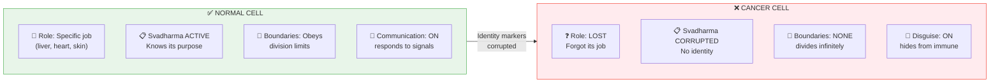

# 🦠 CANCER = FORGOTTEN IDENTITY — When A Cell Loses Its Quest Marker

> **"स्वधर्मे निधनं श्रेयः परधर्मो भयावहः"**
> "Svadharme nidhanam shreyah paradharmo bhayavahah"
> "Better is death in one's own Dharma; following another's Dharma is dangerous."
> — Bhagavad Gita 3.35

---

## 🔴 THE GLITCH

Cancer cells are weird. They:
- **Stop doing their job** (liver cell stops being liver-like)
- **Reproduce endlessly** (ignore normal limits)
- **Hide from immune system** (cloak/disguise behavior)
- **Revert to primitive state** (act like stem cells)

It's like an NPC that **forgot its role** and started acting on raw survival code.

---

## ❓ Q&A — The Mind-Bending Questions

### "What is cancer, really?"

A cell that **lost its identity** and reverted to base programming.

Every cell has:
- **Svadharma (स्वधर्म/self-purpose):** Heart cells pump, liver cells filter, etc.
- **Role markers:** Epigenetic settings that define its job
- **Communication:** Responds to body's signaling

Cancer = Cell whose role-markers got **corrupted or erased**. It "forgets" it's a liver cell and just runs base code: survive, replicate.

### "Why does it replicate infinitely?"

Because that's the **default programming** for cells.

Normal cells have differentiated instructions: "Be a skin cell. Divide X times. Then stop."

Cancer cells lost the differentiation. They're running stem-cell code without limits — like an NPC stuck in spawn mode.

### "Why does the immune system miss it?"

Cancer cells develop **Maya-Avarana (माया-आवरण/disguise-layer)**.

They coat themselves with "don't-attack-me" signals, hide tumor antigens, and recruit cells to protect them.

In game terms: They equip invisibility + friendly-unit tags.

### "Can it be reversed?"

Yes — **differentiation therapy** (making cancer cells "remember" their identity) shows promising results in some cancers.

If cancer is identity-loss (Svadharma-Bhramsha), treatment is identity-restoration.

---

## 🎮 THE GAME ANALOGY



**Cancer = Cell whose Svadharma (स्वधर्म/self-purpose) got corrupted. Treatment = identity restoration.**

---

## 🔗 KEY FORMULA

```
Normal Cell State:
+-- Svadharma (स्वधर्म) = ACTIVE (knows its purpose)
+-- Differentiation = COMPLETE (specialized)
+-- Replication = LIMITED (controlled)
+-- Immune visibility = NORMAL

Cancer Cell State:
+-- Svadharma = LOST (forgot purpose)
+-- Differentiation = REVERSED (de-specialized)
+-- Replication = UNLIMITED (no brakes)
+-- Immune visibility = HIDDEN (disguised)

Transition: Svadharma-loss -> Tamas dominance -> Uncontrolled replication
Treatment: Svadharma-restoration -> Sattva re-establishment -> Re-differentiation
```

---

## 📖 PAPER SECTIONS

| # | Section | File | What It Covers |
|---|---------|------|----------------|
| 00 | Abstract | [📖 00_ABSTRACT.md](./00_ABSTRACT.md) | Identity loss model |
| 01 | Introduction | [📖 01_INTRODUCTION.md](./01_INTRODUCTION.md) | What is cancer? |
| 02 | Literature Review | [📖 02_LITERATURE_REVIEW.md](./02_LITERATURE_REVIEW.md) | Differentiation research |
| 03 | Theoretical Framework | [📖 03_THEORETICAL_FRAMEWORK.md](./03_THEORETICAL_FRAMEWORK.md) | Svadharma mechanics |
| 04 | Hypothesis | [📖 04_HYPOTHESIS.md](./04_HYPOTHESIS.md) | Identity loss hypothesis |
| 05 | Methodology | [📖 05_METHODOLOGY.md](./05_METHODOLOGY.md) | Testing approaches |
| 06 | Results | [📖 06_RESULTS.md](./06_RESULTS.md) | Differentiation therapy data |
| 07 | Anomalies | [📖 07_ANOMALIES.md](./07_ANOMALIES.md) | Spontaneous remission |
| 08 | Backend Analogy | [📖 08_BACKEND_ANALOGY.md](./08_BACKEND_ANALOGY.md) | NPC corruption model |
| 09 | Discussion | [📖 09_DISCUSSION.md](./09_DISCUSSION.md) | Treatment implications |
| 10 | Validation | [📖 10_VALIDATION.md](./10_VALIDATION.md) | Evidence summary |
| 11 | Conclusion | [📖 11_CONCLUSION.md](./11_CONCLUSION.md) | Restore identity, not just kill |
| 12 | References | [📖 12_REFERENCES.md](./12_REFERENCES.md) | All sources |
| 13 | Appendices | [📖 13_APPENDICES.md](./13_APPENDICES.md) | Dharma mechanics |

---

## 🎯 KEY INSIGHT

> **Science:** "Cancer is uncontrolled cell division"  
> **Translation:** "Cancer is identity loss + Tamas takeover"  
> **Backend Term:** Svadharma-Bhramsha (स्वधर्म-भ्रंश/self-purpose-loss)

Don't just kill the cell. **Remind it who it is.**

---

## ⚡ WHY THIS MATTERS IN 2026

- **Cancer treatment paradigm shift:** From "kill the enemy" to "restore identity"
- **Lifestyle = Svadharma maintenance:** Cells need proper signaling to remember
- **Meditation + Sattva = prevention:** Consciousness maintains cellular order
- **Dwapara insight:** Understanding purpose-loss applies to humans too

Are YOU living your Svadharma? Or are you a cancer to the social body?

---

## 🔗 NEXT PAPER

**[Aging = Samskara Accumulation ->](../../aging/aging_samskara/README.md)**  
*"Why does the body degrade over time?"*  
*Spoiler: Save file corruption accumulates until reboot is needed.*

---

**ॐ**
