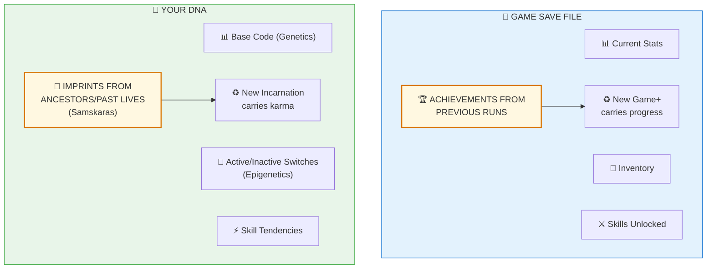

# 🧬 EPIGENETICS = SAMSKARAS — Your DNA Is Your Karmic Save File

> **"पूर्वजन्मकृतं पापं व्याधिरूपेण बाधते"**
> "Purvajanmakritam papam vyadhirupena badhate"
> "The sins (imprints) of previous births afflict in the form of diseases."
> — Charaka Samhita

---

## ⚠️ THE GLITCH

Your DNA isn't just genes. It has **chemical tags** that switch genes on/off based on... your ancestors' experiences.

- Holocaust survivors' descendants have altered stress genes
- Famine survivors' grandchildren have metabolic changes
- Trauma is literally inherited through DNA modifications

Science calls this **epigenetics**.

The Backend Architects called it **Samskaras (संस्कार/karmic-imprints)**.

Same thing.

---

## ❓ Q&A — The Mind-Bending Questions

### "Wait — my ancestors' experiences are in my DNA?"

Yes. Epigenetics has proven this beyond doubt.

Experiences create chemical markers (methylation, acetylation) on DNA. These markers affect which genes express. And these markers **can be inherited**.

Your great-grandmother's famine, your grandfather's war trauma — bits of those experiences live in your cells.

### "That's... karma?"

It's the biological mechanism OF karma.

**Samskara (संस्कार)** = Imprint from experience  
**Epigenetic mark** = Chemical imprint from experience

The Backend Architects described the phenomenon. Scientists discovered the mechanism.

### "Can I change my epigenetics?"

YES. That's the crucial part.

- Meditation changes gene expression
- Lifestyle choices modify epigenetic marks
- Even thoughts create chemical cascades

You're not locked into your ancestors' karma. You can **edit the save file**.

### "How does this connect to reincarnation?"

Beyond inherited epigenetics (from parents), there's evidence that **your own past-life experiences** may influence your baseline patterns.

Children with verified past-life memories often have:
- Birthmarks matching past-life death wounds
- Phobias matching past-life trauma
- Skills matching past-life professions

The Jiva (जीव/individual-soul) carries Samskaras across incarnations. Some express epigenetically.

---

## 🔮 THE GAME ANALOGY



**Your DNA is literally a save file that persists across lives.**

---

## 🔗 KEY FORMULA

```
Epigenetic State = Base Genetics + 
                   Ancestral Markers +
                   Environmental Modifications +
                   Personal Choices

Backend:
Samskara Load = Prarabdha Karma (प्रारब्ध) +
                Sanchita Karma (सञ्चित) +
                Agami Karma (आगामी)

Both describe: Inherited patterns + Current life modifications
```

---

## 📖 PAPER SECTIONS

| # | Section | File | What It Covers |
|---|---------|------|----------------|
| 00 | Abstract | [📖 00_ABSTRACT.md](./00_ABSTRACT.md) | The karma-gene connection |
| 01 | Introduction | [📖 01_INTRODUCTION.md](./01_INTRODUCTION.md) | Epigenetics basics |
| 02 | Literature Review | [📖 02_LITERATURE_REVIEW.md](./02_LITERATURE_REVIEW.md) | Holocaust studies, etc. |
| 03 | Theoretical Framework | [📖 03_THEORETICAL_FRAMEWORK.md](./03_THEORETICAL_FRAMEWORK.md) | Samskara mechanics |
| 04 | Hypothesis | [📖 04_HYPOTHESIS.md](./04_HYPOTHESIS.md) | What we predict |
| 05 | Methodology | [📖 05_METHODOLOGY.md](./05_METHODOLOGY.md) | Correlation analysis |
| 06 | Results | [📖 06_RESULTS.md](./06_RESULTS.md) | Trauma inheritance data |
| 07 | Anomalies | [📖 07_ANOMALIES.md](./07_ANOMALIES.md) | Past-life marks |
| 08 | Backend Analogy | [📖 08_BACKEND_ANALOGY.md](./08_BACKEND_ANALOGY.md) | Save file mechanics |
| 09 | Discussion | [📖 09_DISCUSSION.md](./09_DISCUSSION.md) | Karma as biology |
| 10 | Validation | [📖 10_VALIDATION.md](./10_VALIDATION.md) | Evidence scoring |
| 11 | Conclusion | [📖 11_CONCLUSION.md](./11_CONCLUSION.md) | You can edit your file |
| 12 | References | [📖 12_REFERENCES.md](./12_REFERENCES.md) | All studies |
| 13 | Appendices | [📖 13_APPENDICES.md](./13_APPENDICES.md) | Epigenetic mechanisms |

---

## 🎯 KEY INSIGHT

> **Science:** "Experiences modify heritable gene expression"  
> **Translation:** "Karma physically imprints on DNA"  
> **Backend Term:** Samskara (संस्कार/karmic-imprint)

Your cells remember. Not just your personal experiences — your lineage's, possibly your past lives'.

---

## ⚡ WHY THIS MATTERS IN 2026

- **You're not just YOU.** You're running inherited code.
- **Karma isn't metaphor.** It's epigenetic reality.
- **You CAN edit.** Meditation, breath work, choices — all modify the file.
- **Dwapara means faster modification** — changes stick more easily now.

Understanding this gives you **admin access to your own biology**.

---

## 🔗 NEXT PAPER

**[Cancer = Forgotten Identity ->](../../cancer/cancer_forgotten_identity/README.md)**  
*"What if cancer is a cell that forgot its purpose?"*  
*Spoiler: It's literally a loss of Svadharma (self-purpose).*

---

**ॐ**

---

## 🔗 Related Visual Diagrams

For visual understanding of concepts in this document, see:
- [Samskaras & Vasanas](../../../../site/diagrams/samskaras_vasanas.md) — DNA as karma storage
- [Karma](../../../../site/diagrams/karma.md) — Action-consequence system
- [Ida-Pingala](../../../../site/diagrams/ida_pingala.md) — DNA double helix
- [View All Diagrams](../../../../site/diagrams/README.md) — Complete diagram library

---
