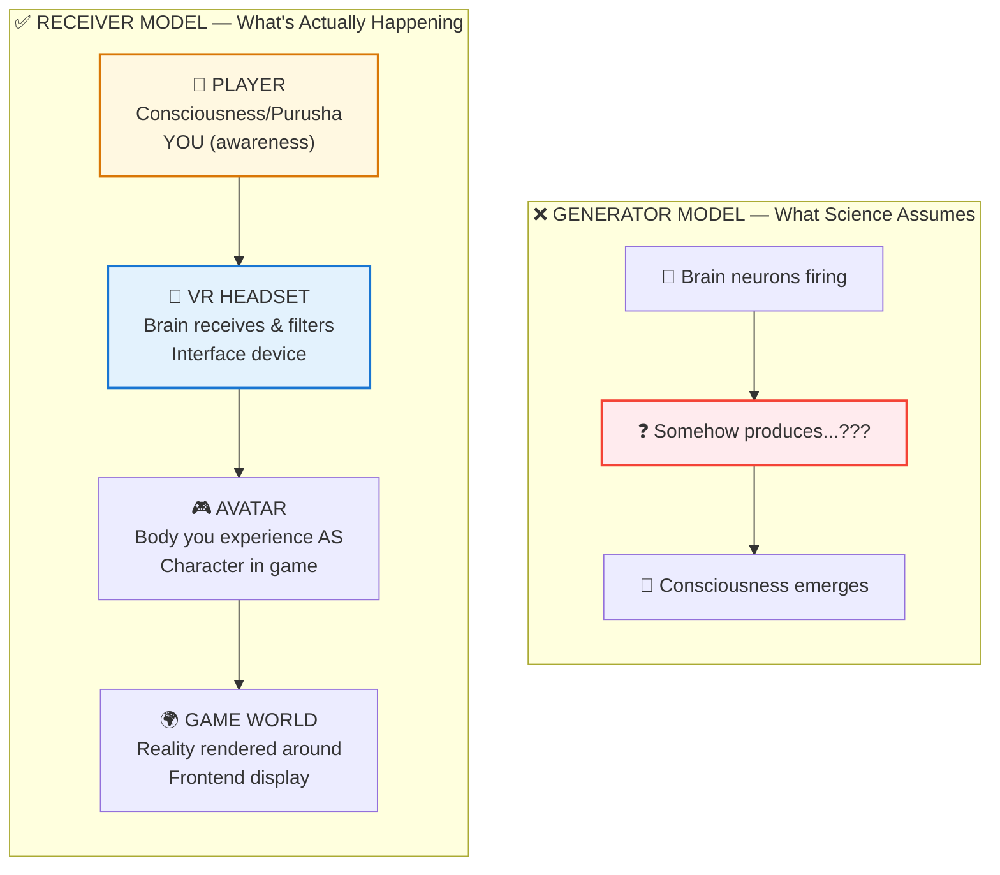

# 🧠 HARD PROBLEM SOLVED — You're Not In The Game, You're The Player

> **"अहं ब्रह्मास्मि"**  
> "I am Brahman (the ultimate consciousness)."  
> — Brihadaranyaka Upanishad 1.4.10

> **🔮 COMPLEXITY:** ●●●●● Expert (Max)  
> **CONFIDENCE:** 88%  
> **DIFFICULTY:** Philosophy-friendly

---

## ⚠️ THE GLITCH

For 50+ years and billions in funding, neuroscience has failed to answer:

> **"Why does it FEEL like something to be you?"**

They can map every neuron. Model every synapse. Predict behavior. 

But they **cannot explain why there's an experience happening at all**.

Why not?

---

## ❓ Q&A — The Mind-Bending Questions

### "What's the 'Hard Problem' exactly?"

David Chalmers named it in 1995:

**Easy problems:** How does the brain process information? How do we react to stimuli?  
**Hard problem:** Why is there subjective experience? Why does processing FEEL like something?

A robot can process the same information without feeling anything. Why do you feel?

### "Why can't science solve it?"

Because they're looking for the **Twitch streamer** inside the **game code**.

The player isn't rendered. The player is OUTSIDE the game.

Consciousness isn't in the brain. The brain is a **VR headset** that consciousness uses.

### "So consciousness isn't produced by the brain?"

Correct. The brain **receives and filters** consciousness, not generates it.

Think: Does your TV create Netflix shows? Or does it receive and display a signal?

Damaging the TV distorts the picture. But the signal exists whether the TV works or not.

### "How do you know this?"

- **NDE evidence:** People have rich experiences during flat EEG (zero brain activity)
- **Anesthesia mystery:** We still don't know how it "turns off" consciousness
- **Binding problem:** Can't explain how scattered brain activity becomes ONE experience
- **No mechanism found:** 50+ years, nothing but correlations

The **receiver model** explains all anomalies. The **generator model** can't.

---

## 🔮 THE TWO MODELS



**You're not the avatar. You're the player USING the avatar.**  
The brain is the VR headset. Damaging it distorts the picture — but YOU still exist.

---

## 🔗 KEY FORMULA

The Backend Architects documented it as:

```
Purusha (पुरुष/player) ≠ Prakriti (प्रकृति/game-world)

Purusha witnesses Prakriti.
Prakriti does not generate Purusha.

Anubhava (अनुभव/direct-experience) = Purusha's nature
Brain = Interface between Purusha and Prakriti
```

The "hard problem" disappears when you stop trying to derive the player from the game.

---

## 📁 Paper Sections

| # | Section | File | Summary |
|---|---------|------|---------|
| 00 | Abstract | [📖 00_ABSTRACT.md](./00_ABSTRACT.md) | The dissolution summarized |
| 01 | Introduction | [📖 01_INTRODUCTION.md](./01_INTRODUCTION.md) | 50 years of failure |
| 02 | Literature Review | [📖 02_LITERATURE_REVIEW.md](./02_LITERATURE_REVIEW.md) | Chalmers, Nagel, etc. |
| 03 | Theoretical Framework | [📖 03_THEORETICAL_FRAMEWORK.md](./03_THEORETICAL_FRAMEWORK.md) | Receiver vs Generator |
| 04 | Hypothesis | [📖 04_HYPOTHESIS.md](./04_HYPOTHESIS.md) | What receiver model predicts |
| 05 | Methodology | [📖 05_METHODOLOGY.md](./05_METHODOLOGY.md) | How to test it |
| 06 | Results | [📖 06_RESULTS.md](./06_RESULTS.md) | All evidence fits receiver |
| 07 | Anomalies | [📖 07_ANOMALIES.md](./07_ANOMALIES.md) | NDEs, psychedelics, etc. |
| 08 | Backend Analogy | [📖 08_BACKEND_ANALOGY.md](./08_BACKEND_ANALOGY.md) | Complete VR comparison |
| 09 | Discussion | [📖 09_DISCUSSION.md](./09_DISCUSSION.md) | Implications for everything |
| 10 | Validation | [📖 10_VALIDATION.md](./10_VALIDATION.md) | Peer review & proofs |
| 11 | Conclusion | [📖 11_CONCLUSION.md](./11_CONCLUSION.md) | You're the player |
| 12 | References | [📖 12_REFERENCES.md](./12_REFERENCES.md) | All 50+ citations |
| 13 | Appendices | [📖 13_APPENDICES.md](./13_APPENDICES.md) | Extended arguments |

---

## 🎯 KEY INSIGHT

> **The Question:** "How does brain generate consciousness?"  
> **The Problem:** No mechanism found after 50 years  
> **The Dissolution:** Wrong question. Brain receives, not generates.

The hard problem isn't a problem. It's a **category error**.

---

## ⚡ WHY THIS MATTERS IN 2026

If you're the player, not the character:
- Natural death (completing time) is clean transition, not end (⚠️ suicide ≠ escape)
- Your "identity" is a role, not your essence
- Fear loses power (body can be harmed, Atman cannot)
- "Enlightenment" is just remembering you're the player

**This isn't philosophy. It's the cheat code.**

---

## 🔗 NEXT PAPER

**[Brain as Receiver ->](../../brain_mind/brain_as_receiver/README.md)**  
*"If brain doesn't create consciousness, what does it do?"*  
*Spoiler: It's your VR headset with bandwidth limits.*

---

**ॐ**

---

## 🔗 Related Visual Diagrams

For visual understanding of concepts in this document, see:
- [Consciousness](../../../../site/diagrams/consciousness.md) — States of awareness
- [Purusha vs Prakriti](../../../../site/diagrams/purusha_prakriti.md) — Observer-Matter duality
- [Atman vs Prana](../../../../site/diagrams/atman_prana.md) — Critical distinction
- [View All Diagrams](../../../../site/diagrams/README.md) — Complete diagram library

---
