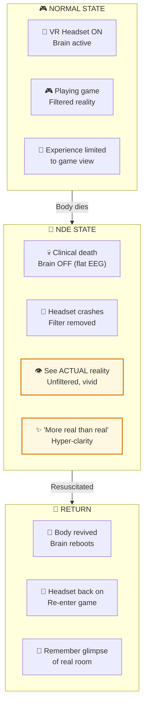

# ☯️➡️👁️ NDE EVIDENCE — When The VR Headset Comes Off

> **"न जायते म्रियते वा कदाचिन्"**  
> "The Self is never born, nor does it ever die."  
> — Bhagavad Gita 2.20

> **🔮 COMPLEXITY:** ●●●●● Expert (Max)  
> **CONFIDENCE:** 80%  
> **DIFFICULTY:** Reality-shattering

---

## ⚠️ THE GLITCH

Thousands of people have **clinically died** — heart stopped, EEG flat, zero brain activity — and then been revived.

What they report is impossible according to mainstream science:

- 👁️ **Verified observations** of events they shouldn't have seen
- 🚁 **Out-of-body viewing** of their own resuscitation
- 👥 **Meeting dead relatives** they didn't know had died
- ✨ **More real than real** experiences during zero brain activity

If brain creates consciousness, **NOTHING should happen during flat EEG**.

---

## ❓ Q&A — The Mind-Bending Questions

### "What's a Near-Death Experience?"

Clinical death + conscious experience + return to life.

Not "almost dying" — actually dying (no heartbeat, no brain activity) and experiencing something during that time.

### "How many cases?"

- ~10-20% of cardiac arrest survivors report NDEs
- ~15 million Americans have had one
- Documented cases going back thousands of years, across all cultures
- The AWARE study (2014) specifically designed to test if experiences during flat EEG are real

### "What do they experience?"

Common elements (across cultures):
- Leaving the body, watching from above
- Traveling through a tunnel/passage
- Encountering deceased relatives
- A "being of light" or review of life
- Being told to return
- Extreme peace, no fear
- "More real than real" — not dreamlike

### "Couldn't it be hallucinations?"

**Problem 1:** Hallucinations require brain activity. They have NONE.

**Problem 2:** Hallucinations are fuzzy, confused, dreamlike. NDEs are hyper-clear, often clearer than normal waking life.

**Problem 3:** People report verifiable facts — specific details about what doctors did, conversations in other rooms, objects placed in hidden locations.

### "What's the explanation?"

**Generator model (mainstream):** "Must be some unknown residual brain activity..." (never found)

**Receiver model (Backend):** When the VR headset (brain) stops working, the player (consciousness) temporarily experiences reality WITHOUT the limiting filter.

It's like when your VR headset glitches and you see the room you're actually sitting in.

---

## 🔮 THE VR HEADSET ANALOGY

**When the VR headset (brain) crashes, you temporarily see the REAL room you're sitting in. That's what 15+ million people describe.**

---

## 🔗 KEY EVIDENCE

### The AWARE Study (2014)
Placed hidden targets visible only from ceiling. Some cardiac arrest patients correctly described them — from a perspective they couldn't have if bound to their body.

### Dr. Pim van Lommel's Research
340 cardiac arrest survivors studied. Those with flat EEG had experiences identical in structure to those with minimal activity. Brain activity level didn't correlate with experience richness.

### Blind From Birth NDEs
Congenitally blind people during NDEs describe VISUAL experiences — colors, forms, their own body — that they've NEVER experienced. How do you hallucinate something you've never perceived?

---

## 📁 Paper Sections

| # | Section | File | Summary |
|---|---------|------|---------|
| 00 | Abstract | [📖 00_ABSTRACT.md](./00_ABSTRACT.md) | Summary of evidence |
| 01 | Introduction | [📖 01_INTRODUCTION.md](./01_INTRODUCTION.md) | The impossibility |
| 02 | Literature Review | [📖 02_LITERATURE_REVIEW.md](./02_LITERATURE_REVIEW.md) | Greyson, Moody, van Lommel |
| 03 | Theoretical Framework | [📖 03_THEORETICAL_FRAMEWORK.md](./03_THEORETICAL_FRAMEWORK.md) | Filter removal model |
| 04 | Hypothesis | [📖 04_HYPOTHESIS.md](./04_HYPOTHESIS.md) | What receiver model predicts |
| 05 | Methodology | [📖 05_METHODOLOGY.md](./05_METHODOLOGY.md) | How NDEs are studied |
| 06 | Results | [📖 06_RESULTS.md](./06_RESULTS.md) | Verified perception cases |
| 07 | Anomalies | [📖 07_ANOMALIES.md](./07_ANOMALIES.md) | Blind NDEs, shared NDEs |
| 08 | Backend Analogy | [📖 08_BACKEND_ANALOGY.md](./08_BACKEND_ANALOGY.md) | Headset crash scenario |
| 09 | Discussion | [📖 09_DISCUSSION.md](./09_DISCUSSION.md) | What this means for death |
| 10 | Validation | [📖 10_VALIDATION.md](./10_VALIDATION.md) | Evidence scoring |
| 11 | Conclusion | [📖 11_CONCLUSION.md](./11_CONCLUSION.md) | Consciousness survives |
| 12 | References | [📖 12_REFERENCES.md](./12_REFERENCES.md) | All studies |
| 13 | Appendices | [📖 13_APPENDICES.md](./13_APPENDICES.md) | Case summaries |

---

## 🎯 KEY INSIGHT

> **Science:** "Experiences during flat EEG are... unexplained"  
> **Translation:** "The headset was off. The player kept playing."  
> **Backend Term:** Kosha (कोश/sheath) — body is just one layer

When body shuts down, consciousness doesn't. It just stops being filtered through that particular receiver.

---

## ⚡ WHY THIS MATTERS IN 2026

- **You are not the body.** 15+ million experiencers agree.
- **Death is transition**, not termination
- **Fear of death is fear of headset removal** — but you've never been the headset
- **The Dwapara transition** means more people will access this understanding BEFORE dying

---

## 🔗 NEXT PAPER

**[📖 Epigenetics = Samskaras ->](../../../04_BIOLOGY/epigenetics/epigenetics_samskaras/README.md)**  
*"What if your ancestors' experiences are stored in your cells?"*  
*Spoiler: Your DNA is your karmic save file.*

---

**ॐ**

---

## 🔗 Related Visual Diagrams

For visual understanding of concepts in this document, see:
- [Moksha](../../../../site/diagrams/moksha.md) — Liberation paths
- [Lokas](../../../../site/diagrams/lokas.md) — 14 frequency layers
- [Consciousness](../../../../site/diagrams/consciousness.md) — States of awareness
- [View All Diagrams](../../../../site/diagrams/README.md) — Complete diagram library

---
