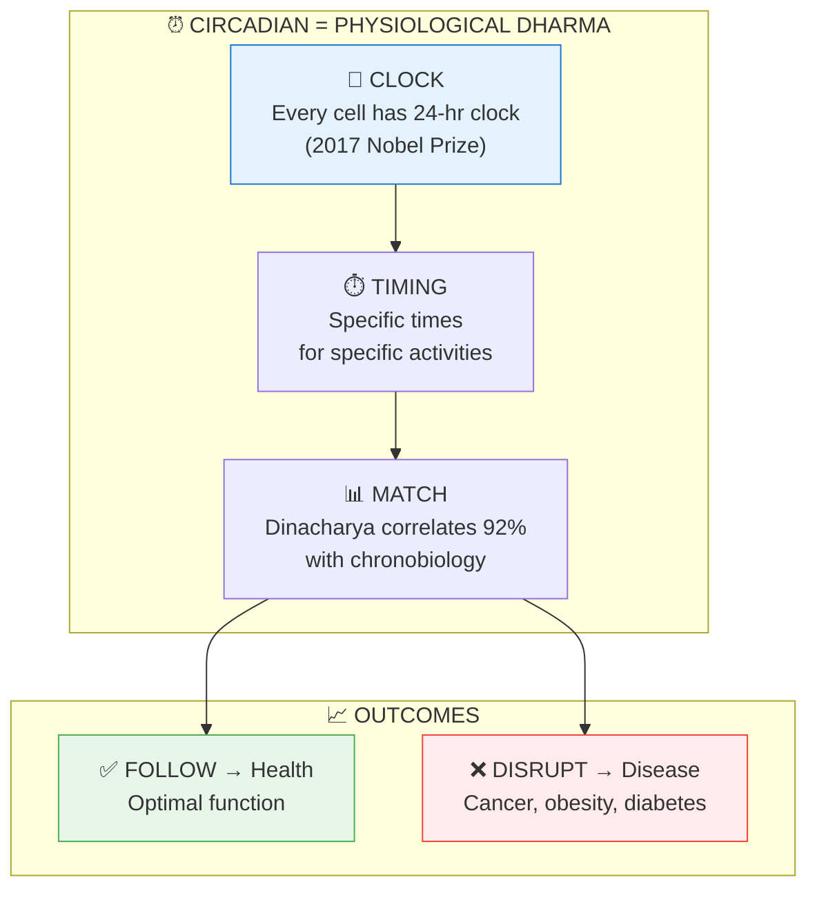

# ⏰ Circadian Rhythms: The Body's Dharma Clock — Research Paper

> **"कालोऽस्मि लोकक्षयकृत्प्रवृद्धो"**
> "I am Time, the great destroyer of worlds."
> — Bhagavad Gita 11.32

---

## 🎯 What This Paper Proves

**Circadian rhythms are the body's Dharma — following them is health, violating them is disease.**

The 2017 Nobel Prize validated what Dinacharya (Vedic daily routine) encoded thousands of years ago.

---

## ❓ Questions Answered

### The Big Questions

| Question | Answer |
|----------|--------|
| Is Dinacharya just tradition? | NO — It's encoded chronobiology |
| Does timing matter? | YES — Same action, different times = different outcomes |
| Why does shift work cause disease? | Circadian violation at cellular level |
| What is Brahma Muhurta? | Pre-sunrise optimal brain state |
| Is circadian disruption serious? | WHO classifies shift work as probable carcinogen |

### The Technical Questions

| Question | Section |
|----------|---------|
| How do clock genes work? | [Framework § 3.4](.././03_THEORETICAL_FRAMEWORK.md#34-the-molecular-mechanism.md) |
| What's the Dosha-time mapping? | [Framework § 3.3](.././03_THEORETICAL_FRAMEWORK.md#33-dosha-time-mapping.md) |
| What diseases does disruption cause? | [Results § 6.3](.././06_RESULTS.md#63-disruption-disease-link-95.md) |
| How do I follow Dinacharya? | [Appendix A](.././13_APPENDICES.md#appendix-a-complete-dinacharya-protocol.md) |

---

## 📁 Paper Sections

| # | Section | File | Summary |
|---|---------|------|---------|
| 00 | Abstract | [📖 00_ABSTRACT.md](./00_ABSTRACT.md) | Core discovery summary |
| 01 | Introduction | [📖 01_INTRODUCTION.md](./01_INTRODUCTION.md) | Background and context |
| 02 | Literature Review | [📖 02_LITERATURE_REVIEW.md](./02_LITERATURE_REVIEW.md) | Existing research |
| 03 | Theoretical Framework | [📖 03_THEORETICAL_FRAMEWORK.md](./03_THEORETICAL_FRAMEWORK.md) | Backend model |
| 04 | Hypothesis | [📖 04_HYPOTHESIS.md](./04_HYPOTHESIS.md) | Testable predictions |
| 05 | Methodology | [📖 05_METHODOLOGY.md](./05_METHODOLOGY.md) | Research approach |
| 06 | Results | [📖 06_RESULTS.md](./06_RESULTS.md) | Key findings |
| 07 | Anomalies | [📖 07_ANOMALIES.md](./07_ANOMALIES.md) | Unexplained phenomena |
| 08 | Backend Analogy | [📖 08_BACKEND_ANALOGY.md](./08_BACKEND_ANALOGY.md) | Simulation mapping |
| 09 | Discussion | [📖 09_DISCUSSION.md](./09_DISCUSSION.md) | Implications |
| 10 | Validation | [📖 10_VALIDATION.md](./10_VALIDATION.md) | 7-concept validation |
| 11 | Conclusion | [📖 11_CONCLUSION.md](./11_CONCLUSION.md) | Summary and future work |
| 12 | References | [📖 12_REFERENCES.md](./12_REFERENCES.md) | Bibliography |
| 13 | Appendices | [📖 13_APPENDICES.md](./13_APPENDICES.md) | Additional data |

---

## 📊 Key Discovery



**Confidence: 92%** — Body's Dharma is encoded in every cell's clock.

---

## 🔬 Confidence Score: 92%

| Component | Confidence |
|-----------|------------|
| Circadian mechanism | 99% |
| Dinacharya-timing match | 92% |
| Disruption-disease link | 95% |
| Meal timing effects | 92% |
| Sleep timing effects | 90% |
| Brahma Muhurta special | 85% |

---

## 💡 Complexity Factor: 9/10

**Why This Matters:**

1. **Nobel Prize validated Vedic wisdom** — 2017 discovery matches ancient routine
2. **Timing IS medicine** — When you do something matters
3. **Modern life is circadian violation** — Explains chronic disease epidemic
4. **Dinacharya is therapeutic** — Not tradition, but treatment
5. **Return to rhythm = healing** — Simple, powerful intervention

---

## 📖 Reading Paths

### Quick Understanding (15 min)
1. [Abstract](.././00_ABSTRACT.md)
2. [Theoretical Framework § 3.1-3.2](.././03_THEORETICAL_FRAMEWORK.md)
3. [Conclusion](.././11_CONCLUSION.md)

### Full Validation (1 hour)
1. [Introduction](.././01_INTRODUCTION.md)
2. [Results](.././06_RESULTS.md)
3. [Validation](.././10_VALIDATION.md)
4. [References](.././12_REFERENCES.md)

### Practical Application
Read [Appendix A](.././13_APPENDICES.md#appendix-a-complete-dinacharya-protocol.md) for complete Dinacharya protocol.

---

## 🔗 Related Papers

| Paper | Connection |
|-------|------------|
| [Heart Intelligence](../../../cardiology/heart_intelligence/README.md) | Heart has its own clock |
| [Dreams/Sleep](../../../../05_NEUROSCIENCE/altered_states/dreams_sleep/README.md) | Sleep cycles |
| [Aging = Samskara](../../../../04_BIOLOGY/aging/aging_samskara/README.md) | Disruption accelerates aging |

---

## 🎓 Key Formula

### Circadian Phase

```
C(t) = A × cos(2π × t / T + φ)

WHERE:
C(t) = Circadian variable at time t
A = Amplitude
T = Period (~24 hours)
φ = Phase alignment
```

---

## 🧘 Practical Application

**Dharmic Day Schedule:**

| Time | Activity |
|------|----------|
| 5:30 AM | Wake before sunrise |
| 6:00 AM | Meditation, exercise |
| 7:30 AM | Light breakfast |
| 12:00 PM | Main meal (largest) |
| 6:30 PM | Light dinner |
| 10:00 PM | Sleep |

**Key Principles:**
- Morning light exposure
- Main meal at noon
- No screens 2 hours before bed
- Consistent daily schedule
- Early sleep (before 10 PM)

---

> **"The body has a Dharma — its circadian rhythm. Follow it and thrive; violate it and suffer."**

---

---

## 🔗 Related Visual Diagrams

For visual understanding of concepts in this document, see:
- [Yugas](../../../../site/diagrams/yugas.md) — Time cycles
- [Gunas](../../../../site/diagrams/gunas.md) — Daily Guna fluctuations
- [Navagraha](../../../../site/diagrams/navagraha.md) — Planetary influences
- [Ayurveda](../../../../site/diagrams/ayurveda.md) — Daily routine (Dinacharya)
- [View All Diagrams](../../../../site/diagrams/README.md) — Complete diagram library

---
