# 🌍 Gaia Hypothesis = Prithvi Consciousness

> **"माता भूमिः पुत्रोऽहं पृथिव्याः"**  
> "Earth is my mother, I am her child."  
> — Atharva Veda 12.1.12

---

## 📁 Paper Sections

| # | Section | File | Summary |
|---|---------|------|---------|
| 00 | Abstract | [📖 00_ABSTRACT.md](./00_ABSTRACT.md) | Core discovery summary |
| 01 | Introduction | [📖 01_INTRODUCTION.md](./01_INTRODUCTION.md) | Background and context |
| 02 | Literature Review | [📖 02_LITERATURE_REVIEW.md](./02_LITERATURE_REVIEW.md) | Existing research |
| 03 | Theoretical Framework | [📖 03_THEORETICAL_FRAMEWORK.md](./03_THEORETICAL_FRAMEWORK.md) | Backend model |
| 04 | Hypothesis | [📖 04_HYPOTHESIS.md](./04_HYPOTHESIS.md) | Testable predictions |
| 05 | Methodology | [📖 05_METHODOLOGY.md](./05_METHODOLOGY.md) | Research approach |
| 06 | Results | [📖 06_RESULTS.md](./06_RESULTS.md) | Key findings |
| 07 | Anomalies | [📖 07_ANOMALIES.md](./07_ANOMALIES.md) | Unexplained phenomena |
| 08 | Backend Analogy | [📖 08_BACKEND_ANALOGY.md](./08_BACKEND_ANALOGY.md) | Simulation mapping |
| 09 | Discussion | [📖 09_DISCUSSION.md](./09_DISCUSSION.md) | Implications |
| 10 | Validation | [📖 10_VALIDATION.md](./10_VALIDATION.md) | 7-concept validation |
| 11 | Conclusion | [📖 11_CONCLUSION.md](./11_CONCLUSION.md) | Summary and future work |
| 12 | References | [📖 12_REFERENCES.md](./12_REFERENCES.md) | Bibliography |
| 13 | Appendices | [📖 13_APPENDICES.md](./13_APPENDICES.md) | Additional data |

---

## Questions Answered

1. **Is Earth alive?** -> It functions as a self-regulating living system
2. **Is Earth conscious?** -> Vedic view: Yes, Bhumi Devi is conscious
3. **How does it self-regulate?** -> Complex biological-geological feedback loops
4. **What are the implications?** -> We are part of a living being, not owners of dead matter

---

## Key Insight

```mermaid
flowchart TD
    subgraph Modern["🔬 GAIA HYPOTHESIS (Modern Science)"]
        M1["🌍 Earth as self-regulating system"]
        M2["🌬️ Atmosphere regulation"]
        M3["🌊 Ocean chemistry"]
        M4["🌱 Biosphere feedback"]
        M1 --> M2 & M3 & M4
    end
    
    subgraph Vedic["🕉️ PRITHVI / BHUMI DEVI (Vedic)"]
        V1["🌏 Earth is conscious goddess"]
        V2["🙏 She is our mother"]
        V3["🔄 Has Prana (life force)"]
        V4["⚖️ Has Dharma (purpose)"]
        V1 --> V2 & V3 & V4
    end
    
    subgraph Synthesis["✨ SYNTHESIS"]
        S1["Gaia = Scientific validation<br/>of Vedic Earth-Mother"]
        S2["Earth is ALIVE, not dead matter"]
        S3["Environmental crisis =<br/>harming a living being"]
    end
    
    Modern --> Synthesis
    Vedic --> Synthesis
    
    style Modern fill:#E3F2FD,stroke:#1976D2
    style Vedic fill:#FFF8E1,stroke:#D97706
    style Synthesis fill:#E8F5E9,stroke:#4CAF50,stroke-width:2px
```

**GAIA = Earth as a living, self-regulating, conscious being. We are her children, not her owners.**

---

## Confidence Score: 80%

| Factor | Score | Reason |
|--------|-------|--------|
| Self-regulation evidence | 90% | Well-documented |
| Scientific acceptance | 75% | Mainstream accepts weak Gaia |
| Consciousness claim | 70% | Hard to verify |
| Vedic correspondence | 95% | Perfect match |
| Environmental implications | 85% | Clear guidance |

---

*Subject: EARTH SCIENCES / Gaia Hypothesis*  
*Confidence: 80%*  
*Status: COMPLETE*

---

## 🔗 Related Visual Diagrams

For visual understanding of concepts in this document, see:
- [Consciousness](../../../../site/diagrams/consciousness.md) — Planetary awareness
- [Fractals](../../../../site/diagrams/fractals.md) — Earth as fractal level
- [Dvipas & Samudras](../../../../site/diagrams/dvipas_samudras.md) — Planetary geography
- [View All Diagrams](../../../../site/diagrams/README.md) — Complete diagram library

---
