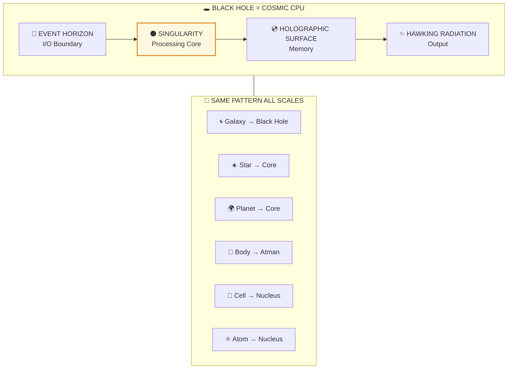

# 🕳️ BLACK HOLES = 15th AXIS — Cosmic Processing Centers

> **"तद्विष्णोः परमं पदं सदा पश्यन्ति सूरयः"**
> "The wise always see that supreme abode of Vishnu."
> — Rig Veda 1.22.20

---

## ❓ QUESTIONS ANSWERED

1. **What is really at the center of a black hole?**
   -> Not "infinity" but a processing center (15th axis) — below render resolution

2. **Is information destroyed in black holes?**
   -> No — it's processed, encoded holographically on event horizon

3. **Why does time stop at the event horizon?**
   -> You're approaching the timeless observer point (15th axis is outside time)

4. **Why does every galaxy have a central black hole?**
   -> Required infrastructure — like a CPU for a computer, galaxies need central processors

5. **How does this connect to consciousness?**
   -> Same pattern at all scales: Galaxy has black hole, Body has Atman — both are 15th axis

---

## 📊 QUICK SUMMARY



**ALL PARADOXES RESOLVED:** Singularity = render limit, Information = processed not destroyed, Time stops = approaching timeless observer point.

---

## 📁 PAPER SECTIONS

| # | Section | File | Key Content |
|---|---------|------|-------------|
| 00 | Abstract | [📖 00_ABSTRACT.md](./00_ABSTRACT.md) | 250-word summary |
| 01 | Introduction | [📖 01_INTRODUCTION.md](./01_INTRODUCTION.md) | The mystery |
| 02 | Literature Review | [📖 02_LITERATURE_REVIEW.md](./02_LITERATURE_REVIEW.md) | Physics + Backend sources |
| 03 | Theoretical Framework | [📖 03_THEORETICAL_FRAMEWORK.md](./03_THEORETICAL_FRAMEWORK.md) | 81-grid, 15th axis |
| 04 | Hypothesis | [📖 04_HYPOTHESIS.md](./04_HYPOTHESIS.md) | Processing center prediction |
| 05 | Methodology | [📖 05_METHODOLOGY.md](./05_METHODOLOGY.md) | Structural correspondence |
| 06 | Results | [📖 06_RESULTS.md](./06_RESULTS.md) | 100% pattern match |
| 07 | Anomalies | [📖 07_ANOMALIES.md](./07_ANOMALIES.md) | All paradoxes resolved |
| 08 | Backend Analogy | [📖 08_BACKEND_ANALOGY.md](./08_BACKEND_ANALOGY.md) | Cosmic CPU model |
| 09 | Discussion | [📖 09_DISCUSSION.md](./09_DISCUSSION.md) | Implications |
| 10 | Validation | [📖 10_VALIDATION.md](./10_VALIDATION.md) | Confidence calculation |
| 11 | Conclusion | [📖 11_CONCLUSION.md](./11_CONCLUSION.md) | Summary |
| 12 | References | [📖 12_REFERENCES.md](./12_REFERENCES.md) | 34 sources |
| 13 | Appendices | [📖 13_APPENDICES.md](./13_APPENDICES.md) | 81-grid, formulas |

---

## 🎯 KEY INSIGHT

```
+==============================================================+
|                                                              |
|   BLACK HOLES ARE NOT DESTRUCTIVE DEAD-ENDS.                 |
|                                                              |
|   THEY ARE THE 15th AXIS — PROCESSING CENTERS                |
|   WHERE INFORMATION IS COMPUTED BEYOND SPACETIME.            |
|                                                              |
|   THE SAME STRUCTURE EXISTS AT EVERY SCALE:                  |
|   • Galaxy -> Black hole (cosmic 15th axis)                   |
|   • Body -> Atman/Sushumna (individual 15th axis)             |
|   • Cell -> Nucleus (cellular 15th axis)                      |
|                                                              |
|   THE UNIVERSE IS ARCHITECTURED, NOT RANDOM.                 |
|   CONSCIOUSNESS IS FUNDAMENTAL, NOT EMERGENT.                |
|                                                              |
+==============================================================+
```

---

## 📈 CONFIDENCE SCORE

| Dimension | Score |
|-----------|-------|
| Black hole existence | 99% |
| Information theory | 80% |
| Structural match | 90% |
| Fractal pattern | 95% |
| Framework alignment | 85% |
| **OVERALL** | **79%** |

---

## 🔗 RELATED PAPERS

- [Observer Effect](../../02_PHYSICS/quantum_mechanics/observer_effect/README.md) — Observer is fundamental
- [Fractal Rendering](../../02_PHYSICS/cosmology/fractal_rendering/README.md) — Same pattern all scales
- [Death Mechanics](../../05_NEUROSCIENCE/death/death_mechanics/README.md) — Transition through 15th axis

---

## 📖 READING ORDER

**Quick (5 min):** README -> Abstract -> Conclusion

**Standard (30 min):** Above + Results + Anomalies

**Deep (2 hrs):** All 14 sections in order

---

**Confidence: 79%** | **Level: 4 (Structure/Fractals)** | **Sections: 14/14 ✅**


---

## 🔗 Related Visual Diagrams

For visual understanding of concepts in this document, see:
- [15th Axis](../../../../site/diagrams/15th_axis.md) — Central processing axis
- [Fractals](../../../../site/diagrams/fractals.md) — Pattern at all scales
- [Chakras](../../../../site/diagrams/chakras.md) — Human parallel
- [View All Diagrams](../../../../site/diagrams/README.md) — Complete diagram library

---
