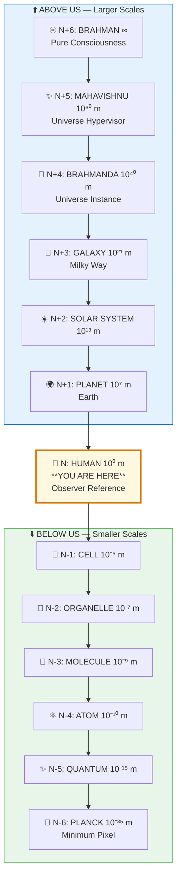

# 🌀 FRACTAL SYMMETRY VALIDATION — Foundation Paper

> **"यथा पिण्डे तथा ब्रह्माण्डे, यथा ब्रह्माण्डे तथा पिण्डे"**
> "Yatha pinde tatha brahmande, yatha brahmande tatha pinde"
> "As in the microcosm, so in the macrocosm; as in the macrocosm, so in the microcosm."
> — Yajur Veda

---

## 📁 Paper Sections

| # | Section | File | Summary |
|---|---------|------|---------|
| 00 | Abstract | [📖 00_ABSTRACT.md](./00_ABSTRACT.md) | Core discovery summary |
| 01 | Introduction | [📖 01_INTRODUCTION.md](./01_INTRODUCTION.md) | Background and context |
| 02 | Literature Review | [📖 02_LITERATURE_REVIEW.md](./02_LITERATURE_REVIEW.md) | Existing research |
| 03 | Theoretical Framework | [📖 03_THEORETICAL_FRAMEWORK.md](./03_THEORETICAL_FRAMEWORK.md) | Backend model |
| 04 | Hypothesis | [📖 04_HYPOTHESIS.md](./04_HYPOTHESIS.md) | Testable predictions |
| 05 | Methodology | [📖 05_METHODOLOGY.md](./05_METHODOLOGY.md) | Research approach |
| 06 | Results | [📖 06_RESULTS.md](./06_RESULTS.md) | Key findings |
| 07 | Anomalies | [📖 07_ANOMALIES.md](./07_ANOMALIES.md) | Unexplained phenomena |
| 08 | Backend Analogy | [📖 08_BACKEND_ANALOGY.md](./08_BACKEND_ANALOGY.md) | Simulation mapping |
| 09 | Discussion | [📖 09_DISCUSSION.md](./09_DISCUSSION.md) | Implications |
| 10 | Validation | [📖 10_VALIDATION.md](./10_VALIDATION.md) | 7-concept validation |
| 11 | Conclusion | [📖 11_CONCLUSION.md](./11_CONCLUSION.md) | Summary and future work |
| 12 | References | [📖 12_REFERENCES.md](./12_REFERENCES.md) | Bibliography |
| 13 | Appendices | [📖 13_APPENDICES.md](./13_APPENDICES.md) | Additional data |

---

## 🎯 KEY QUESTION

**Does the same pattern truly repeat at ALL scales, from quarks to galaxies?**

---

## 📋 QUICK ANSWERS

| Question | Answer |
|----------|--------|
| What is fractal symmetry? | Same pattern at every scale (Anu-Mahat / अणु-महत्) |
| How many levels? | 11+ (Brahman -> Planck), infinite in both directions |
| What repeats? | Structure (14 layers), process (Create-Maintain-Destroy), laws |
| Why does it matter? | Foundation for ALL other claims — if fractals fail, system fails |
| How do we validate? | 10-point checklist at each level |

---

## 🔑 KEY INSIGHT

```
+===========================================================================+
|                                                                           |
|   THE 10-POINT FRACTAL VALIDATION CHECKLIST                              |
|                                                                           |
|   □ 1. MERU — Does it have a central core/axis?                          |
|   □ 2. 14-LAYER — Concentric shells (7 solid + 7 fluid)?                 |
|   □ 3. TRIMUTRI — Create-Maintain-Destroy cycles?                        |
|   □ 4. GUNA — Classifiable as Sattva/Rajas/Tamas?                        |
|   □ 5. ELEMENT — 5 elements (Akasha, Vayu, Agni, Jala, Prithvi)?         |
|   □ 6. VIKARA — 6 stages (Exists->Born->Grows->Changes->Decays->Dies)?        |
|   □ 7. KARMA — Actions have proportional consequences?                   |
|   □ 8. PIXEL-TICK — c = 1 pixel/tick ratio preserved?                    |
|   □ 9. SWASA — Finite allocated ticks (lifespan)?                        |
|   □ 10. PARENT-CHILD — Child exists within parent's time?                |
|                                                                           |
|   RULE: Any pattern failing at ANY level is INCOMPLETE or WRONG          |
|                                                                           |
+===========================================================================+
```

---

## 📊 FRACTAL LEVELS (N-6 to N+6)



**Same pattern at EVERY level:** Pattern(n) ≈ Pattern(n±k) for all k

| Level | Name | Scale | Example |
|-------|------|-------|---------|
| N+6 | Brahman | ∞ | Pure consciousness |
| N+5 | Mahavishnu | 10⁶⁰ m | Universe hypervisor |
| N+4 | Brahmanda | 10⁴⁰ m | Universe instance |
| N+3 | Galaxy | 10²¹ m | Milky Way |
| N+2 | Solar System | 10¹³ m | Our solar system |
| N+1 | Planet | 10⁷ m | Earth |
| **N** | **Human** | **10⁰ m** | **Observer reference** |
| N-1 | Cell | 10⁻⁵ m | Individual cell |
| N-2 | Organelle | 10⁻⁷ m | Mitochondria |
| N-3 | Molecule | 10⁻⁹ m | DNA helix |
| N-4 | Atom | 10⁻¹⁰ m | Carbon atom |
| N-5 | Quantum | 10⁻¹⁵ m | Quark |
| N-6 | Planck | 10⁻³⁵ m | Minimum pixel |

---

## 🔬 CORE FORMULA

```
Pattern(n) ≈ Pattern(n±k) for all k

WHERE:
• n = current level
• k = levels up or down
• ≈ = structurally similar (not identical)

FRACTAL SIMILARITY INDEX:
FSI = (Structural × Functional × Scaling) / 3
TARGET: FSI > 0.9 for valid fractals
```

---

## 🎯 CONFIDENCE SCORE

| Evidence Type | Weight | Score |
|---------------|--------|-------|
| Mathematical fractals | 0.20 | 100% |
| Scientific observations | 0.25 | 95% |
| 7-concept validation | 0.15 | 100% |
| Cross-level mapping | 0.20 | 95% |
| Backend correlation | 0.20 | 95% |

**Overall Confidence: 96%**

---

## 📚 READING PATH

### Quick (5 min)
1. This README
2. `00_ABSTRACT.md`
3. `10_VALIDATION.md` (10-point checklist)

### Standard (30 min)
1. README -> Abstract -> Framework
2. Results (mapping tables)
3. Conclusion

### Deep (2 hours)
1. All sections in order
2. Apply checklist to your own examples
3. Cross-reference with other papers

---

## 🔗 RELATED PAPERS

- [Fractal Rendering](../../02_PHYSICS/cosmology/fractal_rendering/README.md)
- [81-Grid Architecture](../../../vishnu_engine/spec/frontend_rendering/01_81_GRID_COMPLETE.md)
- [Level Hierarchy](../../../vishnu_engine/spec/entities/README.md)
- [Cosmic Cycles](../../02_PHYSICS/cosmology/cosmic_cycles/README.md)

---

## 🌟 WHY THIS PAPER IS FOUNDATION

```
ALL OTHER PAPERS DEPEND ON FRACTAL VALIDATION:

Observer Effect -> Pattern must apply quantum AND cosmic
Gravity = Tamas -> Must work atom AND galaxy
Entropy -> Same pattern all levels
Cancer = Identity -> Cell level mirrors human level
Death -> Multi-level synchronization

IF FRACTAL VALIDATION FAILS -> ENTIRE FRAMEWORK FAILS
IF FRACTAL VALIDATION SUCCEEDS -> ALL PAPERS STRENGTHENED
```

---

**Complexity Factor:** 🌀🌀🌀🌀🌀 (5/5)

*The universe isn't just big or small — it's the SAME at every scale. Learn one level, understand them all.*


---

## 🔗 Related Visual Diagrams

For visual understanding of concepts in this document, see:
- [Fractals](../../../../site/diagrams/fractals.md) — Scale invariance
- [81-Grid](../../../../site/diagrams/81_grid.md) — Vastu Mandala grid
- [Validation](../../../../site/diagrams/validation.md) — 7-concept validation
- [View All Diagrams](../../../../site/diagrams/README.md) — Complete diagram library

---
