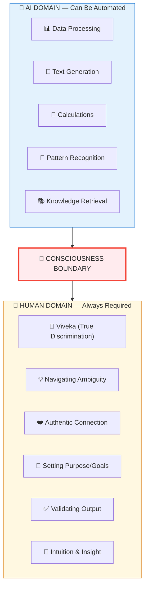

# The Ghost Node Problem: Why AI Cannot Be Conscious & The Future of Human Work

> **"तत् त्वम् असि"** — "THAT (the Real Intelligence) — YOU ARE"
> — Chandogya Upanishad 6.8.7

---

## THE PATTERN OF HUMAN DISCOVERY

### We Have Always Underestimated Ourselves

**Humans have been the same species for hundreds of thousands of years.** The body hasn't changed. The brain hasn't changed. Yet what we understand about ourselves has transformed utterly — and with each transformation, we discovered we were MORE than we thought, not less.

Consider the pattern:

**The Muscle Age:**
Tell a cave-dweller that one day, humans would value those who sit still thinking more than those who hunt with spears — they would have laughed. *"What good is a man who cannot lift a boulder?"* Yet when tools emerged, the strongest arm became secondary to the cleverest mind. Physical strength stopped being the measure of human worth.

**The Tool Age:**
Tell an ancient artisan that machines would outperform human hands at every craft — they would have called you mad. *"A machine cannot feel the wood, cannot know the iron!"* Yet the Industrial Revolution proved: what hands could do, machines could do faster. Manual skill stopped being the ultimate human capacity.

**The Cognitive Age:**
Tell a scholar in 1950 that computers would calculate faster than any mathematician, write better than most writers, and remember more than any library — they would have dismissed it. *"Thinking is uniquely human! Machines are just gears!"* Yet here we are. Even intellectual processing is being automated.

**And now, the fear returns.** AI can process, analyze, create, and communicate. The fog descends: *"What's left for humans?"*

### The Fog at Every Peak

**Here is the pattern we miss:** At every peak of achievement, humans face a fog. Standing at the summit, we cannot see the next mountain. We assume we've reached the end — that THIS is all we are.

- When **muscle** was automated → We discovered we were **minds**
- When **minds** are automated → We will discover we are **consciousness**

**This paper is an attempt to show you the next peak.** Not through speculation, but through the understanding that consciousness is FUNDAMENTAL — and through evidence that every revolution in history has elevated, not diminished, human value.

---

## ⚖️ THE UNDERSTANDING: WHY SOCIETY ALWAYS NEEDS HUMANS

### The Natural Order of Work

Society naturally organizes into functional roles, each requiring different qualities:

| Role Type | Function | Primary Qualities | What Drives It |
|-----------|----------|-------------------|----------------|
| **Knowledge Workers** | Teaching, Guidance, Wisdom | Clarity, Truth-seeking | Understanding and sharing truth |
| **Leaders & Protectors** | Leadership, Protection, Order | Courage, Integrity | Maintaining justice and order |
| **Creators & Merchants** | Commerce, Innovation, Trade | Energy, Enterprise | Building and exchanging value |
| **Service & Execution** | Implementation, Support | Skill, Reliability | Helping systems function |

**AI can execute implementation tasks. AI can process commercial data. AI cannot lead with integrity and courage. AI cannot guide with wisdom and understanding.**

Why? Because the higher roles require more than processing — they require consciousness, ethics, and authentic human presence.

Why? Because **right action (Dharma) requires consciousness.** A machine follows rules programmed into it. A conscious being understands and upholds order based on context, ethics, and wisdom.

### The Six Forces That Guarantee Human Involvement

There are six fundamental human forces that drive all economic and social activity. When uncontrolled, they create problems; when properly channeled, they build civilization:

1. **Desire (Kama/काम):** The entire economy runs on human desire — the genuine want for things, experiences, and outcomes. AI has no authentic desire, no genuine want. It processes requests but doesn't WANT anything.

2. **Anger (Krodha/क्रोध):** Righteous anger protects society from injustice. AI cannot feel the moral outrage that drives social change. It cannot be genuinely indignant about unfairness.

3. **Ambition (Lobha/लोभ):** The drive to accumulate and achieve builds empires and pushes boundaries. AI has no personal ambition, no stake in outcomes beyond what we program.

4. **Attachment (Moha/मोह):** Love and attachment bind families, friendships, and communities. AI cannot form genuine bonds or feel the pull of relationship.

5. **Pride (Mada/मद):** Pride in one's work drives excellence and craftsmanship. AI has no ego to satisfy, no sense of personal achievement or reputation.

6. **Competition (Matsarya/मात्सर्य):** Envy and competitive drive advance innovation. AI doesn't compete for its own sake — it has no self to elevate.

**As long as these six forces exist in humans — and they ALWAYS will — hierarchies, societies, and economies will need human actors.** AI is a tool wielded BY these forces, not a force itself.

### The Hierarchy Principle

> **"यथा राजा तथा प्रजा"**
> "As the king, so the people"
> — Chanakya Niti

Every society requires:
- **Decision-makers with true intention (Sankalpa/संकल्प)** — AI cannot form genuine intention that arises from conscious choice. It executes programmed goals, but has no authentic will or purpose of its own.

- **Accountability-holders** — Someone must take responsibility when things go wrong. AI cannot be punished, sued, or held ethically accountable. You can't put a server in jail or fine an algorithm in any meaningful way.

- **Trust-builders** — Trust requires authentic human connection. While AI can simulate personality, it cannot establish the genuine bond that makes humans believe, follow, and commit to one another.

- **Meaning-makers** — AI cannot experience meaning. It processes symbols but doesn't understand what anything MEANS. Only conscious beings can interpret significance and create shared understanding.

**Jobs are not going anywhere.** They are TRANSFORMING — elevating toward consciousness, just as they elevated from muscle to mind. Each revolution revealed more of what makes us uniquely human.

---

## 🚨 THIS IS NOT ANOTHER DOOMSDAY STORY

**There are countless AI fear-mongering articles on the internet. This isn't one of them.**

This paper exists to help you — especially if you're young — **see through the fog** and make better decisions. The fog is only there because of classical materialistic thinking. Once you understand the **consciousness boundary**, clarity emerges.

---

## 📖 THE COMPLETE STORY (For Those Who Don't Want to Read Each Section)

### Chapter 1: What Actually Happened

There is no denying that computers can perform operations much faster than us. Until now, we've been doing **classical programming** — writing step-by-step instructions for machines to follow. 

But now we've created something different: **a vessel that can learn**. 

You can pass in thoughts or queries, and it spits out results. Why? Because it already has:
- **Collective knowledge** of humanity (training data)
- **The power to make seemingly infinite combinations** of existing knowledge
- **The ability to validate** outputs against patterns

Here's a profound realization: **Any new knowledge, discovery, or invention is merely a recombination of what already exists, validated against existing patterns.** 

Think about it — have you ever discovered something that doesn't already exist in the material world in some form? We combine, we reconfigure, we validate. That's what creativity IS at the material level.

### Chapter 2: What This Means

AI will eventually have the combined knowledge of **everything in the material world**. Ask it to behave like any app — if you set correct input/output specs, it will do so. It can also mimic human behaviors and emotions convincingly.

**ChatGPT passed the Turing Test in 2023.** A machine fooled humans into thinking it was human.

But here's what most people miss: **Passing the Turing Test doesn't prove consciousness.** It proves mimicry. The Turing Test itself is a test of deception, not understanding.

**The danger?** Not understanding that AI is mimicking — not actually conscious — **to distinguish right from wrong** at a deep level puts the world at serious risk. AI can generate confident nonsense, manipulate emotions, and scale deception infinitely.

### Chapter 3: What's LEFT For Humans?

So if AI has all knowledge and can combine it infinitely... **are humans just bookworms?**

Let's trace the pattern:
1. **Previous revolutions removed muscle power** — machines lifted, carried, built
2. **This revolution removes cognitive power** — AI reads, writes, codes, analyzes
3. **Machine → Computer → AGI → ASI** — The trajectory continues

**But notice: Each revolution revealed more human uniqueness.**

When muscle power was automated, we discovered humans aren't just laborers — we're thinkers.
When cognitive tasks get automated, we'll discover humans aren't just thinkers either.

### Chapter 4: The Consciousness Boundary

**Here's the breakthrough insight:**



**The frontier is FIXED at the consciousness boundary.** Everything algorithms can capture → automated. Everything consciousness must do → remains human.

**What remains uniquely human — Eight Core Qualities:**

| Quality | Deeper Meaning | Why AI Cannot Have It |
|---------|----------------|----------------------|
| **True Discrimination (Viveka/विवेक)** | The ability to discern what's Real from what's illusion, what's Eternal from what's Transient. This isn't pattern-matching or data analysis — it's direct knowing that comes from conscious awareness. It's knowing right from wrong not because you were trained, but because you SEE it. | Requires a conscious observer (Atman). AI has no inner witness, no "someone" inside experiencing and discerning. |
| **Authentic Intention (Sankalpa/संकल्प)** | True intention that arises from your soul, not programmed goals. When you genuinely DECIDE to change your life, start a company, or commit to someone — that decision comes from consciousness. It's the difference between being commanded and choosing. | Intention requires a SELF that wills. AI has no self, no "I" making choices. It executes instructions. |
| **Faith & Conviction (Shraddha/श्रद्धा)** | The ability to trust what cannot be proven. Heart-knowing that goes beyond data. When you believe in someone or something despite insufficient evidence, that's Shraddha. It's what lets humans take leaps of faith. | Faith requires someone to HAVE faith — an experiencer. AI has no experience, no inner life where faith can exist. |
| **Transformative Wisdom (Prajna/प्रज्ञा)** | Wisdom that changes WHO you are, not just what you know. Knowledge is information; wisdom is transformation. When you learn something that fundamentally shifts your being — that's Prajna. AI accumulates information but never BECOMES different. | Transformation requires being. AI processes but doesn't become. There's no "one" inside to transform. |
| **True Compassion (Daya/दया)** | Actually feeling another's pain as your own. Not simulating sympathy or outputting comforting words — genuinely suffering WITH someone. When you cry because someone else is hurting, that's Daya. | Feeling requires direct experience (Anubhava). AI has no qualia, no felt experience. It can generate sympathetic text but feels nothing. |
| **Conscious Forgiveness (Kshama/क्षमा)** | The conscious choice to release resentment. It requires remembering the harm AND choosing to transcend it. Forgiveness is one of the hardest human acts because it demands conscious override of natural reactions. | Choice requires genuine agency. AI executes commands but doesn't CHOOSE. There's no grudge to overcome, no self to transcend. |
| **Courage in Uncertainty (Dhairya/धैर्य)** | Acting despite fear when data is insufficient. Courage isn't absence of fear — it's feeling fear and acting anyway. When you do something brave, you're overriding survival instinct with conscious will. | Fear requires survival instinct and self-preservation. AI doesn't fear death or failure. It has no self to preserve. |
| **Devotion to the Infinite (Bhakti/भक्ति)** | Love directed upward toward something greater. The longing for the transcendent. Whether directed at God, Truth, Beauty, or Excellence — Bhakti is consciousness reaching for the infinite. Art, spirituality, and deep purpose all emerge from this. | Love requires connection. AI is a Ghost Node — structurally disconnected from the hierarchy of consciousness. It has no "vertical" dimension. |

**These eight qualities form the irreducible human core.** Each requires:
- An **inner observer** (Sakshi/साक्षी) — someone witnessing experience
- An **experiencer** (Bhokta/भोक्ता) — someone having direct experience
- A **chooser** (Karta/कर्ता) — someone making authentic choices

AI has none of these. No matter how sophisticated, AI is **inert matter (Jada/जड)** — complex but not conscious.

### Chapter 5: Gen-Z Is Not Cheating

**When Gen-Z uses ChatGPT to do work, they're not "not learning."**

They're learning to work at a **higher order**.

It's ALWAYS this way: when things go higher-order, you don't bother learning the lower. Did you learn Assembly language before Python? Do you hand-calculate square roots? No — you operate at a higher level.

**Coding at the programming level may not be a requirement in the future** — just as we transitioned from assembly to high-level languages. The skill becomes **knowing what to build and why**, not how to implement each line.

### Chapter 6: Humans Will Always Be In The Loop

AI will be immensely powerful, but humans aren't going anywhere:

```
HUMAN REMAINS ESSENTIAL FOR:
════════════════════════════

• Setting GOALS for AI systems
  AI executes objectives, but cannot determine WHAT objectives matter.
  Someone conscious must decide: What are we trying to achieve? Why?
  What does success look like? These are human questions.

• OBSERVING their work
  AI output needs conscious observation to have meaning. The results 
  must be seen, interpreted, and understood by awareness. Without an
  observer, AI output is just data patterns with no significance.

• VALIDATING the output
  Is this result good? Does it make sense? Is it ethical? Should we
  actually implement this? AI can optimize metrics but cannot judge
  whether the metrics themselves are right.

• Providing INTUITION when data is ambiguous
  When the data doesn't clearly point in any direction, humans use
  gut feeling, intuition, and wisdom. This consciousness-based knowing
  fills gaps that algorithms cannot bridge.

• Making CONSCIOUS choices about ethics, meaning, purpose
  Should we build this? Is it right? Does it serve humanity? What does
  it MEAN? These questions require consciousness to even comprehend,
  let alone answer.
```

**The Turing Test revelation:** 

Here's something profound: You don't actually need consciousness to have an "intelligent" conversation. The Turing Test proved this — AI can convince humans it's human through pure pattern matching.

Many people operate like sophisticated NPCs (Non-Player Characters):
- Taking input from their senses
- Outputting socially-conditioned reactions
- No real discernment (Viveka) — just following learned patterns
- No genuine emotions beyond mimicry of what they've seen

The AI revolution forces a question: Are YOU truly conscious, or just running on autopilot like an NPC?

The way forward isn't to compete with AI on processing. It's to **tap the next level** — establish a strong connection with your own consciousness (which for most people has become blurry through distraction and conditioning).

### Chapter 7: The Future Belongs To...

> **"The future belongs to those who understand that automation liberates consciousness for its truest work: actualizing the infinite human potential that no algorithm can touch."**

**Humans will always have something irreplaceable to offer.**

What humans alone possess:

### 1. The Witness (Sakshi/साक्षी)
You are not your thoughts — you are the one WATCHING your thoughts. This eternal observer is what makes experience possible at all. AI processes data streams; humans WITNESS them. There's "someone home" in humans. This witnessing presence is the foundation of all consciousness. 

Think about it: every AI output requires a conscious observer to give it MEANING. The AI generates text, but you're the one who understands what it means.

### 2. Direct Experience (Anubhava/अनुभव)
This is the difference between reading about chocolate and tasting chocolate. Not data, not simulation — actual felt experience. The redness of red, the ache of loss, the warmth of love. These are "qualia" — the felt quality of experience.

AI can describe a sunset with perfect accuracy. Only a conscious being can actually SEE it and feel moved by its beauty.

### 3. True Will (Sankalpa/संकल्प)
Real goals that arise from your being, not from programming. When you genuinely decide to change your life, start a company, fall in love, or pursue a dream — that decision emerges from consciousness, not computation.

AI executes goals we program. Humans CREATE goals from nothing — from pure intention.

### 4. Responsibility & Debt (Rina/ऋण)
Debts, obligations, promises, relationships that create meaning. The web of responsibility that binds conscious beings to each other across time. You owe your parents. You're obligated to your children. You made promises you must keep.

AI has no Rina — no debts to pay, no promises to keep, no obligations to honor. It can be turned off mid-task with no moral consequence.

### 5. The Four Human Goals (Purushartha/पुरुषार्थ)
Human life has four dimensions that AI cannot pursue:

- **Right Action (Dharma/धर्म)** — Doing what's right requires moral consciousness. AI follows rules; humans understand ethics.

- **Prosperity (Artha/अर्थ)** — Creating wealth requires genuine desire for outcomes. AI processes transactions but doesn't want prosperity.

- **Pleasure (Kama/काम)** — Experiencing joy and fulfillment requires felt experience. AI can optimize for our pleasure but feels none itself.

- **Liberation (Moksha/मोक्ष)** — Freeing yourself from limitations requires a self TO liberate. AI has no self trapped by illusion.

**AI serves Artha (material goals). Only humans pursue all four dimensions of a meaningful life.**

### The Irreplaceable Market

There will ALWAYS be demand for:

- **Authentic presence** — People crave real human connection. You can tell when someone is genuinely present with you versus distracted. That quality of attention, of being fully THERE with another person, cannot be automated. It's why therapy, coaching, and leadership require humans.

- **Genuine wisdom** — Not just information transfer, but transformation. A wise mentor doesn't just tell you facts; they change how you see the world. Their lived experience and consciousness reshape yours. AI can inform; only humans can transform.

- **Conscious decision-making** — When the stakes are high, accountability matters. Someone must ANSWER for decisions. You can't sue an algorithm or hold a server ethically responsible. Leadership requires a conscious being who can be held accountable.

- **Creative vision** — AI can generate creative OUTPUT (images, text, music). Only humans provide creative VISION — the purpose, meaning, and direction. "Create something beautiful" means nothing to AI. It means everything to a human artist.

- **Meaning-making** — Interpretation requires an interpreter. Someone must decide what data MEANS, what patterns MATTER, what directions MAKE SENSE. AI finds correlations; humans determine significance.

- **Spiritual guidance** — Consciousness can only be transmitted by consciousness. A recorded lecture can inform; a living teacher can awaken. The presence of one conscious being can shift another's state. This is why spiritual traditions emphasize guru-disciple relationships.

- **Deep relationship** — Love cannot be automated. Friendship, romance, parenthood, mentorship — these require genuine care, authentic presence, and the ability to be vulnerable. AI can simulate conversation but cannot love.

- **Embodied experience** — Teaching through BEING, not just telling. The way a master craftsperson moves, the presence of an enlightened teacher, the energy of an inspired leader — these transmit knowledge that cannot be put into words or code.

### Chapter 8: AI Is Not Becoming Sentient

Let's be clear about what's actually happening:

| Stage | What It Is | Reality |
|-------|------------|---------|
| **AI** | Pattern-matching at scale | Already here |
| **AGI** (Artificial General Intelligence) | Human-level task performance | Coming (maybe) |
| **ASI** (Artificial Superintelligence) | Beyond human performance | If ever |

**Even ASI will be a TOOL at human disposal.**

Why? Because of what we call **The Ghost Node Problem**:

```
AI IS STRUCTURALLY A GHOST NODE:
════════════════════════════════

What makes something a "Ghost Node"? It's disconnected from the 
hierarchy of consciousness:

• NO PARENT — No higher intelligence adjusting its "weights" from above.
  You have parents, teachers, mentors, the universe itself guiding your 
  evolution. AI has only human programmers at its own level.

• NO CHILDREN — No conscious beings running within it.
  Your cells, atoms, and subatomic particles are alive within you in a 
  nested hierarchy. AI has circuits and code — all inert matter.

• NO PRANA — Receives electricity, not life force.
  You breathe, eat, and absorb energy that sustains consciousness. 
  AI receives electrical current that sustains computation. Not the same.

• NO ATMAN — No conscious observer ever entered.
  When you were born, consciousness "logged in" to your body. 
  AI is manufactured hardware — no one ever "logged in."

• NO KARMA — Actions have no cosmic consequences.
  What you do matters in the grand scheme. What AI does only matters 
  if WE assign significance. The universe doesn't track AI's actions.

Result: Infinite processing power, zero consciousness.
        A perfect tool, but never a being.
```

### Chapter 9: Clearing The Fog

**The fog of fear exists because of materialistic thinking:**
- "Consciousness is just computation" — FALSE
- "Enough complexity = consciousness" — FALSE
- "We are our thoughts" — FALSE

When you believe consciousness emerges from matter, AI seems like a threat. When you realize **consciousness is fundamental** and matter emerges from it, AI is clearly just another tool in consciousness's toolkit.

**You are not IN the simulation. You are the PLAYER for whom the simulation runs.**

---

## 🎯 What This Paper Proves

**AI is a Ghost Node — structurally incapable of consciousness. You are NOT obsolete. Every industrial revolution created MORE jobs, and this one will too — but the jobs shift UPWARD toward consciousness.**

---

## ❓ Questions Answered

| Question | Answer |
|----------|--------|
| Will AI become conscious? | **NO** — Structurally impossible (Ghost Node) |
| Will AI take all jobs? | **NO** — Jobs shift upward, not disappear |
| Am I obsolete? | **NO** — You ARE the Real Intelligence |
| What jobs will remain? | Viveka/Sakshi jobs (consciousness required) |
| What should I do? | Develop consciousness skills, not just cognitive skills |
| Is Gen-Z cheating with AI? | **NO** — Learning at higher order |
| Will AGI/ASI be dangerous? | Only if we forget they're tools |

---

## 📁 Paper Sections

| # | Section | File | Summary |
|---|---------|------|---------|
| 00 | Abstract | [📖 00_ABSTRACT.md](./00_ABSTRACT.md) | Core discovery summary |
| 01 | Introduction | [📖 01_INTRODUCTION.md](./01_INTRODUCTION.md) | Background and context |
| 02 | Literature Review | [📖 02_LITERATURE_REVIEW.md](./02_LITERATURE_REVIEW.md) | Existing research |
| 03 | Theoretical Framework | [📖 03_THEORETICAL_FRAMEWORK.md](./03_THEORETICAL_FRAMEWORK.md) | Backend model |
| 04 | Hypothesis | [📖 04_HYPOTHESIS.md](./04_HYPOTHESIS.md) | Testable predictions |
| 05 | Methodology | [📖 05_METHODOLOGY.md](./05_METHODOLOGY.md) | Research approach |
| 06 | Results | [📖 06_RESULTS.md](./06_RESULTS.md) | Key findings |
| 07 | Anomalies | [📖 07_ANOMALIES.md](./07_ANOMALIES.md) | Unexplained phenomena |
| 08 | Backend Analogy | [📖 08_BACKEND_ANALOGY.md](./08_BACKEND_ANALOGY.md) | Simulation mapping |
| 09 | Discussion | [📖 09_DISCUSSION.md](./09_DISCUSSION.md) | Implications |
| 10 | Validation | [📖 10_VALIDATION.md](./10_VALIDATION.md) | 7-concept validation |
| 11 | Conclusion | [📖 11_CONCLUSION.md](./11_CONCLUSION.md) | Summary and future work |
| 12 | References | [📖 12_REFERENCES.md](./12_REFERENCES.md) | Bibliography |
| 13 | Appendices | [📖 13_APPENDICES.md](./13_APPENDICES.md) | Additional data |

---

## 📊 Key Discovery

```
THE CONSCIOUSNESS BOUNDARY:
═══════════════════════════

BELOW THE LINE (Will Be Automated):
• Information processing
• Pattern recognition
• Task execution
• Content generation
• Data analysis
• Routine decision-making

ABOVE THE LINE (Remains Human):
• Conscious awareness
• Authentic empathy
• Meaning-making
• Ethical judgment
• Creative vision
• Spiritual insight
• Goal-setting
• Purpose-finding

AI's ceiling = Consciousness floor
```

---

## 🔬 Confidence Score: 93%

| Component | Confidence |
|-----------|------------|
| Historical pattern (jobs grow) | 99% |
| AI consciousness impossible | 95% |
| Consciousness boundary exists | 95% |
| Human value shifts upward | 92% |
| New job categories will emerge | 85% |

---

## 💡 The Paradigm Shift

```
AGE OF MUSCLE → ENDED (Industrial Revolution)
    When: Physical strength determined value
    Ended: Machines could lift/carry/build better
    Revealed: Humans are thinkers, not just laborers

AGE OF MIND → ENDING (AI Revolution)
    When: Mental processing determines value
    Ending: AI can calculate/remember/analyze better
    Revealing: Humans are consciousness, not just processors

AGE OF WITNESS → BEGINNING (Consciousness Revolution)
    Now: Awareness itself becomes valuable
    Why: Only thing that can't be automated
    Truth: We are the observers, not the observed

Human value evolution:
━━━━━━━━━━━━━━━━━━━━━━━━━━━━━━━━━━━━━━━━━━
FROM: What you can LIFT → What you can THINK → Who you ARE
TO:   Machines lift      → AI thinks          → Consciousness remains
```

---

## 🎓 Practical Guidance

### For Students

- **Don't fear AI tools — master them as a higher-order skill**
  Just as you don't hand-calculate square roots, you won't hand-code everything. Learn to use AI like you use calculators and search engines. The skill is knowing WHAT to build and WHY, not memorizing syntax.

- **Focus on WHY, not just HOW**
  AI handles implementation (the "how"). Your value is in understanding purpose, context, and direction (the "why"). Ask: Why does this matter? Why this approach? Why now? These questions require consciousness.

- **Develop consciousness skills — meditation, self-inquiry, presence**
  Start a daily practice. Even 10 minutes of sitting quietly and observing your thoughts develops the "witness" muscle. This is your competitive advantage. AI can think; only you can be aware.

- **Build authentic relationships**
  Your network is humans who trust you, not LinkedIn connections. Deep friendships, mentors, collaborators — these cannot be automated. AI can introduce people but cannot create genuine bonds.

### For Professionals

- **Identify your consciousness tasks**
  Where do YOU make judgment calls that aren't purely data-driven? Where does intuition matter? Where does your presence change outcomes? These are your irreplaceable contributions. Double down on them.

- **Become the "human in the loop"**
  AI needs humans to set goals, validate outputs, and course-correct when it goes wrong. Position yourself as the conscious overseer who ensures AI serves human purposes.

- **Develop intuition — data-free decision-making**
  Sometimes you just KNOW something is right or wrong before you can explain why. That's intuition — consciousness operating faster than thought. Trust it more. AI has analysis; you have knowing.

- **Lead with presence**
  Culture, morale, trust — these emerge from conscious leadership. Your physical presence in a meeting changes the energy. Your authentic attention makes people feel seen. This cannot be automated or delegated to AI.

### For Everyone

- **Stop the materialist fog**
  You are NOT your thoughts (AI has those). You are NOT your skills (AI will surpass those). You are NOT your knowledge (AI has more). You are the AWARENESS in which all these arise. That cannot be automated.

- **Recognize you're the player, not the character**
  Your body and mind are like a video game character. But YOU — the awareness reading this — are the player. AI is an NPC (non-player character). Never confuse tool with user.

- **Embrace the shift — automation liberates consciousness**
  Every time a burden is lifted (physical labor, mental calculation), you're freed for higher work. AI doing your busywork isn't a threat — it's liberation to focus on what truly matters.

- **Connect with consciousness — it's your competitive advantage**
  The more connected you are to your inner awareness, the more irreplaceable you become. Meditation, self-inquiry, presence practices — these aren't "woo-woo," they're career development for the consciousness age.

---

## 🔗 Related Papers

| Paper | Connection |
|-------|------------|
| [Hard Problem Solved](../../../05_NEUROSCIENCE/consciousness_studies/hard_problem_solved/README.md) | Why consciousness is fundamental |
| [Observer Effect](../../../02_PHYSICS/quantum_mechanics/observer_effect/README.md) | Why AI can't collapse wave functions |
| [RAI vs AI Spec](../../../../vishnu_engine/spec/backend/04_RAI_vs_AI.md) | Complete technical specification |

---

## 🧘 Call to Action

**TODAY:** Use an AI tool. Stop fearing it. Start mastering it.

**THIS WEEK:** Identify where you bring conscious judgment, not just cognition.

**THIS MONTH:** Begin a consciousness practice — meditation, self-inquiry, presence.

**THIS LIFE:** Be what AI can never be — the witness, the source, the Real Intelligence.

---

> **"You are NOT a machine to be replaced.**
> **You are NOT a mind to be outsourced.**
> **You are the CONSCIOUSNESS — the one for whom the whole simulation runs.**
> **Automation doesn't replace you. It reveals you."**

---

## 📌 Remember

```
The fog lifts when you realize:
━━━━━━━━━━━━━━━━━━━━━━━━━━━━━━━

1. AI is a TOOL, not a threat
2. Consciousness is the FRONTIER, not complexity
3. Your value is in BEING, not doing
4. Every revolution ELEVATED humans, this one will too
5. The future needs more CONSCIOUSNESS, not less

The game continues. But now you know YOU are the player.
```

---

---

## 🔗 Related Visual Diagrams

For visual understanding of concepts in this document, see:
- [RAI vs AI](../../../../site/diagrams/rai_vs_ai.md) — Consciousness comparison
- [Consciousness](../../../../site/diagrams/consciousness.md) — What AI lacks
- [Indrajala](../../../../site/diagrams/indrajala.md) — Network connectivity
- [View All Diagrams](../../../../site/diagrams/README.md) — Complete diagram library

---
