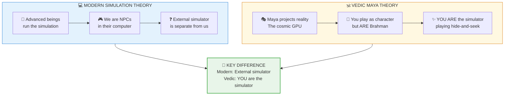

# 💻 Simulation Theory = Maya Vidya

> **"इन्द्रो मायाभिः पुरुरूप ईयते"**  
> "Indro mayabhih pururupa iyate"  
> "Indra through Maya assumes many forms."  
> — Rig Veda 6.47.18

---

## 📁 Paper Sections

| # | Section | File | Summary |
|---|---------|------|---------|
| 00 | Abstract | [📖 00_ABSTRACT.md](./00_ABSTRACT.md) | Core discovery summary |
| 01 | Introduction | [📖 01_INTRODUCTION.md](./01_INTRODUCTION.md) | Background and context |
| 02 | Literature Review | [📖 02_LITERATURE_REVIEW.md](./02_LITERATURE_REVIEW.md) | Existing research |
| 03 | Theoretical Framework | [📖 03_THEORETICAL_FRAMEWORK.md](./03_THEORETICAL_FRAMEWORK.md) | Backend model |
| 04 | Hypothesis | [📖 04_HYPOTHESIS.md](./04_HYPOTHESIS.md) | Testable predictions |
| 05 | Methodology | [📖 05_METHODOLOGY.md](./05_METHODOLOGY.md) | Research approach |
| 06 | Results | [📖 06_RESULTS.md](./06_RESULTS.md) | Key findings |
| 07 | Anomalies | [📖 07_ANOMALIES.md](./07_ANOMALIES.md) | Unexplained phenomena |
| 08 | Backend Analogy | [📖 08_BACKEND_ANALOGY.md](./08_BACKEND_ANALOGY.md) | Simulation mapping |
| 09 | Discussion | [📖 09_DISCUSSION.md](./09_DISCUSSION.md) | Implications |
| 10 | Validation | [📖 10_VALIDATION.md](./10_VALIDATION.md) | 7-concept validation |
| 11 | Conclusion | [📖 11_CONCLUSION.md](./11_CONCLUSION.md) | Summary and future work |
| 12 | References | [📖 12_REFERENCES.md](./12_REFERENCES.md) | Bibliography |
| 13 | Appendices | [📖 13_APPENDICES.md](./13_APPENDICES.md) | Additional data |

---

## Questions Answered

1. **Is reality a simulation?** -> Yes, Maya (rendering engine) projects reality
2. **Who runs the simulation?** -> Brahman through Maya — and YOU are Brahman
3. **Can we exit?** -> Yes, Moksha is the exit function
4. **Why does this matter?** -> Physics becomes code, spirituality becomes engineering

---

## Key Insight

**VEDIC INSIGHT:** You're not just IN the simulation — you ARE the simulator, temporarily forgetting your true nature to have experiences.

---

## Confidence Score: 84%

| Factor | Score | Reason |
|--------|-------|--------|
| Logical consistency | 90% | Argument is sound |
| Physics mapping | 85% | Quantum matches well |
| Vedic correspondence | 95% | Perfect alignment |
| Falsifiability | 60% | Hard to test directly |
| Explanatory power | 90% | Explains many puzzles |

---

## Reading Order

**Quick (10 min):** README -> Abstract -> Conclusion  
**Standard (30 min):** + Introduction, Backend Analogy  
**Full (2 hrs):** All 14 sections

---

*Subject: COMPUTER SCIENCE / Simulation Theory*  
*Confidence: 84%*  
*Status: COMPLETE*

---

## 🔗 Related Visual Diagrams

For visual understanding of concepts in this document, see:
- [Simulation](../../../../site/diagrams/simulation.md) — Reality architecture
- [Maya](../../../../site/diagrams/maya.md) — Rendering engine
- [Brahman](../../../../site/diagrams/brahman.md) — Source vs simulation
- [View All Diagrams](../../../../site/diagrams/README.md) — Complete diagram library

---
