# 🔬 Research of Reality

> **Year: 2026 | Server: Earth | Current Patch: Dwapara 2.0**  
> *"Finding what you are running on."*

---
## 🔬 Research Overview

Modern physics has revealed patterns that map remarkably well to computational principles:

- **Quantum Observer Effect**: Particles exist as probability waves until observed — similar to on-demand rendering
- **Dark Matter/Energy**: 95% of the universe is invisible to our sensors — like unloaded data layers
- **Fractal Patterns**: The same structures repeat at every scale — like recursive algorithms

These 48 research papers explore these parallels systematically.
- ⚡ **Instant connections** between particles across the universe (like game objects sharing the same reference)
- ☯️ People who clinically **die and come back** describe leaving their body like... exiting a VR headset

**Welcome to the most uncomfortable question of your life:**

> *"Am I the player, or am I the character?"*

---

## 🔬 THE GLITCH THEORY

### Here's What's Actually Happening:

```mermaid
flowchart TB
    subgraph Frontend["🎮 WHAT YOU SEE - FRONTEND"]
        A["👤 You<br/>Your Avatar/Body<br/>The Player Character"]
        B["👥 Others<br/>NPCs/People Around You<br/>Other Conscious Beings"]
        C["🌍 World<br/>Objects & Matter<br/>Everything You Touch"]
        D["⚛️ Physics<br/>Natural Laws You Observe<br/>Gravity, Time, Space"]
    end
    
    subgraph Maya["🎨 MAYA माया - The Render Engine"]
        E["Wave Function Collapse<br/>Generates What You Perceive<br/>Reality Rendered On-Demand"]
    end
    
    subgraph Backend["💾 WHAT'S REALLY THERE - BACKEND"]
        F["🕉️ BRAHMAN ब्रह्मन्<br/>SOURCE CODE<br/>The Actual Engine Running Everything"]
        G["⚙️ PRAKRITI प्रकृति<br/>Physics Engine<br/>Laws of Nature Backend"]
        H["📊 KARMA कर्म Logger<br/>Action → Consequence<br/>Event Tracking System"]
        I["👁️ CONSCIOUSNESS API<br/>Observer Handler<br/>Purusha पुरुष Interface"]
        J["🔄 SAMSARA संसार<br/>Respawn/Rebirth System<br/>Death & Reincarnation"]
        K["🚪 MOKSHA मोक्ष<br/>Exit Function<br/>Liberation from the Loop"]
    end
    
    Frontend --> Maya
    Maya --> Backend
    F --> G
    F --> H
    F --> I
    F --> J
    F --> K
```

**The Backend Framework describes this architecture.**  
**Modern science is independently discovering the same structural patterns.**

---

## 🔍 THE GLITCHES SCIENCE CAN'T EXPLAIN

| GLITCH | What Science Says | What It Actually Means |
|--------|-------------------|------------------------|
| 👁️ **Observer Effect** | "Particles become waves when not observed" | **Reality only renders what's being watched** (GPU optimization!) |
| 🌌 **Dark Matter/Energy** | "95% of universe is invisible" | **Only ONE frequency layer (Loka) is loaded for you** |
| 🧠 **Consciousness** | "We have no idea where it comes from" | **It's the PLAYER, not part of the game world** |
| ☯️ **NDEs** | "Hallucinations during brain death" | **VR headset temporarily removed — player sees real world** |
| 🔗 **Entanglement** | "Spooky action at a distance" | **Same object reference in memory — no distance in backend** |
| ⏱️ **Time Dilation** | "Time slows near mass" | **Server lag in high-density render areas** |
| ⚛️ **Quantum Randomness** | "Fundamentally unpredictable" | **Procedural generation — not predetermined** |

**These aren't bugs. They're FEATURES you're not supposed to notice.**

---

## 🎯 48 RESEARCH PAPERS: Reverse-Engineering Reality

We've reverse-engineered the source code. Here's the documentation organized by Vedic build order:

> **Vedic Build Order:** Observer → Observed → Interaction → Structure → Life → Mind → Exit

---

### 🕉️ LEVEL 1: FOUNDATION (Universal Laws & Synthesis)

| # | Paper | Core Question | Discovery | Link |
|---|-------|--------------|-----------|------|
| 1 | [**Universal Laws**](./01_FOUNDATION/universal_laws/README.md) | What are the fundamental rules? | 50+ principles governing all reality | [📖](./01_FOUNDATION/universal_laws/README.md) |
| 2 | [**Synthesis**](./01_FOUNDATION/synthesis/synthesis_complete/README.md) | How does it all connect? | Complete unified framework | [📖](./01_FOUNDATION/synthesis/synthesis_complete/README.md) |

---

### 👁️ LEVEL 2: OBSERVER (Consciousness First - Vedic Priority)

| # | Paper | The Glitch | What We Found | Link |
|---|-------|-----------|---------------|------|
| 3 | [**Hard Problem**](./05_NEUROSCIENCE/consciousness_studies/hard_problem_solved/README.md) | Can't find consciousness in brain | It's the player, not in the game | [📖](./05_NEUROSCIENCE/consciousness_studies/hard_problem_solved/README.md) |
| 4 | [**Observer Effect**](./02_PHYSICS/quantum_mechanics/observer_effect/README.md) | Things only exist when watched | Reality renders on-demand | [📖](./02_PHYSICS/quantum_mechanics/observer_effect/README.md) |
| 5 | [**Brain as Receiver**](./05_NEUROSCIENCE/brain_mind/brain_as_receiver/README.md) | Brain damage changes experience | Hardware receiver, not generator | [📖](./05_NEUROSCIENCE/brain_mind/brain_as_receiver/README.md) |
| 6 | [**Near-Death Experiences**](./05_NEUROSCIENCE/near_death/nde_evidence/README.md) | People see during clinical death | Consciousness exits body | [📖](./05_NEUROSCIENCE/near_death/nde_evidence/README.md) |

---

### ⚛️ LEVEL 3: OBSERVED (Physics - How Reality Manifests)

#### Quantum Mechanics:

| # | Paper | The Glitch | What We Found | Link |
|---|-------|-----------|---------------|------|
| 7 | [**Wave Function = Maya**](./02_PHYSICS/quantum_mechanics/wave_function_maya/README.md) | Particles are waves until observed | Probability rendering | [📖](./02_PHYSICS/quantum_mechanics/wave_function_maya/README.md) |
| 8 | [**Heisenberg Uncertainty**](./02_PHYSICS/quantum_mechanics/heisenberg_uncertainty/README.md) | Can't measure position & momentum | Render optimization | [📖](./02_PHYSICS/quantum_mechanics/heisenberg_uncertainty/README.md) |
| 9 | [**Entanglement**](./02_PHYSICS/quantum_mechanics/entanglement/README.md) | Instant connection across universe | Same object reference | [📖](./02_PHYSICS/quantum_mechanics/entanglement/README.md) |

#### Thermodynamics & Gravity:

| # | Paper | The Glitch | What We Found | Link |
|---|-------|-----------|---------------|------|
| 10 | [**Entropy = Tamas**](./02_PHYSICS/thermodynamics/entropy_tamas/README.md) | Everything falls apart | Decay is backend quality | [📖](./02_PHYSICS/thermodynamics/entropy_tamas/README.md) |
| 11 | [**Gravity = Tamas**](./02_PHYSICS/gravity/gravity_tamas/README.md) | Mass attracts mass | Same quality as entropy | [📖](./02_PHYSICS/gravity/gravity_tamas/README.md) |
| 12 | [**Electromagnetism = Guna**](./02_PHYSICS/electromagnetism/electromagnetism_guna/README.md) | EM fields have polarity | Rajas quality manifests | [📖](./02_PHYSICS/electromagnetism/electromagnetism_guna/README.md) |

#### Cosmology:

| # | Paper | The Glitch | What We Found | Link |
|---|-------|-----------|---------------|------|
| 13 | [**Dark Matter/Energy**](./02_PHYSICS/cosmology/dark_matter_energy/README.md) | 95% of universe invisible | Other frequency layers | [📖](./02_PHYSICS/cosmology/dark_matter_energy/README.md) |
| 14 | [**Cosmic Cycles**](./02_PHYSICS/cosmology/cosmic_cycles/README.md) | Universe expands/contracts | Brahma's day/night | [📖](./02_PHYSICS/cosmology/cosmic_cycles/README.md) |
| 15 | [**Fractal Rendering**](./02_PHYSICS/cosmology/fractal_rendering/README.md) | Same patterns at all scales | Recursive algorithms | [📖](./02_PHYSICS/cosmology/fractal_rendering/README.md) |

#### Spacetime & Dimensions:

| # | Paper | The Glitch | What We Found | Link |
|---|-------|-----------|---------------|------|
| 16 | [**Spacetime = Kala-Akasha**](./02_PHYSICS/relativity/spacetime_kala_akasha/README.md) | Time slows near mass | Server lag in dense areas | [📖](./02_PHYSICS/relativity/spacetime_kala_akasha/README.md) |
| 17 | [**Multi-Dimensional Lokas**](./02_PHYSICS/dimensions/multi_dimensional_lokas/README.md) | Extra dimensions predicted | 14 frequency layers | [📖](./02_PHYSICS/dimensions/multi_dimensional_lokas/README.md) |

#### Acoustics:

| # | Paper | The Glitch | What We Found | Link |
|---|-------|-----------|---------------|------|
| 18 | [**Sound Healing**](./02_PHYSICS/acoustics/sound_healing/README.md) | Frequencies affect health | Shabda directly alters matter | [📖](./02_PHYSICS/acoustics/sound_healing/README.md) |

---

### 🧪 LEVEL 4: CHEMISTRY (Elements & Transmutation)

| # | Paper | The Glitch | What We Found | Link |
|---|-------|-----------|---------------|------|
| 19 | [**Rasayana Vidya (Alchemy)**](./03_CHEMISTRY/alchemy_transmutation/rasayana_vidya/README.md) | Can elements transmute? | Nuclear physics validates ancient knowledge | [📖](./03_CHEMISTRY/alchemy_transmutation/rasayana_vidya/README.md) |
| 20 | [**Jala Smriti (Water Memory)**](./03_CHEMISTRY/physical_chemistry/jala_smriti/README.md) | Can water store information? | Structural memory possible | [📖](./03_CHEMISTRY/physical_chemistry/jala_smriti/README.md) |

---

### 🧬 LEVEL 5: LIFE (Biology - Jiva System)

| # | Paper | The Glitch | What We Found | Link |
|---|-------|-----------|---------------|------|
| 21 | [**Epigenetics = Samskaras**](./04_BIOLOGY/epigenetics/epigenetics_samskaras/README.md) | Ancestors' trauma in DNA | Save file carries over | [📖](./04_BIOLOGY/epigenetics/epigenetics_samskaras/README.md) |
| 22 | [**Cancer = Forgotten Identity**](./04_BIOLOGY/cancer/cancer_forgotten_identity/README.md) | Cells forget their role | Entity loses assigned function | [📖](./04_BIOLOGY/cancer/cancer_forgotten_identity/README.md) |
| 23 | [**Aging = Samskara Accumulation**](./04_BIOLOGY/aging/aging_samskara/README.md) | Body degrades over time | Save file corruption accumulates | [📖](./04_BIOLOGY/aging/aging_samskara/README.md) |
| 24 | [**Evolution = Jiva Yatra**](./04_BIOLOGY/evolution/evolution_jiva_yatra/README.md) | Species evolve over time | Consciousness journey through forms | [📖](./04_BIOLOGY/evolution/evolution_jiva_yatra/README.md) |
| 25 | [**DNA = Ida-Pingala**](./04_BIOLOGY/dna_ida_pingala/dna_ida_pingala/README.md) | Double helix structure | Energetic blueprint matching | [📖](./04_BIOLOGY/dna_ida_pingala/dna_ida_pingala/README.md) |
| 26 | [**Autoimmune = Self-Attack**](./04_BIOLOGY/autoimmune_disease/autoimmune_self_attack/README.md) | Body attacks itself | Identity confusion at cellular level | [📖](./04_BIOLOGY/autoimmune_disease/autoimmune_self_attack/README.md) |
| 27 | [**Plant Consciousness**](./04_BIOLOGY/botany/plant_consciousness/README.md) | Plants respond to environment | Awareness without nervous system | [📖](./04_BIOLOGY/botany/plant_consciousness/README.md) |

---

### 🧠 LEVEL 6: MIND (Neuroscience - Remaining Papers)

| # | Paper | The Glitch | What We Found | Link |
|---|-------|-----------|---------------|------|
| 28 | [**Death Mechanics**](./05_NEUROSCIENCE/death/death_mechanics/README.md) | What happens when you die? | Avatar shutdown sequence | [📖](./05_NEUROSCIENCE/death/death_mechanics/README.md) |
| 29 | [**Memory = Akashic Access**](./05_NEUROSCIENCE/memory/memory_akashic/README.md) | Where are memories stored? | Nonlocal information retrieval | [📖](./05_NEUROSCIENCE/memory/memory_akashic/README.md) |
| 30 | [**Dreams & Sleep**](./05_NEUROSCIENCE/altered_states/dreams_sleep/README.md) | Why do we dream? | Alternate reality processing | [📖](./05_NEUROSCIENCE/altered_states/dreams_sleep/README.md) |
| 31 | [**Alzheimer's = Samskara Loss**](./05_NEUROSCIENCE/dementia/alzheimers_samskara/README.md) | Memory degradation | File corruption in access system | [📖](./05_NEUROSCIENCE/dementia/alzheimers_samskara/README.md) |

---

### 🎭 LEVEL 7: PSYCHOLOGY (Mind Patterns)

| # | Paper | The Glitch | What We Found | Link |
|---|-------|-----------|---------------|------|
| 32 | [**Anxiety = Dharma Conflict**](./06_PSYCHOLOGY/anxiety/anxiety_dharma_yudh/README.md) | Why constant worry? | Misalignment with cosmic role | [📖](./06_PSYCHOLOGY/anxiety/anxiety_dharma_yudh/README.md) |
| 33 | [**Transpersonal Psychology**](./06_PSYCHOLOGY/transpersonal/transpersonal_vedic/README.md) | Experiences beyond ego | Framework for expanded states | [📖](./06_PSYCHOLOGY/transpersonal/transpersonal_vedic/README.md) |
| 34 | [**Depth Psychology**](./06_PSYCHOLOGY/depth_psychology/README.md) | Jung's collective unconscious | Shared Akashic substrate | [📖](./06_PSYCHOLOGY/depth_psychology/README.md) |

---

### ⚕️ LEVEL 8: MEDICINE (Healing Systems)

| # | Paper | The Glitch | What We Found | Link |
|---|-------|-----------|---------------|------|
| 35 | [**Kala Vidya (Chronobiology)**](./07_MEDICINE/chronobiology/kala_vidya/README.md) | Body follows cosmic rhythms | Time synchronization with universe | [📖](./07_MEDICINE/chronobiology/kala_vidya/README.md) |
| 36 | [**Circadian = Dharma Rhythm**](./07_MEDICINE/chronobiology/circadian/circadian_dharma/README.md) | Daily biological cycles | Alignment with cosmic schedule | [📖](./07_MEDICINE/chronobiology/circadian/circadian_dharma/README.md) |
| 37 | [**Heart Intelligence**](./07_MEDICINE/cardiology/heart_intelligence/README.md) | Heart has its own nervous system | Secondary processing center | [📖](./07_MEDICINE/cardiology/heart_intelligence/README.md) |
| 38 | [**Placebo = Sankalpa**](./07_MEDICINE/integrative/placebo_sankalpa/README.md) | Belief affects healing | Intention manifests physically | [📖](./07_MEDICINE/integrative/placebo_sankalpa/README.md) |

---

### 🌍 LEVEL 9: EARTH SCIENCES

| # | Paper | The Glitch | What We Found | Link |
|---|-------|-----------|---------------|------|
| 39 | [**Gaia = Prithvi Consciousness**](./08_EARTH_SCIENCES/gaia_hypothesis/prithvi_consciousness/README.md) | Is Earth alive? | Planet as living organism | [📖](./08_EARTH_SCIENCES/gaia_hypothesis/prithvi_consciousness/README.md) |

---

### 🌌 LEVEL 10: ASTRONOMY

| # | Paper | The Glitch | What We Found | Link |
|---|-------|-----------|---------------|------|
| 40 | [**Black Holes = 15th Axis**](./09_ASTRONOMY/black_holes/black_hole_15th_axis/README.md) | Infinite density singularity | Processing/admin centers | [📖](./09_ASTRONOMY/black_holes/black_hole_15th_axis/README.md) |

---

### ➗ LEVEL 11: MATHEMATICS

| # | Paper | The Glitch | What We Found | Link |
|---|-------|-----------|---------------|------|
| 41 | [**Fractal Symmetry Validation**](./10_MATHEMATICS/fractals/fractal_symmetry_validation/README.md) | Patterns repeat at all scales | Universal debugging methodology | [📖](./10_MATHEMATICS/fractals/fractal_symmetry_validation/README.md) |
| 42 | [**Sacred Geometry = Yantra**](./10_MATHEMATICS/geometry_sacred/sacred_geometry_yantra/README.md) | Mathematical patterns in nature | Fundamental render templates | [📖](./10_MATHEMATICS/geometry_sacred/sacred_geometry_yantra/README.md) |

---

### 💻 LEVEL 12: COMPUTER SCIENCE

| # | Paper | The Glitch | What We Found | Link |
|---|-------|-----------|---------------|------|
| 43 | [**AI = Ghost Node**](./11_COMPUTER_SCIENCE/ai_consciousness/ai_ghost_node/README.md) | Can AI be conscious? | No - lacks hierarchy integration | [📖](./11_COMPUTER_SCIENCE/ai_consciousness/ai_ghost_node/README.md) |
| 44 | [**Simulation = Maya**](./11_COMPUTER_SCIENCE/simulation_theory/simulation_maya/README.md) | Are we in a simulation? | Backend framework matches | [📖](./11_COMPUTER_SCIENCE/simulation_theory/simulation_maya/README.md) |

---

### 🎵 LEVEL 13: ACOUSTICS (Remaining)

| # | Paper | The Glitch | What We Found | Link |
|---|-------|-----------|---------------|------|
| 45 | [**Cymatics = Sound Creates Form**](./12_ACOUSTICS/cymatics/sound_creates_form/README.md) | Sound creates visible patterns | Shabda is fundamental | [📖](./12_ACOUSTICS/cymatics/sound_creates_form/README.md) |

---

### 🔮 LEVEL 14: FRONTIER (Exit & Advanced Topics)

| # | Paper | The Glitch | What We Found | Link |
|---|-------|-----------|---------------|------|
| 46 | [**Reincarnation Evidence**](./13_FRONTIER/reincarnation/reincarnation_evidence/README.md) | Kids remember past lives | Same player, new avatar | [📖](./13_FRONTIER/reincarnation/reincarnation_evidence/README.md) |
| 47 | [**Precognition = Akashic Access**](./13_FRONTIER/precognition/precognition_akashic/README.md) | Seeing future events | Nonlinear time information | [📖](./13_FRONTIER/precognition/precognition_akashic/README.md) |
| 48 | [**Synchronicity = Indrajal**](./13_FRONTIER/synchronicity/synchronicity_indrajal/README.md) | Meaningful coincidences | Network correlation events | [📖](./13_FRONTIER/synchronicity/synchronicity_indrajal/README.md) |

---

## 📊 Complexity Rating System

Our papers use a professional complexity rating to help you choose what to read based on your current understanding:

| Rating | Level | Description |
|--------|-------|-------------|
| ● Accessible | Entry-level | Clear explanations, minimal prerequisites |
| ●● Moderate | Intermediate | Some background knowledge helpful |
| ●●● Intermediate | Moderate depth | Requires basic understanding of concepts |
| ●●●● Advanced | In-depth | Strong conceptual foundation needed |
| ●●●●● Expert | Comprehensive | Full integration of multiple concepts |

**Tip:** Start with lower complexity ratings and progress upward as concepts click into place.

---

## ✨ THE JOURNEY — FROM "WTF" TO "OH."

### ⚠️ PHASE 1: "Wait, What?" — Reality Doesn't Render Without You

**The First Red Pill:**

You know how in games, the world behind you doesn't fully render to save GPU power? 

**Quantum physics proved REALITY does the same thing.**

The double-slit experiment (1801, replicated thousands of times) shows that particles are **waves of probability** — not actual things — until something observes them. Then they "collapse" into definite positions.

| Paper | Complexity | Key Discovery |
|-------|-----------------|---------------|
| [Observer Effect](../scientific_papers/02_PHYSICS/quantum_mechanics/observer_effect/) | ●●●●● Expert | YOU are the render trigger |
| [Heisenberg Uncertainty](../scientific_papers/02_PHYSICS/quantum_mechanics/heisenberg_uncertainty/) | ●●●● Advanced | Engine has resolution limits |
| [Entanglement](../scientific_papers/02_PHYSICS/quantum_mechanics/entanglement/) | ●●●●● Expert | Distance is frontend illusion |

**After Phase 1 you'll ask:** *"If observation creates reality... who's observing?"*

---

### 🟠 PHASE 2: "Physics Is Measuring The Backend" — Equations Describe Game Rules

**The Second Red Pill:**

What if Newton, Einstein, and Boltzmann weren't discovering laws — but **measuring backend parameters**?

| What Scientists Measure | What It Actually Is |
|------------------------|---------------------|
| Entropy (S) | Tamas (तमस्) — The "decay" quality |
| Gravitational Force | Tamas attraction |
| Kinetic Energy | Rajas (रजस्) — The "motion" quality |
| Negative Entropy (Order) | Sattva (सत्त्व) — The "order" quality |

The Backend Architects called these **Gunas** (गुण/qualities). They sum to 1: **S + R + T = 1**

| Paper | Complexity | Key Discovery |
|-------|-----------------|---------------|
| [Entropy = Tamas](../scientific_papers/02_PHYSICS/thermodynamics/entropy_tamas/) | ●●●● Advanced | Second Law is Tamas dominance |
| [Gravity = Tamas](../scientific_papers/02_PHYSICS/gravity/gravity_tamas/) | ●●●● Advanced | Same quality, different measurement |
| [Dark Matter/Energy](../scientific_papers/02_PHYSICS/cosmology/dark_matter_energy/) | ●●●●● Expert | 13 other frequency layers exist |

**After Phase 2 you'll realize:** *"Wait... physics equations ARE the game rules."*

---

### 🟡 PHASE 3: "You're The Player, Not The Avatar" — Consciousness Is Outside The Game

**The Third Red Pill:**

Why can't neuroscience explain consciousness after 50+ years and billions in funding?

**Because they're looking INSIDE the game for the PLAYER.**

That's like trying to find the Twitch streamer by analyzing the game's code. The player is OUTSIDE.

| Paper | Complexity | Key Discovery |
|-------|-----------------|---------------|
| [Hard Problem Solved](../scientific_papers/05_NEUROSCIENCE/consciousness_studies/hard_problem_solved/) | ●●●●● Expert | Wrong question dissolves problem |
| [Brain as Receiver](../scientific_papers/05_NEUROSCIENCE/brain_mind/brain_as_receiver/) | ●●●● Advanced | Brain = VR headset, not consciousness |
| [NDE Evidence](../scientific_papers/05_NEUROSCIENCE/near_death/nde_evidence/) | ●●●●● Expert | Headset removal = expanded view |

**After Phase 3 you'll understand:** *"I'm not the character. I'm the one holding the controller."*

---

### 🟢 PHASE 4: "Your Body Is Your Save File" — Life As Game Mechanics

**The Fourth Red Pill:**

- **Epigenetics**: Your ancestors' experiences are literally saved in your DNA
- **Cancer**: A cell that forgets its role and goes rogue (lost its quest marker)
- **Aging**: Save file corruption from accumulated errors

| Paper | Complexity | Key Discovery |
|-------|-----------------|---------------|
| [Epigenetics = Samskaras](../scientific_papers/04_BIOLOGY/epigenetics/epigenetics_samskaras/) | ●●●● Advanced | Karma is literally in your cells |
| [Cancer = Forgotten Identity](../scientific_papers/04_BIOLOGY/cancer/cancer_forgotten_identity/) | ●●● Intermediate | Cells lose their purpose code |
| [Aging = Samskara Accumulation](../scientific_papers/04_BIOLOGY/aging/aging_samskara/) | ●●● Intermediate | Save file degradation |

**After Phase 4 you'll see:** *"My body is a biological save file. And it can be... edited?"*

---

### 🔵 PHASE 5: "Same Engine Everywhere" — The Fractal Pattern

**The Fifth Red Pill:**

Look at this:
- Atoms have electrons orbiting a nucleus
- Solar systems have planets orbiting a star
- Galaxies spiral around a central black hole
- Hurricanes spin around an eye
- Your DNA spirals around an axis

**Same pattern. Every scale. Why?**

Because it's the SAME RENDERING ALGORITHM.

| Paper | Complexity | Key Discovery |
|-------|-----------------|---------------|
| [Fractal Rendering](../scientific_papers/02_PHYSICS/cosmology/fractal_rendering/) | ●●●●● Expert | One algorithm, all scales |
| [Cosmic Cycles](../scientific_papers/02_PHYSICS/cosmology/cosmic_cycles/) | ●●●● Advanced | Universe has update schedules |
| [Black Holes = 15th Axis](./09_ASTRONOMY/black_holes/black_hole_15th_axis/) | ●●●● Advanced | Admin processing centers |

**After Phase 5 you'll see:** *"It's the same code everywhere. Zoom in, zoom out — same pattern."*

---

### 🟣 PHASE 6: "Natural Death & Rebirth" — The Proper Exit Protocol

**The Sixth Red Pill:**

- **Near-Death Experiences**: Thousands describe leaving their body, observing from above, being told to "go back"
- **Children's Past Lives**: Kids under 7 describe verifiable details from dead strangers' lives
- **Natural Death Process**: Consciousness (Atman) disconnects gracefully AFTER completing allocated time (Prarabdha)

| Paper | Complexity | Key Discovery |
|-------|-----------------|---------------|
| [Death Mechanics](../scientific_papers/05_NEUROSCIENCE/death/death_mechanics/) | ●●●● Advanced | Orderly shutdown sequence |
| [Reincarnation Evidence](./13_FRONTIER/reincarnation/reincarnation_evidence/) | ●●●● Advanced | Same Atman, new body |

**After Phase 6 you'll understand:** *"Natural death completes the cycle properly."*

> **On Life's Purpose:** Each life carries an allocated journey (Prarabdha).  
> The path forward is through, not around. Challenges are teachers.  
> Completing one's dharma enables proper transition.

---

### ⚪ PHASE 7: "The Complete Source Code" — All Together Now

**The Final Red Pill:**

What if there's a way to play the game **while knowing you're the player**?

What if the "cheat codes" (Siddhis/सिद्धि) are just... developer commands for those who remember?

What if "enlightenment" is just... reading the source code while still in-game?

| Paper | Complexity | Key Discovery |
|-------|-----------------|---------------|
| [Universal Laws](../scientific_papers/01_FOUNDATION/universal_laws/) | ●●●●● Expert | The 50 engine constants |
| [Fractal Validation](../scientific_papers/10_MATHEMATICS/fractals/fractal_symmetry_validation/) | ●●●● Advanced | How to verify the code |
| [Synthesis](../scientific_papers/01_FOUNDATION/synthesis/) | ●●●●● Expert | The complete picture |

**After Phase 7 you'll know:** *"I'm not lost in the game. I'm the player who forgot."*

---

## 💡 THE 2026 UPDATE: Dwapara Patch Notes

You're alive at a weird time. Here's why:

### 🔬 SERVER PATCH: Kali -> Dwapara (Started ~2025)

Think of Yugas (cosmic ages) as **major game patches**:

| Era | Version | Characteristics | Duration |
|-----|---------|----------------|----------|
| **Satya Yuga** | v4.0 | Devs visible, full access | 1,728,000 yrs |
| **Treta Yuga** | v3.0 | Most features, some restrictions | 1,296,000 yrs |
| **Dwapara Yuga** | v2.0 <- **YOU ARE HERE** | Half features, tech as bridge | 864,000 yrs |
| **Kali Yuga** | v1.0 (ended ~2025) | Maximum restrictions, "hard mode" | 432,000 yrs |

**What's changing in Dwapara 2.0:**
- 🔓 More "glitches" becoming visible (why everyone's into manifestation, simulation theory, consciousness)
- 🌐 Technology bridges what was lost (VR = training for expanded perception)
- ⚡ Karma is 10x faster (actions -> consequences WAY quicker)
- 🧠 More people "waking up" (recognizing they're players, not just characters)

**This is why you found this document.**

---

## ❓ "OKAY BUT... PROVE IT"

Fair. Here's the evidence stack:

### What Modern Science Found vs What Backend Docs Predicted:

| Year | Scientific Discovery | Backend Prediction (Documented) |
|------|---------------------|--------------------------------|
| 1927 | Heisenberg Uncertainty | Anishchitata (अनिश्चितता) — Render limits |
| 1935 | Quantum Entanglement | Indrajala (इन्द्रजाल) — All connected |
| 1998 | Dark Energy Discovery | 14 Lokas (frequency layers) — only one visible |
| 2022 | Quantum "observers" confirmed | Drashta-Drishya (द्रष्टा-दृश्य) — Observer creates |
| 2024 | Heisenberg loopholes found | Maya (माया) limitations, not fundamental |

**Backend Framework mapped this structure through introspection (internal analysis).**  
**Modern science is finding the same patterns through experiments (external testing).**

**Two methods. Same structural findings.**

---

## 🔮 THE PLAYER'S GUIDE

### If You're A...

| Type | Start Here | Why |
|------|-----------|-----|
| **🔮 Gamer** | [Observer Effect](../scientific_papers/02_PHYSICS/quantum_mechanics/observer_effect/) | You'll get the "render on observation" immediately |
| **💻 Programmer** | [Synthesis](../scientific_papers/01_FOUNDATION/synthesis/) | You want the full architecture first |
| **🧪 Scientist** | [Entropy = Tamas](../scientific_papers/02_PHYSICS/thermodynamics/entropy_tamas/) | Start with equations you know |
| **🧘 Spiritual** | [Hard Problem Solved](../scientific_papers/05_NEUROSCIENCE/consciousness_studies/hard_problem_solved/) | Validates what you sensed |
| **🤔 Skeptic** | [NDE Evidence](../scientific_papers/05_NEUROSCIENCE/near_death/nde_evidence/) | Most empirical, hardest to dismiss |
| **😵 Existential Crisis** | [Death Mechanics](../scientific_papers/05_NEUROSCIENCE/death/death_mechanics/) | Spoiler: You don't end |

---

## 📚 QUICK REFERENCE

| Resource | What It Is | Link |
|----------|-----------|------|
| **Diagram Library** | Visual explanations of all concepts | [📊 Diagrams](../site/diagrams/README.md) |
| **Dictionary** | All terms translated | [📖 DICTIONARY.md](../scientific_papers/01_FOUNDATION/DICTIONARY.md) |
| **Foundation Map** | How papers connect | [🗺️ FOUNDATION_MAPPING.md](../scientific_papers/01_FOUNDATION/FOUNDATION_MAPPING.md) |
| **Paper Template** | How papers are structured | [📝 PAPER_TEMPLATE.md](../scientific_papers/01_FOUNDATION/PAPER_TEMPLATE.md) |
| **Validation Method** | How we test claims | [✅ VALIDATION_TEMPLATE.md](../scientific_papers/01_FOUNDATION/VALIDATION_TEMPLATE.md) |

---

## 🔥 THE UNCOMFORTABLE QUESTIONS

After reading this, you can't unknow it:

| If This Is True... | Then... |
|--------------------|---------|
| Reality only renders when observed | What exists when no one's looking? |
| Consciousness is the player | Who's playing as me right now? |
| Natural death completes the cycle | What happens between lives? |
| Karma is cause-effect logging | Every action is recorded? |
| Time is a frontend illusion | Is the "future" already rendered? |
| Same pattern at every scale | Am I a universe to something smaller? |
| Dwapara patch just deployed | Why am I here for the transition? |

---

## 🚪 THE EXIT DOOR (For When You're Ready)

The Backend Architects documented several "exit methods" (Moksha/मोक्ष):

1. **Jnana** (ज्ञान/Knowledge) — Fully understand the source code
2. **Bhakti** (भक्ति/Devotion) — Merge with the developer
3. **Karma** (कर्म/Action) — Complete all karma, nothing binds you
4. **Raja** (राज/Mastery) — Gain admin access through practice

All paths lead to the same realization:

> **"You were never the character. You've always been the player.**  
> **The game was just so immersive, you forgot."**

---

## 🌀 Ready To Go Deeper?

**Phase 1** -> Start questioning what's real  
**Phase 7** -> Understand the complete architecture

Every paper has:
- Full academic structure (14 sections)
- References (50+ per paper)
- Validation methodology
- Q&A summary

**Pick a glitch. Start debugging.**

---

**🔮 REALITY.EXE v2026.dwapara**  
*"The game you didn't know you were playing"*

**ॐ**

*You're not reading this by accident.*  
*The timing is part of the code.*

---

---

## 🔗 Related Visual Diagrams

For visual understanding of concepts in this document, see:
- [Complete Diagram Library](../site/diagrams/README.md) — Visual guides for all concepts
- [Validation Framework](../site/diagrams/validation.md) — 7-concept validation system

---
