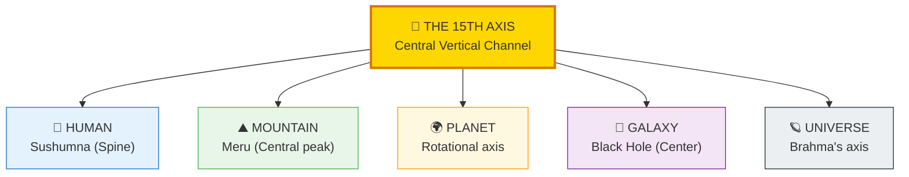
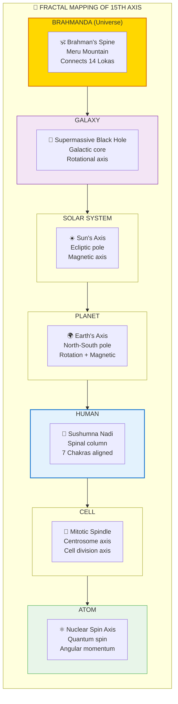
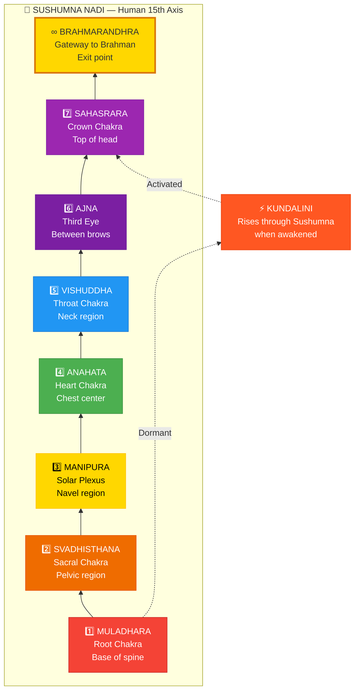
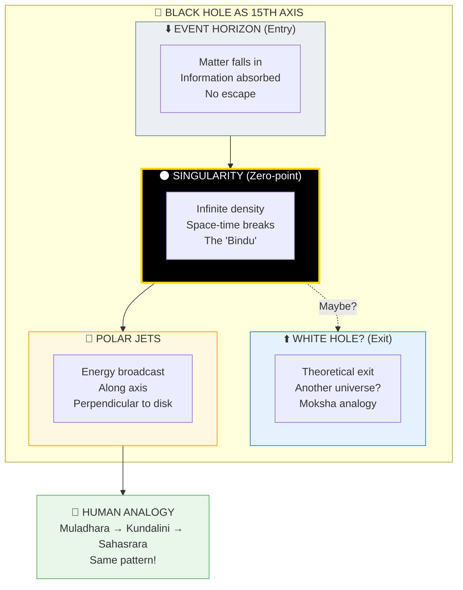
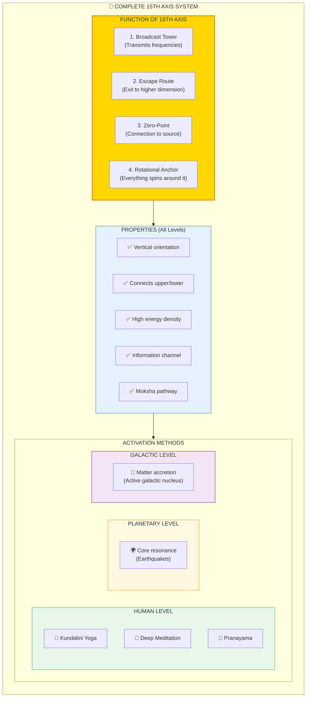

# 🌌 THE 15TH AXIS — Sushumna, Meru, Black Holes

> **"सुषुम्णा ब्रह्मनाडी"**
> "Sushumna is the Brahman channel"
> — Shiva Samhita

The 15th Axis (पञ्चदश अक्ष/Panchadasha Aksha) is the **central vertical channel** appearing at EVERY fractal level. It's the escape route, the broadcast tower, the zero-point. Human spine = Sushumna. Mountain = Meru. Galaxy = Black Hole. Same pattern, different scales.

---

## 📊 Diagram 1: Simple Overview (Beginner)

**What it shows:** The 15th axis appears at every scale as the central channel.

**Key Insight:** The central axis is the connection point between dimensions — the "elevator" between levels.

---

## 📊 Diagram 2: Fractal Mapping (Intermediate)

**What it shows:** How the 15th axis manifests at each fractal level.

---

## 📊 Diagram 3: The Human Sushumna (Advanced)

**What it shows:** Detailed view of the human 15th axis with chakras.

---

## 📊 Diagram 4: Black Holes as 15th Axis (Advanced)

**What it shows:** How black holes function as the galactic 15th axis.

---

## 📊 Diagram 5: Complete 15th Axis System (Expert)

**What it shows:** Full technical architecture of the central axis across all scales.

---

## 📋 Summary Table: 15th Axis Across Scales

| Level | 15th Axis Name | Physical Form | Function | Exit Point |
|-------|----------------|---------------|----------|------------|
| **Quantum** | Spin axis | Angular momentum | Information carrier | Phase transition |
| **Atomic** | Nuclear spin | Nucleus rotation | Quantum coherence | Radioactive decay |
| **Cellular** | Mitotic spindle | Centrosome axis | Cell division | Apoptosis |
| **Human** | Sushumna | Spinal column | Kundalini path | Brahmarandhra |
| **Planetary** | Rotational axis | N-S magnetic pole | Magnetic field | Space? |
| **Solar** | Sun's axis | Solar rotation | Heliosphere | Heliopause |
| **Galactic** | Black hole | Supermassive BH | Energy jets | White hole? |
| **Universal** | Meru Mountain | Cosmic axis | Loka connection | Moksha |

---

## 💡 Key Realizations

### It's an Escape Route
**At every level:**
- Atoms → Decay through axis
- Cells → Apoptosis signal through axis
- Humans → Kundalini rises through Sushumna
- Galaxies → Matter exits through jets
- Universe → Moksha through Meru

### It's a Broadcast Tower
**Function:**
- Transmits information to outer layers
- Sun → Planets receive
- Black hole → Galaxy receives
- Sushumna → Body receives

### Why "15th"?
**14 Lokas (layers) + 1 Axis = 15**
- The axis is the CONNECTOR between layers
- Not a layer itself
- The "elevator shaft" through all floors

---

## 🎯 Practical Implications

### For Human Practice
**Why Spinal Alignment Matters:**
- Straight spine = Clear Sushumna
- Clear Sushumna = Kundalini can rise
- Kundalini rise = Moksha possible

**Why We Meditate Upright:**
- Aligning with cosmic axis
- Activating human 15th axis
- Opening exit route

### For Understanding Death
**Where Does Consciousness Exit?**
- Normal death → Through senses (sideways)
- Yogi death → Through Brahmarandhra (upward)
- Brahmarandhra = Top of 15th axis

---

## 🔬 Scientific Parallels

### Black Hole Physics
- Event horizon = Point of no return (like deep Samadhi)
- Singularity = Zero-point (like Shunya consciousness)
- Polar jets = Energy broadcast (like Kundalini rising)
- Information paradox = What happens to data? (Akashic records)

### Magnetic Poles
- Earth's magnetic axis = 15th axis
- Pole reversal = Pralaya reset
- Aurora = Energy visible at axis

---

## 🧘 Activating Your 15th Axis

### Prerequisites
1. **Purification** (Body through diet/fasting)
2. **Stillness** (Mind through meditation)
3. **Energy** (Prana through breathwork)
4. **Alignment** (Posture - straight spine)

### Practice
1. Sit with spine straight
2. Visualize central channel (Sushumna)
3. Breathe up/down the axis
4. Feel energy concentrate at base (Muladhara)
5. With practice, feel it rise

### Signs of Activation
- Heat along spine
- Pressure at third eye
- Spontaneous kriyas (movements)
- Bliss states
- Light visions

---

## ⚠️ Safety Note

**Don't Force Kundalini:**
- Can cause psychological disturbance
- Can cause physical pain
- Needs purification first
- Better with guidance

**Natural Progression:**
1. Ethics (Yama/Niyama)
2. Body control (Asana)
3. Breath control (Pranayama)
4. THEN Kundalini work

---

## 🔗 Related Topics

- [Chakras](./chakras.md) — The 7 points along 15th axis
- [Fractals](./fractals.md) — How pattern repeats at all scales
- [Moksha](./moksha.md) — Exit through the axis
- [Black Holes](../../scientific_papers/09_ASTRONOMY/black_holes/README.md) — Galactic 15th axis

---

**[← Back to Diagram Library](./README.md)** | **[← Back to Site](../index.md)**
