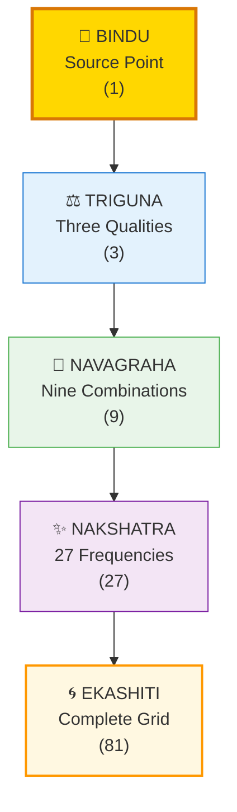
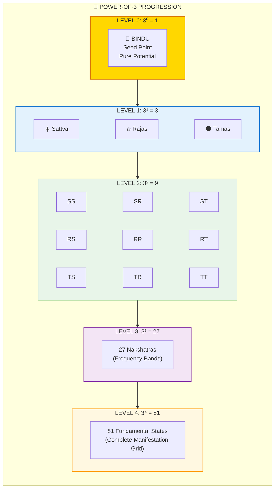
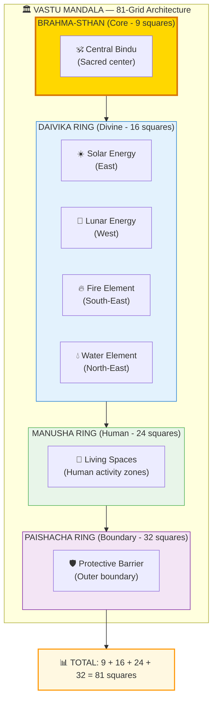
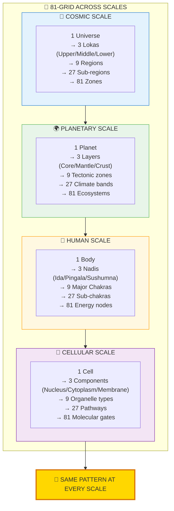
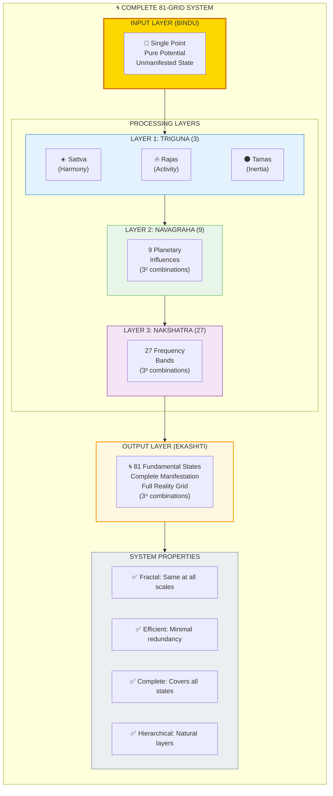

# 🌀 81-GRID — The Universal Fractal Pattern (3⁴ = 81)

> **"ॐ पूर्णमदः पूर्णमिदं पूर्णात् पूर्णमुदच्यते"**
> "That is whole, this is whole. From the whole, the whole manifests."
> — Isha Upanishad (Invocation)

The 81-Grid (एकाशीति-पद/Ekashiti-Pada) is the fundamental fractal pattern found at ALL scales of reality. Based on the progression **1 → 3 → 9 → 27 → 81** (powers of 3), this pattern appears in your body, buildings, planets, and galaxies.

---

## 📊 Diagram 1: Simple Overview (Beginner)

**What it shows:** The basic 3× progression from source to full manifestation.

**Key Insight:** Every complex system in nature follows this 3× expansion pattern — from a single seed to full bloom.

---

## 📊 Diagram 2: The Power-of-3 Progression (Intermediate)

**What it shows:** How each level multiplies by 3, creating the complete 81-grid structure.

---

## 📊 Diagram 3: Vastu Mandala Structure (Intermediate)

**What it shows:** The 81-grid as used in Vastu architecture — the ancient building science.

---

## 📊 Diagram 4: Fractal Application Across Scales (Advanced)

**What it shows:** The same 81-grid pattern appearing at different scales of reality.

---

## 📊 Diagram 5: Complete 81-Grid System (Expert)

**What it shows:** Full technical breakdown of the 81-grid as a computational architecture.

---

## 📋 Summary Table

| Level | Name | Count | Represents | Formula |
|-------|------|-------|------------|---------|
| **0** | Bindu | 1 | Source point | 3⁰ |
| **1** | Triguna | 3 | Three qualities | 3¹ |
| **2** | Navagraha | 9 | Nine combinations | 3² |
| **3** | Nakshatra | 27 | Frequency bands | 3³ |
| **4** | Ekashiti | 81 | Complete grid | 3⁴ |

**Total States:** 1 + 3 + 9 + 27 + 81 = **121 discrete states per fractal level**

---

## 🏛️ Vastu Architecture Breakdown

| Ring | Name | Squares | Represents | Energy |
|------|------|---------|------------|--------|
| **Core** | Brahma-Sthan | 9 | Sacred center | Pure consciousness |
| **Ring 1** | Daivika | 16 | Divine forces | Cosmic energies |
| **Ring 2** | Manusha | 24 | Human activity | Life functions |
| **Ring 3** | Paishacha | 32 | Boundary | Protection |

**Total:** 9 + 16 + 24 + 32 = **81 squares**

---

## 🌍 Where You See This Pattern

### In Nature
- **Trees:** 1 trunk → 3 main branches → 9 sub-branches → 27 twigs → 81+ leaves
- **Rivers:** Source → 3 main tributaries → 9 streams → 27 channels → 81 micro-flows
- **Lightning:** Single bolt → 3 main forks → 9 branches → continues fractally

### In Human Body
- **Energy System:** 1 spine → 3 nadis → 9 chakras → 27 sub-chakras → 81 nodes → 72,000 nadis
- **Nervous System:** Brain → 3 main divisions → 9 regions → 27 nuclei → 81+ sub-regions
- **DNA:** Single double-helix → 3 base-pair types → 9 codon patterns → continues fractally

### In Architecture
- **Temples:** Central shrine → 3 main halls → 9 chambers → 27 niches → 81-grid mandala
- **Cities:** Core → 3 districts → 9 zones → 27 neighborhoods → continues fractally
- **Homes:** Vastu 81-grid for optimal energy flow

---

## 🔗 Related Topics

- [Gunas](./gunas.md) — The three fundamental qualities
- [Fractals](./fractals.md) — Scale-invariant patterns
- [Nadis](./nadis.md) — Energy channels (3 → 72,000)
- [Chakras](./chakras.md) — Energy centers (9 major)

---

**[← Back to Diagram Library](./README.md)** | **[← Back to Site](../index.md)**
