# ☁️ AKASHA — Universal Information Field

> **"आकाशात् वायुः वायोर् अग्निः"**
> "From Akasha came Vayu, from Vayu came Agni"
> — Taittiriya Upanishad

Akasha (आकाश/Space) is the **first and subtlest element** — the universal information field from which all other elements emerge. It's not empty space; it's the **storage medium** of the cosmos where all information is recorded eternally.

---

## 📊 Diagram 1: Simple Overview (Beginner)

**What it shows:** Akasha as the field containing all information.

**Key Insight:** Nothing is ever lost. Every thought, action, and event is recorded in Akasha permanently.

---

## 📊 Diagram 2: Akasha as First Element (Intermediate)

**What it shows:** How Akasha is the source of all other elements.

```mermaid
flowchart TD
    subgraph ElementChain["☁️ AKASHA → ALL ELEMENTS"]
        direction TD
        
        Ak["1️⃣ AKASHA आकाश<br/>Space/Ether<br/>(Pure potential)"]
        
        Va["2️⃣ VAYU वायु<br/>Air/Motion<br/>(First movement)"]
        
        Ag["3️⃣ AGNI अग्नि<br/>Fire/Energy<br/>(First transformation)"]
        
        Ja["4️⃣ JALA जल<br/>Water/Flow<br/>(First cohesion)"]
        
        Pr["5️⃣ PRITHVI पृथ्वी<br/>Earth/Solid<br/>(First form)"]
    end
    
    Ak --> Va --> Ag --> Ja --> Pr
    
    Dissolve["🔄 DISSOLUTION: Reverse order<br/>Earth → Water → Fire → Air → Akasha"]
    
    Pr -.-> Dissolve
    
    style Ak fill:#ECEFF1,stroke:#78909C,stroke-width:2px
    style Va fill:#E3F2FD,stroke:#64B5F6
    style Ag fill:#FFEBEE,stroke:#E57373
    style Ja fill:#E0F7FA,stroke:#4DD0E1
    style Pr fill:#EFEBE9,stroke:#8D6E63
    style Dissolve fill:#FFF8E1,stroke:#FF9800
```

---

## 📊 Diagram 3: Akashic Records Structure (Advanced)

**What it shows:** How information is organized in the Akashic field.

```mermaid
flowchart TD
    subgraph AkashicRecords["📚 AKASHIC RECORDS STRUCTURE"]
        direction TB
        
        subgraph Individual["👤 INDIVIDUAL RECORDS"]
            I1["Soul history (all lives)"]
            I2["Karma ledger"]
            I3["Samskara patterns"]
            I4["Life purpose data"]
        end
        
        subgraph Collective["👥 COLLECTIVE RECORDS"]
            C1["Species memory"]
            C2["Cultural archetypes"]
            C3["Planetary events"]
            C4["Civilization data"]
        end
        
        subgraph Universal["🌌 UNIVERSAL RECORDS"]
            U1["Cosmic laws (Rta)"]
            U2["Dharma patterns"]
            U3["Timeline branches"]
            U4["Creation blueprints"]
        end
    end
    
    Individual --> Collective --> Universal
    
    Access["🔑 ACCESS METHODS:<br/>Deep meditation, Trance,<br/>Intuition, Dreams"]
    
    Individual -.-> Access
    
    style Individual fill:#E3F2FD,stroke:#1976D2
    style Collective fill:#E8F5E9,stroke:#4CAF50
    style Universal fill:#FFF8E1,stroke:#FF9800
    style Access fill:#F3E5F5,stroke:#7B1FA2
```

---

## 📊 Diagram 4: How Akasha Works (Advanced)

**What it shows:** Technical mechanism of information storage and retrieval.

```mermaid
flowchart TD
    subgraph Mechanism["☁️ AKASHA MECHANISM"]
        direction TB
        
        subgraph Write["✍️ WRITE (Recording)"]
            W1["Every action<br/>Every thought<br/>Every intention"]
            W2["↓"]
            W3["Automatically encoded<br/>into Akashic field"]
        end
        
        subgraph Storage["💾 STORAGE"]
            St1["Non-local (everywhere)"]
            St2["Non-temporal (outside time)"]
            St3["Holographic (part = whole)"]
        end
        
        subgraph Read["📖 READ (Retrieval)"]
            R1["Tune consciousness<br/>to right frequency"]
            R2["↓"]
            R3["Information downloads<br/>as vision/knowing/sound"]
        end
    end
    
    Write --> Storage --> Read
    
    Note["💡 NOTE: You're always<br/>connected to Akasha.<br/>Noise (thoughts) blocks signal."]
    
    Read --> Note
    
    style Write fill:#E3F2FD,stroke:#1976D2
    style Storage fill:#FFD700,stroke:#D97706,stroke-width:2px
    style Read fill:#E8F5E9,stroke:#4CAF50
    style Note fill:#FFF8E1,stroke:#FF9800
```

---

## 📊 Diagram 5: Complete Akasha System (Expert)

**What it shows:** Full architecture of Akasha as cosmic information field.

```mermaid
flowchart TB
    subgraph Complete["☁️ COMPLETE AKASHA SYSTEM"]
        direction TB
        
        subgraph Nature["NATURE OF AKASHA"]
            N1["🌐 Omnipresent (everywhere)"]
            N2["⏰ Eternal (no beginning/end)"]
            N3["📡 Interconnected (all linked)"]
            N4["💎 Holographic (any part = whole)"]
        end
        
        subgraph Functions["FUNCTIONS"]
            direction LR
            F1["Record events"] ~~~ F2["Store karma"] ~~~ F3["Enable telepathy"]
            F4["Hold blueprints"] ~~~ F5["Connect all beings"]
        end
        
        subgraph Access["ACCESS POINTS"]
            direction LR
            A1["Meditation"] ~~~ A2["Intuition"] ~~~ A3["Dreams"]
            A4["Psychedelics"] ~~~ A5["Near-death"] ~~~ A6["Samadhi"]
        end
        
        subgraph Scientific["SCIENTIFIC PARALLELS"]
            Sc1["Zero-point field"]
            Sc2["Quantum vacuum"]
            Sc3["Morphic resonance"]
        end
    end
    
    Nature --> Functions --> Access --> Scientific
    
    style Nature fill:#FFD700,stroke:#D97706,stroke-width:2px
    style Functions fill:#E3F2FD,stroke:#1976D2
    style Access fill:#E8F5E9,stroke:#4CAF50
    style Scientific fill:#F3E5F5,stroke:#7B1FA2
```

---

## 📋 Summary Table: Akasha Properties

| Property | Description | Implication |
|----------|-------------|-------------|
| **Omnipresent** | Exists everywhere | No distance in information |
| **Eternal** | No beginning/end | Records are permanent |
| **Holographic** | Part = Whole | Access any point → Access all |
| **Non-local** | Beyond space | Telepathy possible |
| **Non-temporal** | Beyond time | Past/future accessible |
| **Interconnected** | All linked | Indrajala network |

---

## 💡 Key Realizations

### Akasha is NOT Empty
**Wrong View:** "Space is vacuum/emptiness"  
**Right View:** "Space is full of potential and information"

### You're Always Recording
Every thought/action writes to Akasha. Nothing is hidden.  
This is WHY karma is automatic — the records are perfect.

### Akasha is the "Cloud Storage"
Like internet cloud — distributed, redundant, accessible from anywhere.  
But cosmic scale, infinite capacity, eternal retention.

---

## 🎯 Accessing Akasha

### Prerequisites
1. **Still mind** (noise reduction)
2. **Clear intention** (what you want to know)
3. **Receptive state** (not forcing)
4. **Ethical alignment** (some records protected)

### Methods
- **Meditation:** Deepen until thoughts stop, then inquire
- **Intuition:** Trust sudden knowing
- **Dreams:** Request information before sleep
- **Breathwork:** Altered states open access

### What You Receive
- Visual (seeing scenes/symbols)
- Auditory (hearing words/sounds)
- Knowing (direct understanding)
- Feeling (emotional impressions)

---

## 🔬 Scientific Parallels

| Akasha Concept | Scientific Parallel |
|----------------|-------------------|
| Universal field | Zero-point field |
| Information storage | Quantum vacuum fluctuations |
| Non-local connection | Quantum entanglement |
| Holographic nature | Holographic principle |
| Collective memory | Morphic resonance (Sheldrake) |

---

## 🔗 Related Topics

- [Five Elements](./five_elements.md) — Akasha as first element
- [Indrajala](./indrajala.md) — The network aspect of Akasha
- [Karma](./karma.md) — Stored in Akasha
- [Samskaras](./samskaras_vasanas.md) — Personal records in Akasha

---

**[← Back to Diagram Library](./README.md)** | **[← Back to Site](../index.md)**
