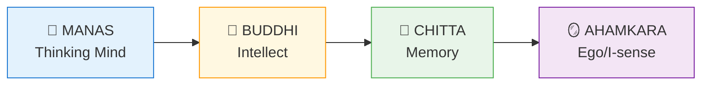
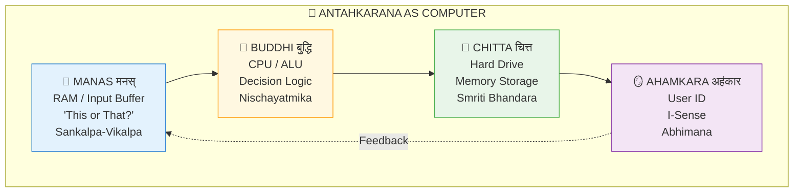
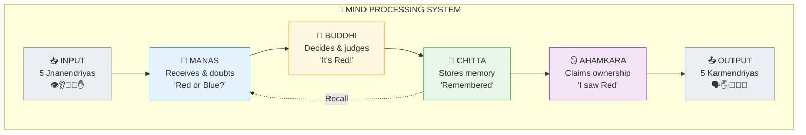
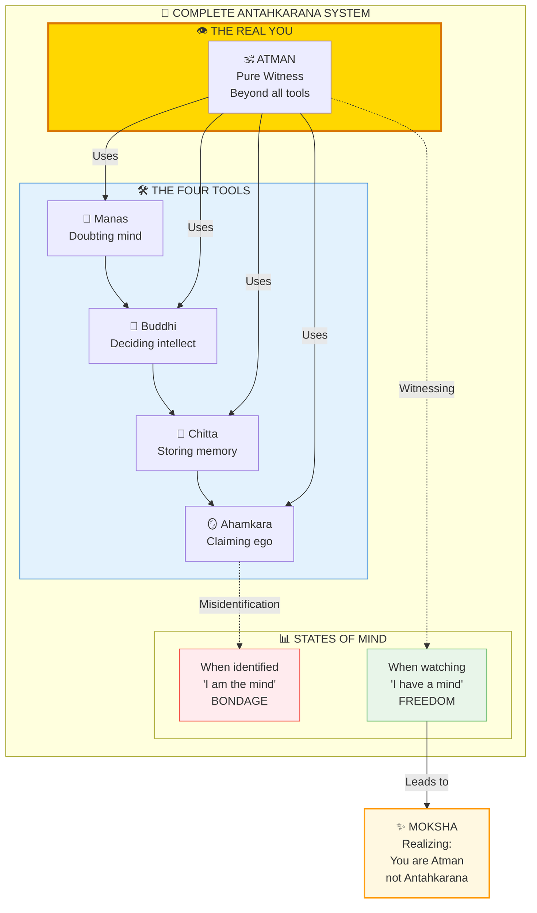

# 🧠 ANTAHKARANA — The Inner Instrument

> **"मनो बुद्ध्यहंकार चित्तानि नाहं"**
> "Mano buddhyahankara chittani naham"
> "I am not the mind, intellect, ego, or memory."
> — Nirvanashtakam, Adi Shankaracharya

Antahkarana (अन्तःकरण) is the "inner instrument" — the total mind apparatus consisting of four components that process all experience.

---

## 📊 Diagram 1: Simple Four Components (Beginner)

**What it shows:** The four parts of the mind.

**Key Insight:** None of these ARE you — they're tools consciousness uses!

---

## 📊 Diagram 2: Computer Analogy (Intermediate)

**What it shows:** Antahkarana as computer components.

---

## 📊 Diagram 3: Complete Processing Flow (Intermediate)

**What it shows:** How sensory input becomes experience.

---

## 📊 Diagram 4: Four Functions in Detail (Advanced)

**What it shows:** Detailed operations of each component.

```mermaid
flowchart TD
    subgraph Details["📜 ANTAHKARANA FUNCTIONS"]
        subgraph Manas["💭 MANAS"]
            M1["Function: Sankalpa-Vikalpa<br/>(Doubt & Alternatives)"]
            M2["Nature: Vacillating"]
            M3["Speed: Very Fast"]
            M4["Example: 'Should I eat this?'"]
        end
        
        subgraph Buddhi["🧮 BUDDHI"]
            B1["Function: Nischaya<br/>(Determination)"]
            B2["Nature: Decisive"]
            B3["Speed: Slower, deeper"]
            B4["Example: 'Yes, I will eat it'"]
        end
        
        subgraph Chitta["💾 CHITTA"]
            C1["Function: Smriti<br/>(Memory & Recall)"]
            C2["Nature: Retentive"]
            C3["Speed: Variable"]
            C4["Example: 'I ate this before'"]
        end
        
        subgraph Ahamkara["🪞 AHAMKARA"]
            A1["Function: Abhimana<br/>(I-ness, ownership)"]
            A2["Nature: Self-referential"]
            A3["Speed: Constant"]
            A4["Example: 'I am eating'"]
        end
    end
    
    Manas --> Buddhi --> Chitta --> Ahamkara
    
    style Manas fill:#E3F2FD,stroke:#1976D2
    style Buddhi fill:#FFF8E1,stroke:#FF9800
    style Chitta fill:#E8F5E9,stroke:#4CAF50
    style Ahamkara fill:#F3E5F5,stroke:#7B1FA2
```

---

## 📊 Diagram 5: Complete System with Liberation (Expert)

**What it shows:** How understanding Antahkarana leads to freedom.

---

## 📋 Component Comparison

| Component | Sanskrit | Function | Analogy | Problem When Dominant |
|-----------|----------|----------|---------|----------------------|
| **Manas** | मनस् | Doubts, receives | RAM | Indecision, confusion |
| **Buddhi** | बुद्धि | Decides, judges | CPU | Rigidity, judgment |
| **Chitta** | चित्त | Remembers, stores | Hard Drive | Stuck in past |
| **Ahamkara** | अहंकार | Claims "I did this" | User ID | Pride, separation |

---

## 🎯 Practical Understanding

**The Key Realization:**

You are NOT the Antahkarana. You are the WITNESS of it.

- When you notice "I'm thinking" — who's noticing?
- When you observe "I'm deciding" — who's observing?
- When you recall "I remember" — who's recalling?
- When you feel "I am" — who's feeling?

**That witness is Atman — the real you.**

**Liberation practice:** Watch your mind like watching clouds. Don't identify with thoughts, decisions, memories, or the sense of "I".

---

## 🔗 Related Topics

- [Consciousness](./consciousness.md) — The witness (Atman)
- [Koshas](./koshas.md) — Manomaya Kosha contains Antahkarana
- [Moksha](./moksha.md) — Freedom from identification

---

**[← Back to Diagram Library](./README.md)** | **[← Back to Site](../index.md)**
