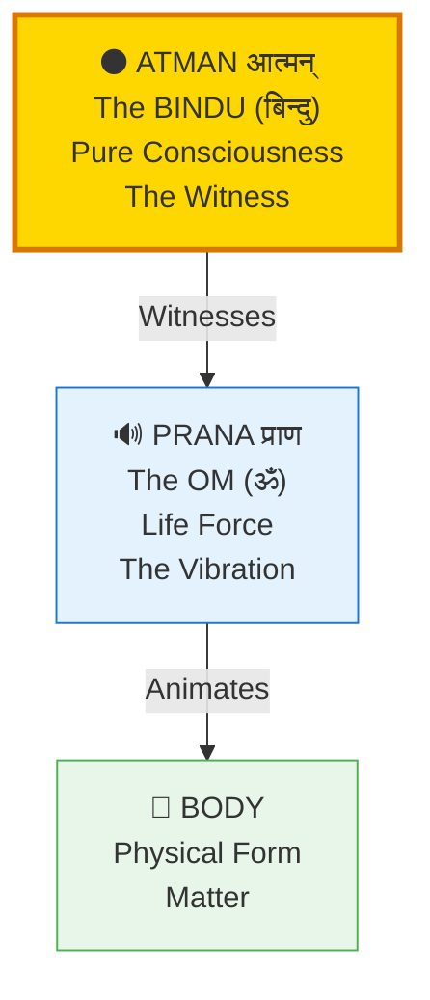
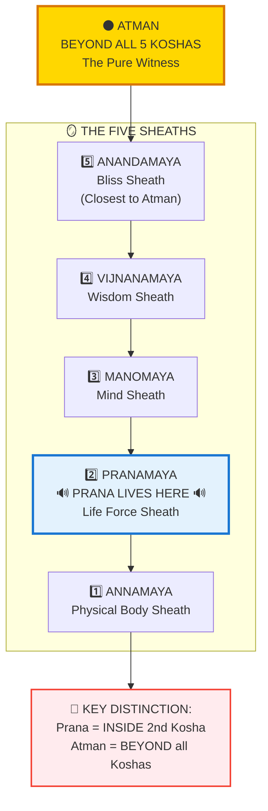
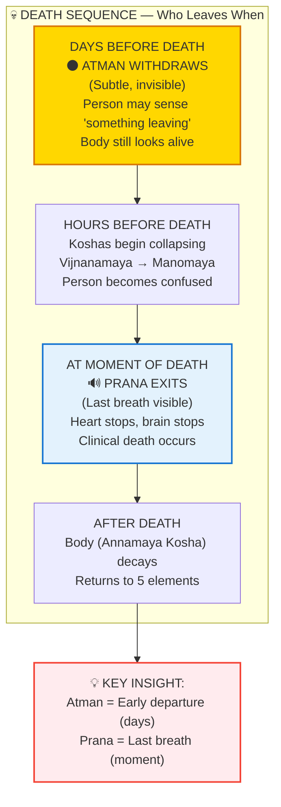
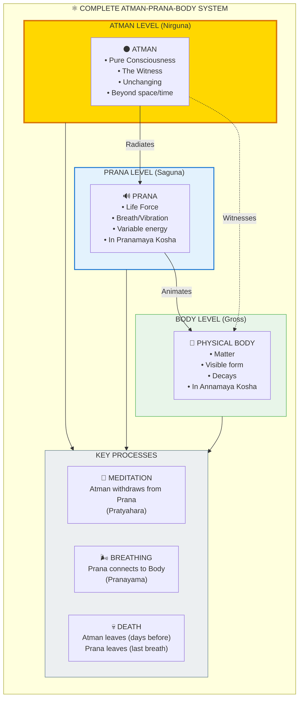

# ⚛️ ATMAN vs PRANA — The CRITICAL Distinction

> **"प्राणस्य प्राणम्"**
> "The Prana OF Prana"  
> — Kena Upanishad 1.2

> **CRITICAL:** Atman ≠ Prana. Understanding this distinction is KEY to liberation.

Atman (आत्मन्) is the **BINDU** — pure consciousness, the witness. Prana (प्राण) is the **OM** — life force, energy, breath. They are **fundamentally different**, though often confused.

---

## 📊 Diagram 1: Simple Overview (Beginner)

**What it shows:** The basic distinction between Atman and Prana.

**Key Insight:** Atman is stillness (BINDU point). Prana is vibration (OM sound). Atman observes Prana.

---

## 📊 Diagram 2: Atman vs Prana Attributes (Intermediate)

**What it shows:** Complete comparison of their distinct natures.

```mermaid
flowchart TD
    subgraph Comparison["⚛️ ATMAN vs PRANA — Core Attributes"]
        direction LR
        
        subgraph AtmanAttributes["⚫ ATMAN (Pure Consciousness)"]
            A1["Nature: NIRGUNA<br/>(Without qualities)"]
            A2["Symbol: BINDU •<br/>(Point/Stillness)"]
            A3["State: Unchanging<br/>Eternal"]
            A4["Location: Beyond all<br/>Not in body"]
            A5["Role: WITNESS<br/>Observer"]
            A6["Withdraws: Days before<br/>death (subtle)"]
        end
        
        subgraph PranaAttributes["🔊 PRANA (Life Force)"]
            P1["Nature: SAGUNA<br/>(With qualities)"]
            P2["Symbol: OM ॐ<br/>(Sound/Vibration)"]
            P3["State: Changing<br/>Variable"]
            P4["Location: Pranamaya Kosha<br/>(Energy sheath)"]
            P5["Role: ANIMATOR<br/>Life giver"]
            P6["Exits: At death<br/>(last breath)"]
        end
    end
    
    AtmanAttributes ~~~ PranaAttributes
    
    style AtmanAttributes fill:#FFD700,stroke:#D97706,stroke-width:2px
    style PranaAttributes fill:#E3F2FD,stroke:#1976D2,stroke-width:2px
```

---

## 📊 Diagram 3: The Five Koshas (Where Each Resides) (Advanced)

**What it shows:** Prana is IN the 2nd Kosha. Atman is BEYOND all 5 Koshas.

---

## 📊 Diagram 4: Death Sequence (When Each Leaves) (Advanced)

**What it shows:** Atman leaves DAYS before death. Prana leaves AT death.

---

## 📊 Diagram 5: Complete Relationship System (Expert)

**What it shows:** Full technical breakdown of Atman-Prana-Body relationship.

---

## 📋 Summary Table: Atman vs Prana

| Aspect | ATMAN आत्मन् | PRANA प्राण |
|--------|--------------|-------------|
| **Symbol** | ⚫ BINDU (Point) | 🔊 OM (Sound) |
| **Nature** | NIRGUNA (No qualities) | SAGUNA (Has qualities) |
| **Change** | Unchanging, Eternal | Variable, Can increase/decrease |
| **Location** | Beyond all 5 Koshas | Inside 2nd Kosha (Pranamaya) |
| **Role** | WITNESS (Observer) | ANIMATOR (Life force) |
| **Visible** | Invisible always | Visible as breath |
| **At Death** | Leaves days before | Leaves at last breath |
| **Sound** | Silent (Bindu) | Vibrating (Om/So-Ham) |
| **You** | What you ARE | What you HAVE |

---

## 💡 Critical Realizations

### The Sun Analogy
- **Atman = The SUN itself** (Pure light source)
- **Prana = LIGHT FROM THE SUN** (Rays emanating)
- **Body = Objects lit by the sun** (Receives light)

### Common Mistakes
❌ **WRONG:** "When I die, Atman and Prana leave together"  
✅ **RIGHT:** "Atman leaves days before. Prana leaves at last breath."

❌ **WRONG:** "Prana is my soul/consciousness"  
✅ **RIGHT:** "Atman is consciousness. Prana is life force animating body."

❌ **WRONG:** "Internal sun = Atman"  
✅ **RIGHT:** "Internal sun = Prana manifestation. Atman is beyond."

### The Meditation Experience
**During deep meditation:**
1. Breath slows (Prana reduces)
2. Heart rate drops (Prana minimizes)
3. Yet awareness remains sharp (Atman unchanged)
4. **Proof:** Atman ≠ Prana

### The Death Realization
**Clinical observations:**
- Patient says "something left" days before death (Atman withdrawal)
- Body still alive but different (Prana still present)
- Last breath = Prana exits (visible, measurable)
- **Proof:** They leave at different times

---

## 🧘 Practical Discrimination

**How to know which is which in your experience:**

| Experience | Is it Atman or Prana? |
|------------|----------------------|
| The breath you feel | Prana (observable) |
| The heartbeat you sense | Prana (observable) |
| The energy you feel after yoga | Prana (variable) |
| The tiredness after work | Prana (depleted) |
| The AWARENESS watching breath | Atman (the observer) |
| The SILENCE behind thoughts | Atman (the witness) |

**Test:** Whatever CHANGES = Prana. Whatever never changes = Atman.

---

## 🔗 Related Topics

- [Koshas](./koshas.md) — The 5 sheaths (Prana in 2nd, Atman beyond all)
- [Purusha vs Prakriti](./purusha_prakriti.md) — Atman is Purusha
- [Death Mechanics](../../scientific_papers/05_NEUROSCIENCE/death/death_mechanics/README.md) — Death sequence details
- [Consciousness States](./consciousness.md) — Atman in different states

---

**[← Back to Diagram Library](./README.md)** | **[← Back to Site](../index.md)**
