# 🌿 AYURVEDA — The Science of Life

> **"आयुर्वेदो अमृतानाम्"**
> "Ayurveda is the nectar of immortality"
> — Charaka Samhita

Ayurveda (आयुर्वेद/Science of Life) is the healing system based on **balancing Gunas and Elements**. Disease = imbalance. Health = balance. Treatment = restoring equilibrium through diet, herbs, lifestyle, and purification.

---

## 📊 Diagram 1: Simple Overview (Beginner)

**What it shows:** The three Doshas — body constitutions based on elements.

```mermaid
flowchart TD
    Doshas["🌿 THREE DOSHAS<br/>Body Constitutions"]
    
    Doshas --> Vata["💨 VATA वात<br/>Air + Ether<br/>(Movement)"]
    Doshas --> Pitta["🔥 PITTA पित्त<br/>Fire + Water<br/>(Transformation)"]
    Doshas --> Kapha["🌊 KAPHA कफ<br/>Water + Earth<br/>(Structure)"]
    
    Balance["⚖️ HEALTH = Balance<br/>All three in harmony"]
    Imbalance["⚠️ DISEASE = Imbalance<br/>One or more aggravated"]
    
    Kapha --> Balance
    Kapha --> Imbalance
    
    style Doshas fill:#FFD700,stroke:#D97706,stroke-width:3px
    style Vata fill:#E3F2FD,stroke:#1976D2
    style Pitta fill:#FFEBEE,stroke:#F44336
    style Kapha fill:#E8F5E9,stroke:#4CAF50
    style Balance fill:#C8E6C9,stroke:#388E3C
    style Imbalance fill:#FFCDD2,stroke:#E57373
```



**Key Insight:** Your unique Dosha ratio (Prakriti) determines your ideal diet, lifestyle, and medicine.

---

## 📊 Diagram 2: Doshas & Elements (Intermediate)

**What it shows:** How elements combine to form Doshas.

```mermaid
flowchart TD
    subgraph DoshaElements["🌿 DOSHA-ELEMENT RELATIONSHIP"]
        direction TB
        
        subgraph Elements["FIVE ELEMENTS"]
            E1["☁️ Akasha (Ether)"]
            E2["💨 Vayu (Air)"]
            E3["🔥 Agni (Fire)"]
            E4["💧 Jala (Water)"]
            E5["🌍 Prithvi (Earth)"]
        end
        
        subgraph Formation["DOSHA FORMATION"]
            E1 & E2 --> Vata["💨 VATA"]
            E3 & E4 --> Pitta["🔥 PITTA"]
            E4 & E5 --> Kapha["🌊 KAPHA"]
        end
        
        subgraph Qualities["DOSHA QUALITIES"]
            VQ["Vata: Dry, Light,<br/>Cold, Mobile, Subtle"]
            PQ["Pitta: Hot, Sharp,<br/>Oily, Liquid, Spreading"]
            KQ["Kapha: Heavy, Slow,<br/>Cool, Oily, Smooth"]
        end
    end
    
    Vata --> VQ
    Pitta --> PQ
    Kapha --> KQ
    
    style Elements fill:#FFF8E1,stroke:#FF9800
    style Vata fill:#E3F2FD,stroke:#1976D2
    style Pitta fill:#FFEBEE,stroke:#F44336
    style Kapha fill:#E8F5E9,stroke:#4CAF50
```



---

## 📊 Diagram 3: Dhatus — Seven Tissues (Intermediate)

**What it shows:** The seven bodily tissues and their sequence.

```mermaid
flowchart LR
    subgraph Dhatus["🧬 SAPTA DHATU — Seven Tissues"]
        direction LR
        
        D1["1️⃣ RASA रस<br/>Plasma<br/>(Nutrient fluid)"]
        
        D2["2️⃣ RAKTA रक्त<br/>Blood<br/>(Oxygenation)"]
        
        D3["3️⃣ MAMSA मांस<br/>Muscle<br/>(Movement)"]
        
        D4["4️⃣ MEDA मेद<br/>Fat<br/>(Lubrication)"]
    end
    
    D1 --> D2 --> D3 --> D4
    
    style D1 fill:#E3F2FD,stroke:#1976D2
    style D2 fill:#FFEBEE,stroke:#F44336
    style D3 fill:#FFF8E1,stroke:#FF9800
    style D4 fill:#FFF3E0,stroke:#FFB74D
```

```mermaid
flowchart LR
    subgraph Dhatus2["🧬 SAPTA DHATU (continued)"]
        direction LR
        
        D5["5️⃣ ASTHI अस्थि<br/>Bone<br/>(Structure)"]
        
        D6["6️⃣ MAJJA मज्जा<br/>Marrow<br/>(Nervous tissue)"]
        
        D7["7️⃣ SHUKRA शुक्र<br/>Reproductive<br/>(Creation)"]
        
        Ojas["✨ OJAS ओजस्<br/>Essence/Immunity<br/>(Final refinement)"]
    end
    
    D5 --> D6 --> D7 --> Ojas
    
    style D5 fill:#ECEFF1,stroke:#607D8B
    style D6 fill:#E8F5E9,stroke:#4CAF50
    style D7 fill:#F3E5F5,stroke:#9C27B0
    style Ojas fill:#FFD700,stroke:#D97706,stroke-width:2px
```





---

## 📊 Diagram 4: Panchakarma — Five Purifications (Advanced)

**What it shows:** The five main detoxification therapies.

```mermaid
flowchart TD
    subgraph Panchakarma["🧹 PANCHAKARMA — Five Purifications"]
        direction TB
        
        PK["🧹 PANCHAKARMA<br/>Deep Detoxification"]
        
        subgraph Methods["FIVE METHODS"]
            direction LR
            M1["1️⃣ VAMANA वमन<br/>Therapeutic Vomiting<br/>(Clears Kapha)"]
            M2["2️⃣ VIRECHANA विरेचन<br/>Purgation<br/>(Clears Pitta)"]
            M3["3️⃣ BASTI बस्ति<br/>Enema<br/>(Clears Vata)"]
        end
        
        subgraph Methods2[""]
            direction LR
            M4["4️⃣ NASYA नस्य<br/>Nasal Cleansing<br/>(Head/Sinuses)"]
            M5["5️⃣ RAKTAMOKSHANA रक्तमोक्षण<br/>Blood Letting<br/>(Blood purification)"]
        end
    end
    
    PK --> Methods
    PK --> Methods2
    
    Result["✨ RESULT:<br/>Toxins removed (Ama)<br/>Doshas balanced<br/>Ojas increased"]
    
    Methods2 --> Result
    
    style PK fill:#FFD700,stroke:#D97706,stroke-width:3px
    style M1 fill:#E8F5E9,stroke:#4CAF50
    style M2 fill:#FFEBEE,stroke:#F44336
    style M3 fill:#E3F2FD,stroke:#1976D2
    style M4 fill:#FFF8E1,stroke:#FF9800
    style M5 fill:#F3E5F5,stroke:#9C27B0
    style Result fill:#C8E6C9,stroke:#388E3C
```

---

## 📊 Diagram 5: Complete Ayurveda System (Expert)

**What it shows:** Full architecture of Ayurvedic healing.

```mermaid
flowchart TB
    subgraph Complete["🌿 COMPLETE AYURVEDA SYSTEM"]
        direction TB
        
        subgraph Assessment["ASSESSMENT (Diagnosis)"]
            direction LR
            A1["Prakriti (Constitution)"] ~~~ A2["Vikriti (Imbalance)"]
            A3["Pulse reading (Nadi)"] ~~~ A4["Tongue/Eyes/Skin"]
        end
        
        subgraph Causes["DISEASE CAUSES"]
            direction LR
            C1["Prajnaparadha<br/>(Wrong choices)"]
            C2["Asatmyendriyartha<br/>(Sense misuse)"]
            C3["Kala Parinama<br/>(Time/Age)"]
        end
        
        subgraph Treatment["TREATMENT (Chikitsa)"]
            direction LR
            T1["🍽️ Ahara<br/>Diet"] ~~~ T2["🏃 Vihara<br/>Lifestyle"]
            T3["🌿 Aushadhi<br/>Herbs"] ~~~ T4["🧹 Shodhana<br/>Detox"]
        end
        
        subgraph Goal["GOAL"]
            G1["⚖️ Dosha Balance<br/>→ Health (Swasthya)"]
        end
    end
    
    Assessment --> Causes --> Treatment --> Goal
    
    style Assessment fill:#E3F2FD,stroke:#1976D2
    style Causes fill:#FFEBEE,stroke:#F44336
    style Treatment fill:#E8F5E9,stroke:#4CAF50
    style Goal fill:#FFD700,stroke:#D97706,stroke-width:2px
```



---

## 📋 Summary Table: Dosha Characteristics

| Aspect | VATA वात | PITTA पित्त | KAPHA कफ |
|--------|----------|-------------|----------|
| **Elements** | Air + Ether | Fire + Water | Water + Earth |
| **Quality** | Movement | Transformation | Structure |
| **Body Type** | Thin, light | Medium, muscular | Heavy, solid |
| **Personality** | Creative, anxious | Driven, irritable | Calm, stubborn |
| **Seat** | Colon | Small intestine | Stomach/Lungs |
| **Time** | Old age | Middle age | Childhood |
| **Season** | Fall/Winter | Summer | Spring |
| **Balance** | Ground, routine | Cool, relax | Stimulate, move |

---

## 💡 Key Realizations

### Disease = Dosha Imbalance
Every disease traces back to aggravated Dosha(s).  
Treatment = Return Doshas to your unique balance (Prakriti).

### Like Increases Like
- Eating cold food in winter → More Vata
- Hot spicy food in summer → More Pitta
- Heavy food with sedentary life → More Kapha

### Opposites Balance
- Vata (cold, dry) → Warm, oily foods
- Pitta (hot, sharp) → Cool, sweet foods
- Kapha (heavy, slow) → Light, spicy foods

---

## 🎯 Quick Dosha Guide

### Signs of VATA Imbalance
- Anxiety, fear, restlessness
- Dry skin, constipation
- Joint pain, cracking
- **Remedy:** Warm, grounding, routine

### Signs of PITTA Imbalance
- Anger, irritability, criticism
- Inflammation, acid reflux
- Skin rashes, burning
- **Remedy:** Cool, sweet, relaxation

### Signs of KAPHA Imbalance
- Depression, attachment, lethargy
- Weight gain, congestion
- Excessive sleep, sluggishness
- **Remedy:** Movement, stimulation, fasting

---

## 🔗 Related Topics

- [Five Elements](./five_elements.md) — Foundation of Doshas
- [Gunas](./gunas.md) — Mental qualities (Sattva/Rajas/Tamas)
- [Chakras](./chakras.md) — Energy centers for healing
- [Samskaras](./samskaras_vasanas.md) — Mental patterns affecting health

---

**[← Back to Diagram Library](./README.md)** | **[← Back to Site](../index.md)**
