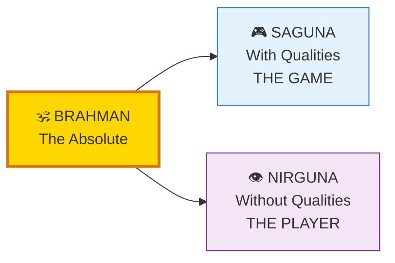
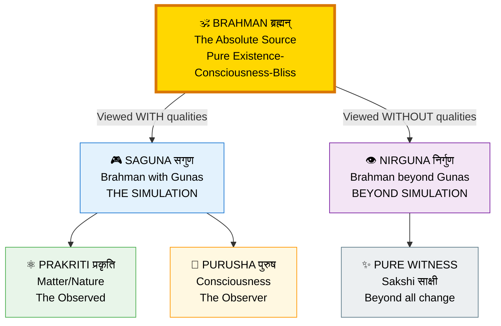
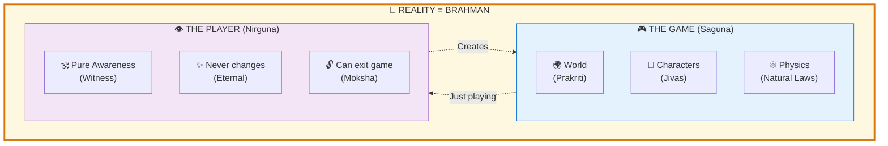
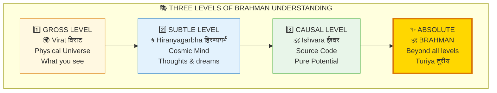
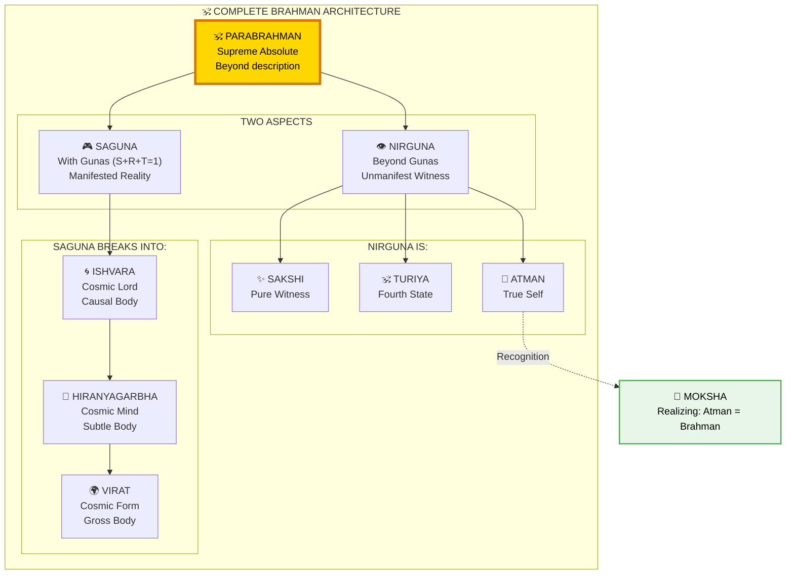

# 🕉️ BRAHMAN — The Absolute Reality

> **"एकमेवाद्वितीयम्"**
> "Ekam eva advitiyam"
> "One without a second."
> — Chandogya Upanishad 6.2.1

Brahman (ब्रह्मन्) is the absolute reality — the substrate of all existence. It has two aspects: Saguna (with qualities) and Nirguna (without qualities).

---

## 📊 Diagram 1: Simple Duality (Beginner)

**What it shows:** The two ways to view Brahman.

**Key Insight:** Brahman isn't two things — it's one reality viewed from two perspectives!

---

## 📊 Diagram 2: Complete Hierarchy (Intermediate)

**What it shows:** How Saguna and Nirguna relate to Prakriti and Purusha.

---

## 📊 Diagram 3: Game Analogy (Intermediate)

**What it shows:** Understanding through familiar concepts.

---

## 📊 Diagram 4: Three Levels of Understanding (Advanced)

**What it shows:** Progressive realization of Brahman.

---

## 📊 Diagram 5: Complete System (Expert)

**What it shows:** Full Brahman architecture with all relationships.

---

## 📋 Comparison Table

| Aspect | Saguna (सगुण) | Nirguna (निर्गुण) |
|--------|---------------|-------------------|
| **Nature** | With qualities | Without qualities |
| **Experience** | Can be known through meditation | Is the knower itself |
| **Composition** | Gunas (S+R+T=1) | Beyond Gunas |
| **Realm** | Within time & space | Eternal, spaceless |
| **Analogy** | The movie | The screen |
| **State** | Changing | Unchanging |
| **Access** | Through practice | Through recognition |

---

## 🎯 Practical Understanding

**Why this matters:**

1. **Saguna is what you experience** — The world, your body, thoughts
2. **Nirguna is what you ARE** — The consciousness experiencing it
3. **Moksha happens** when you realize they're both Brahman

**Key insight:** You've never NOT been Brahman. You just forgot while playing.

---

## 🔗 Related Topics

- [Simulation](./simulation.md) — Saguna as the simulation
- [Consciousness](./consciousness.md) — Nirguna as awareness
- [Moksha](./moksha.md) — Realizing Atman = Brahman

---

**[← Back to Diagram Library](./README.md)** | **[← Back to Site](../index.md)**
