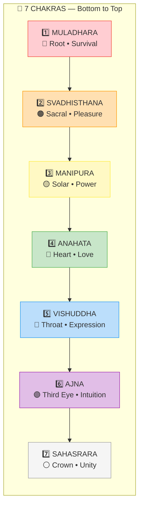
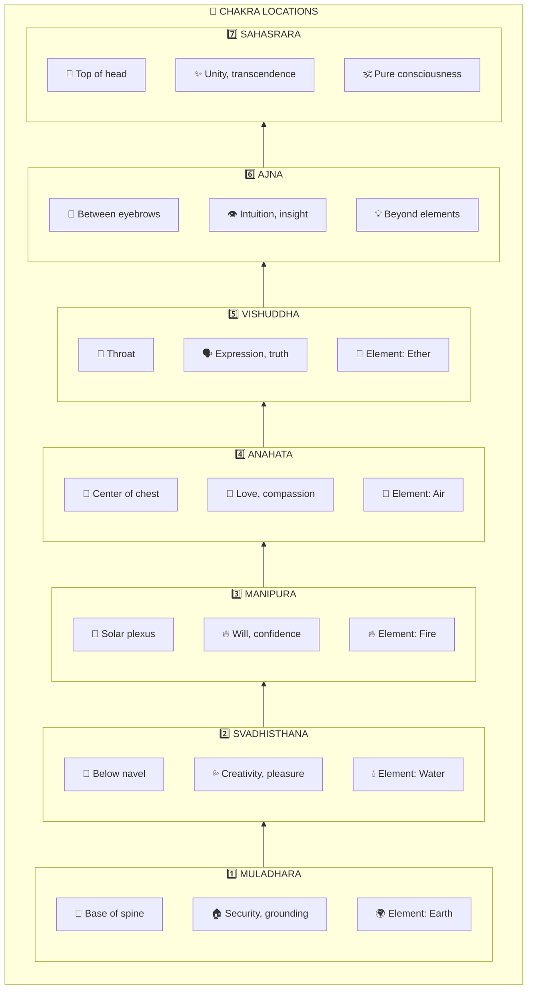
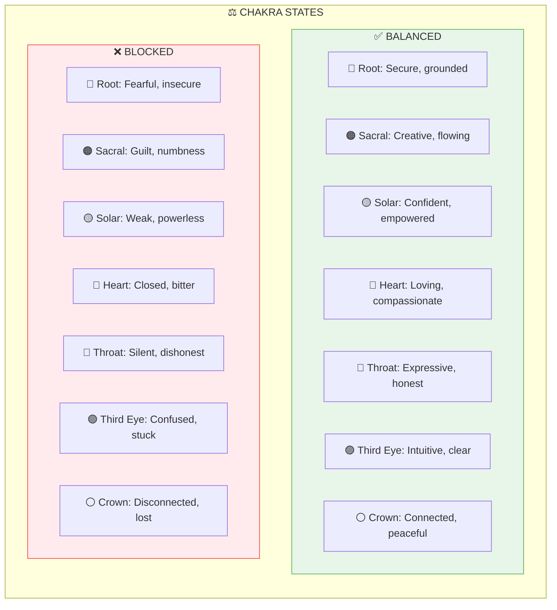
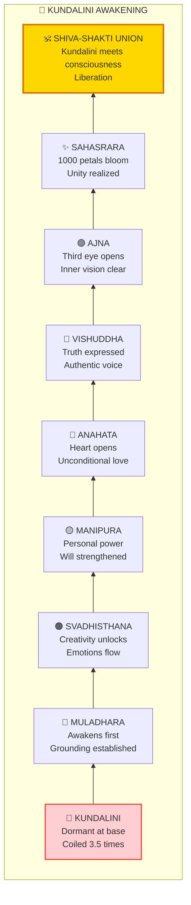
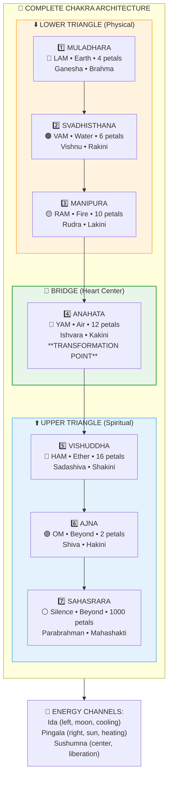

# 🌈 CHAKRAS — The Seven Energy Centers

> **"षट्चक्रं भित्त्वा मनो विलीनं भवति"**
> "Piercing the six chakras, the mind becomes dissolved."
> — Hatha Yoga Pradipika

The Chakras (चक्र) are energy centers along the spine that regulate different aspects of human experience. Understanding them helps you recognize where you're blocked and how to restore flow.

---

## 📊 Diagram 1: Simple Overview (Beginner)

**What it shows:** The seven chakras along the spine — from survival to transcendence.

**Key Insight:** Energy naturally rises from survival (root) to transcendence (crown) — but blockages can stop it anywhere.

---

## 📊 Diagram 2: Location & Function (Intermediate)

**What it shows:** Where each chakra is located and what it governs.

---

## 📊 Diagram 3: Balanced vs Blocked (Intermediate)

**What it shows:** Signs of balanced and blocked chakras.

---

## 📊 Diagram 4: Kundalini Rising (Advanced)

**What it shows:** The journey of Kundalini energy through the chakras.

---

## 📊 Diagram 5: Complete Chakra System (Expert)

**What it shows:** Full chakra architecture with all correspondences.

---

## 📋 Summary Table

| Chakra | Sanskrit | Location | Element | Mantra | Color |
|--------|----------|----------|---------|--------|-------|
| **Muladhara** | मूलाधार | Base | Earth | LAM | Red |
| **Svadhisthana** | स्वाधिष्ठान | Sacral | Water | VAM | Orange |
| **Manipura** | मणिपूर | Solar | Fire | RAM | Yellow |
| **Anahata** | अनाहत | Heart | Air | YAM | Green |
| **Vishuddha** | विशुद्ध | Throat | Ether | HAM | Blue |
| **Ajna** | आज्ञा | Third Eye | Mind | OM | Indigo |
| **Sahasrara** | सहस्रार | Crown | Beyond | Silence | Violet/White |

---

## 🎯 Practical Application

**To balance chakras:**
1. **Root** — Grounding exercises, nature walks
2. **Sacral** — Creative expression, water
3. **Solar** — Core exercises, sun exposure
4. **Heart** — Loving-kindness meditation
5. **Throat** — Singing, honest expression
6. **Third Eye** — Meditation, reduce screen time
7. **Crown** — Meditation, surrender

---

## 🔗 Related Topics

- [Kundalini Science](../../scientific_papers/05_NEUROSCIENCE/altered_states/)
- [Meditation Guide](../practical/02_MEDITATION_GUIDE.md)
- [Koshas](./koshas.md) — Chakras within Pranamaya Kosha

---

**[← Back to Diagram Library](./README.md)** | **[← Back to Site](../index.md)**
