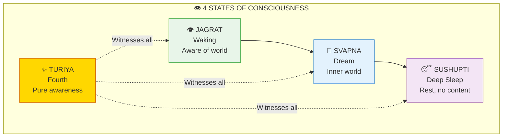
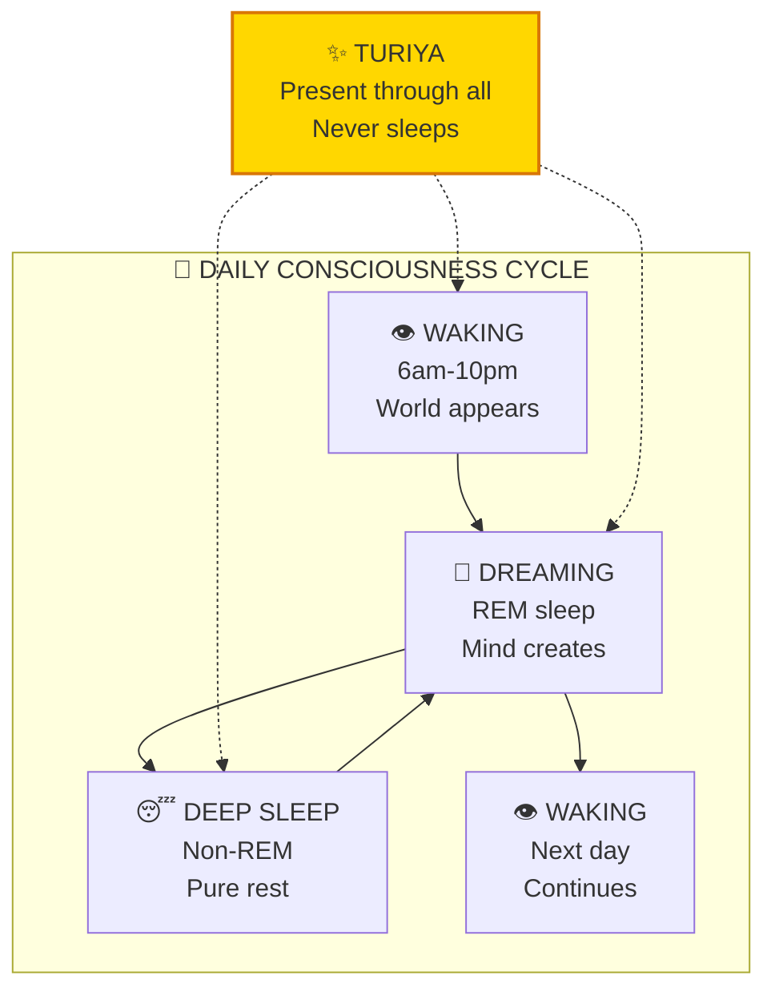
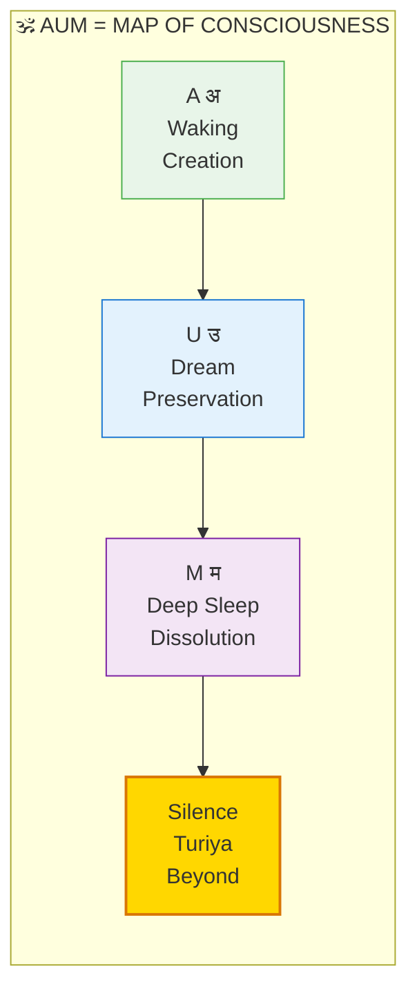
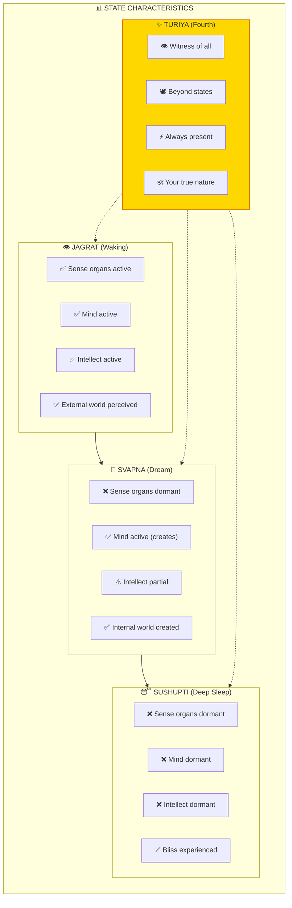
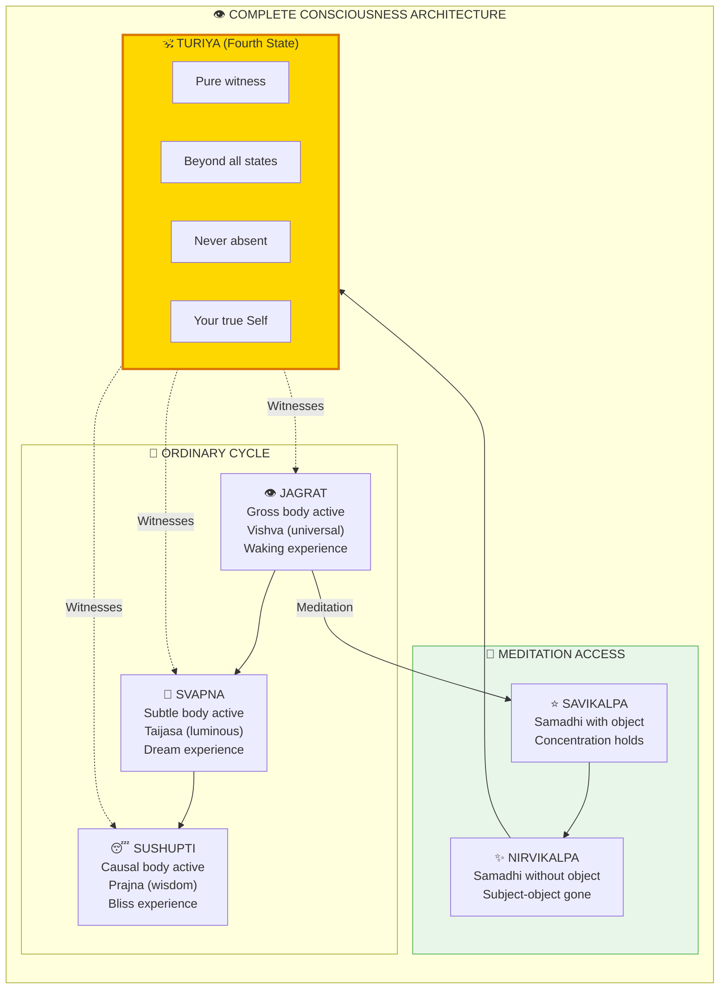

# 👁️ CONSCIOUSNESS — Four States of Awareness

> **"तुरीयं यत् सर्वदृक् नित्यं तद्विज्ञेयं तदात्मनः"**
> "That which is the witness of all, eternal — know that as the Self."
> — Mandukya Upanishad

Consciousness (चैतन्य) has four states — waking, dreaming, deep sleep, and the witnessing awareness that underlies all three. Understanding this map helps you navigate inner terrain.

---

## 📊 Diagram 1: Simple Overview (Beginner)

**What it shows:** The four states of consciousness we all experience.

**Key Insight:** The first three states come and go — but YOU (the witness) remain through all of them!

---

## 📊 Diagram 2: Daily Cycle (Intermediate)

**What it shows:** How we cycle through states every day.

---

## 📊 Diagram 3: AUM Mapping (Intermediate)

**What it shows:** How the sacred syllable AUM represents all states.

---

## 📊 Diagram 4: State Characteristics (Advanced)

**What it shows:** What's active/dormant in each state.

---

## 📊 Diagram 5: Complete Consciousness Map (Expert)

**What it shows:** Full architecture including meditation access.

---

## 📋 Summary Table

| State | Sanskrit | Body Active | Experience | AUM |
|-------|----------|-------------|------------|-----|
| **Jagrat** | जाग्रत् | Gross (Sthula) | External world | A |
| **Svapna** | स्वप्न | Subtle (Sukshma) | Internal creation | U |
| **Sushupti** | सुषुप्ति | Causal (Karana) | Blissful rest | M |
| **Turiya** | तुरीय | Beyond all | Pure witness | Silence |

---

## 🎯 Practical Application

**Key recognition:**
- In waking, YOU are present
- In dreaming, YOU are present
- In deep sleep, YOU return saying "I slept well"
- Therefore, YOU are not any state — you WITNESS all states

**Practice:**
1. Notice transitions between states
2. Ask "Who is aware?" in each state
3. Meditation accesses Turiya directly

---

## 🔗 Related Topics

- [Hard Problem Paper](../../scientific_papers/05_NEUROSCIENCE/consciousness_studies/hard_problem_solved/README.md)
- [Meditation Guide](../practical/02_MEDITATION_GUIDE.md)
- [Koshas](./koshas.md) — States relate to Koshas

---

**[← Back to Diagram Library](./README.md)** | **[← Back to Site](../index.md)**
