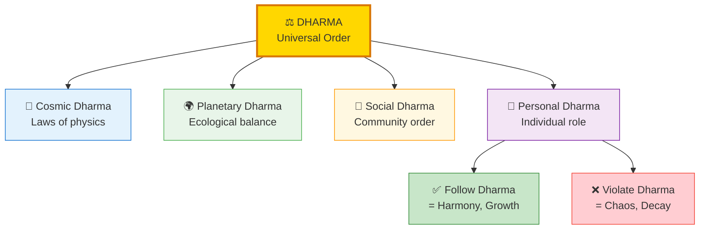
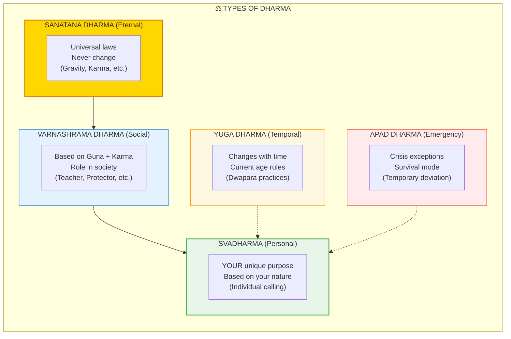
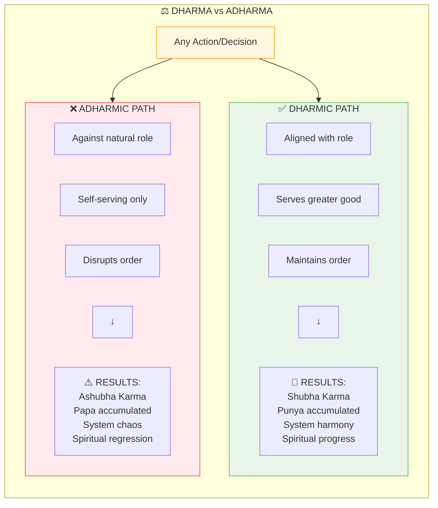
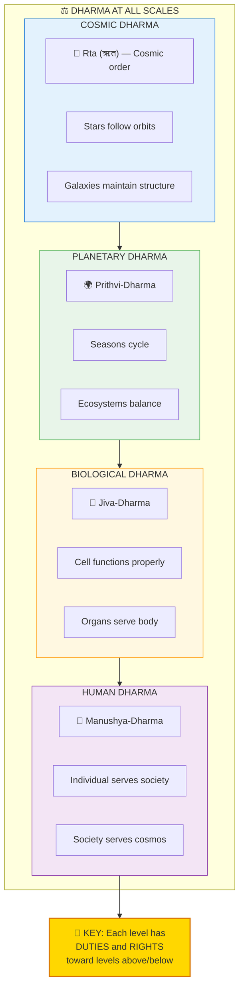
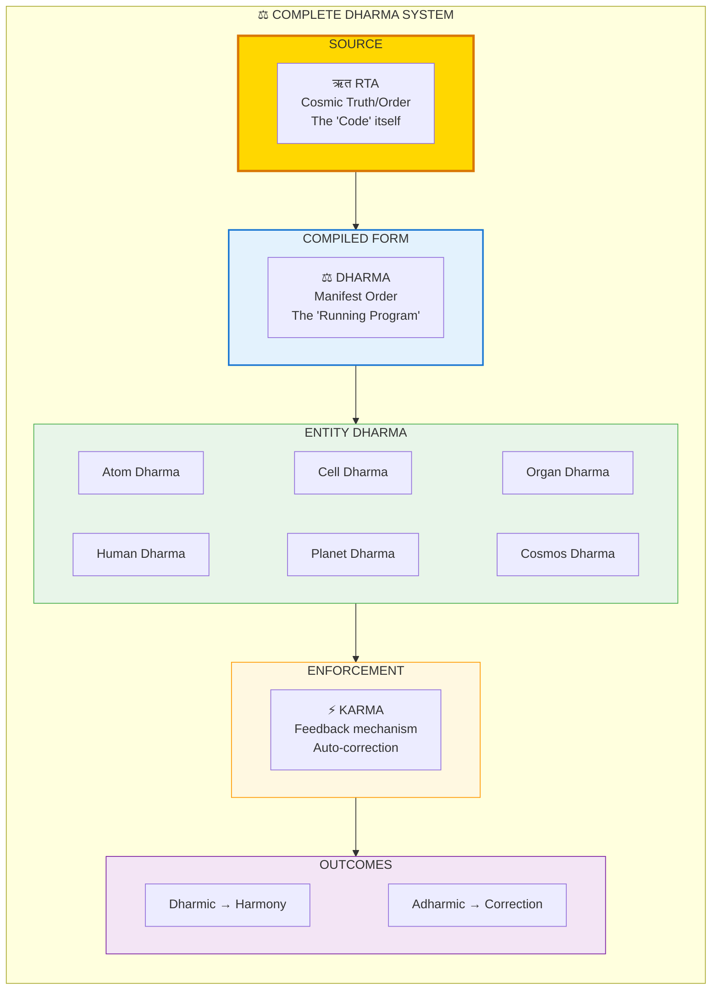

# ⚖️ DHARMA — Universal Operational Logic

> **"धर्मो रक्षति रक्षितः"**
> "Dharma protects those who protect Dharma"
> — Manusmriti

Dharma (धर्म/Operational Logic) is the universal law that maintains cosmic order. It's not just "duty" or "religion" — it's the **fundamental operating logic** that ensures systems remain in equilibrium. Every entity has its Dharma (role/function).

---

## 📊 Diagram 1: Simple Overview (Beginner)

**What it shows:** Dharma as the ordering principle at every level.

**Key Insight:** Everything has a Dharma (function). Sun's Dharma = shine. Tree's Dharma = produce oxygen. Your Dharma = your unique role.

---

## 📊 Diagram 2: Dharma Types (Intermediate)

**What it shows:** Different categories of Dharma and how they relate.

---

## 📊 Diagram 3: Dharma vs Adharma (Intermediate)

**What it shows:** The consequences of following vs violating Dharma.

---

## 📊 Diagram 4: Dharma at Different Scales (Advanced)

**What it shows:** How Dharma manifests at every fractal level.

---

## 📊 Diagram 5: Complete Dharma System (Expert)

**What it shows:** Full technical architecture of Dharma as operational logic.

---

## 📋 Summary Table: Dharma Types

| Type | Sanskrit | Scope | Changes? | Example |
|------|----------|-------|----------|---------|
| **Sanatana** | सनातन धर्म | Universal | Never | Karma, Gravity |
| **Yuga** | युग धर्म | Temporal | Per age | Kali → Dwapara rules |
| **Varna** | वर्ण धर्म | Social | Rarely | Teacher, Warrior roles |
| **Ashrama** | आश्रम धर्म | Life stage | Per phase | Student, Householder |
| **Sva** | स्वधर्म | Personal | Per individual | YOUR unique calling |
| **Apad** | आपद धर्म | Crisis | Emergency | Survival exceptions |

---

## 💡 Key Realizations

### Dharma is NOT "Religion"
**Wrong Translation:** "Hindu religion"  
**Correct Meaning:** "That which upholds/sustains" — The operational logic

### Everyone Has Unique Svadharma
**Bhagavad Gita 3.35:**  
"Better is one's own Dharma imperfectly performed than another's perfectly."

Your unique nature = Your unique Dharma. Don't copy others.

### Dharma Changes by Context
- **Satya Yuga:** Meditation primary
- **Kali Yuga:** Nama-Japa primary
- **Emergency:** Survival first

---

## 🎯 Finding Your Dharma

### Signs You're In Dharma
- Natural ability (easy for you)
- Serves others (not just you)
- Time disappears (flow state)
- Energy increases (not depletes)
- Feels right (even when hard)

### Signs You're Against Dharma
- Constant struggle (against nature)
- Only self-serving
- Drains energy
- Requires constant force
- Creates guilt/unease

---

## 🔗 Related Topics

- [Karma](./karma.md) — Enforcement of Dharma
- [Gunas](./gunas.md) — Determines your Svadharma
- [Validation](./validation.md) — 7 laws include Dharma check
- [Yugas](./yugas.md) — Yuga Dharma changes

---

**[← Back to Diagram Library](./README.md)** | **[← Back to Site](../index.md)**
