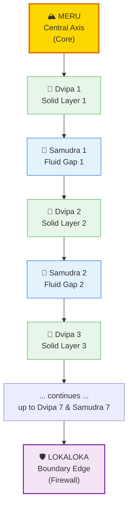
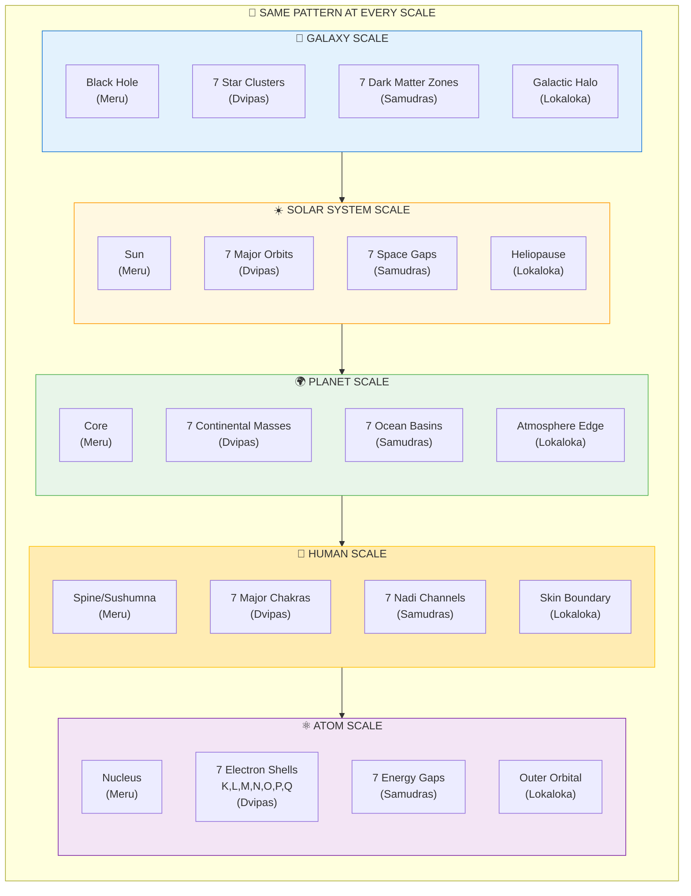
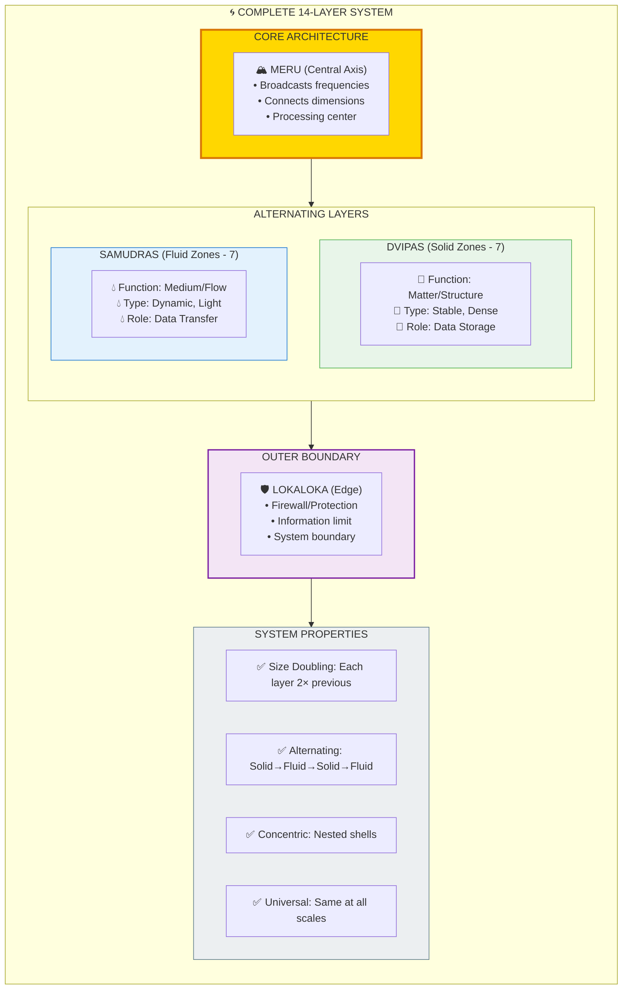

# 🌊 7 DVIPAS + 7 SAMUDRAS — The Concentric Structure of Reality

> **"यथा पिण्डे तथा ब्रह्माण्डे"**
> "As in the microcosm, so in the macrocosm."
> — Yajur Veda

The 7 Dvipas (द्वीप/islands or solid zones) + 7 Samudras (समुद्र/oceans or fluid zones) form a **14-layer concentric structure** found at ALL scales of reality — from atoms to galaxies. This is the universal blueprint for how reality organizes itself in nested shells.

---

## 📊 Diagram 1: Simple Overview (Beginner)

**What it shows:** The basic alternating pattern of solid (Dvipa) and fluid (Samudra) layers.

**Key Insight:** Reality is structured like an onion — alternating solid and fluid layers around a central core.

---

## 📊 Diagram 2: Complete 14-Layer Structure (Intermediate)

**What it shows:** All 14 layers with the 2× size progression (each layer is double the previous).

```mermaid
flowchart TD
    subgraph Structure["🌀 14-LAYER STRUCTURE"]
        direction TD
        
        M["🏔️ MERU<br/>(Central Core)"]
        
        M --> L1["1️⃣ Dvipa 1<br/>Size: 1×"]
        L1 --> L2["💧 Samudra 1<br/>Size: 2×"]
        L2 --> L3["2️⃣ Dvipa 2<br/>Size: 4×"]
        L3 --> L4["💧 Samudra 2<br/>Size: 8×"]
        L4 --> L5["3️⃣ Dvipa 3<br/>Size: 16×"]
        L5 --> L6["💧 Samudra 3<br/>Size: 32×"]
        L6 --> L7["4️⃣ Dvipa 4<br/>Size: 64×"]
        L7 --> L8["💧 Samudra 4<br/>Size: 128×"]
        L8 --> L9["5️⃣ Dvipa 5<br/>Size: 256×"]
        L9 --> L10["💧 Samudra 5<br/>Size: 512×"]
        L10 --> L11["6️⃣ Dvipa 6<br/>Size: 1,024×"]
        L11 --> L12["💧 Samudra 6<br/>Size: 2,048×"]
        L12 --> L13["7️⃣ Dvipa 7<br/>Size: 4,096×"]
        L13 --> L14["💧 Samudra 7<br/>Size: 8,192×"]
        
        L14 --> Lokaloka["🛡️ LOKALOKA<br/>(Boundary Mountain)"]
    end
    
    style M fill:#FFD700,stroke:#D97706,stroke-width:3px
    style L1 fill:#E8F5E9,stroke:#4CAF50
    style L2 fill:#E3F2FD,stroke:#1976D2
    style L3 fill:#E8F5E9,stroke:#4CAF50
    style L4 fill:#E3F2FD,stroke:#1976D2
    style L5 fill:#E8F5E9,stroke:#4CAF50
    style L6 fill:#E3F2FD,stroke:#1976D2
    style L7 fill:#E8F5E9,stroke:#4CAF50
    style L8 fill:#E3F2FD,stroke:#1976D2
    style L9 fill:#E8F5E9,stroke:#4CAF50
    style L10 fill:#E3F2FD,stroke:#1976D2
    style L11 fill:#E8F5E9,stroke:#4CAF50
    style L12 fill:#E3F2FD,stroke:#1976D2
    style L13 fill:#E8F5E9,stroke:#4CAF50
    style L14 fill:#E3F2FD,stroke:#1976D2
    style Lokaloka fill:#F3E5F5,stroke:#7B1FA2,stroke-width:2px
```

---

## 📊 Diagram 3: Fractal Mapping Across Scales (Advanced)

**What it shows:** How the same 7+7 pattern appears at different scales of reality.

---

## 📊 Diagram 4: Vedic Brahmanda Structure (Intermediate)

**What it shows:** The original Vedic names for the 7 Dvipas and 7 Samudras of the cosmic disk.

```mermaid
flowchart TD
    subgraph Brahmanda["🌌 BRAHMANDA — The Cosmic Disk"]
        direction TD
        
        Meru["🏔️ MOUNT MERU<br/>Central Mountain<br/>Cosmic Axis"]
        
        Meru --> J["1️⃣ JAMBU DVIPA<br/>(जम्बू द्वीप)<br/>Rose-Apple Island"]
        J --> L1["🌊 LAVANA SAMUDRA<br/>(लवण समुद्र)<br/>Salt Ocean"]
        L1 --> P["2️⃣ PLAKSHA DVIPA<br/>(प्लक्ष द्वीप)<br/>Fig Island"]
        P --> I1["🌊 IKSHU SAMUDRA<br/>(इक्षु समुद्र)<br/>Sugarcane Ocean"]
        I1 --> S["3️⃣ SHALMALI DVIPA<br/>(शाल्मली द्वीप)<br/>Silk-Cotton Island"]
        S --> S1["🌊 SURAA SAMUDRA<br/>(सुरा समुद्र)<br/>Wine Ocean"]
        S1 --> K["4️⃣ KUSHA DVIPA<br/>(कुश द्वीप)<br/>Grass Island"]
        K --> G1["🌊 GHRITA SAMUDRA<br/>(घृत समुद्र)<br/>Ghee Ocean"]
        G1 --> Kr["5️⃣ KRAUNCHA DVIPA<br/>(क्रौञ्च द्वीप)<br/>Crane Island"]
        Kr --> D1["🌊 DADHI SAMUDRA<br/>(दधि समुद्र)<br/>Curd Ocean"]
        D1 --> Sh["6️⃣ SHAKA DVIPA<br/>(शाक द्वीप)<br/>Teak Island"]
        Sh --> K1["🌊 KSHIRA SAMUDRA<br/>(क्षीर समुद्र)<br/>Milk Ocean"]
        K1 --> Pu["7️⃣ PUSHKARA DVIPA<br/>(पुष्कर द्वीप)<br/>Lotus Island"]
        Pu --> J1["🌊 JALA SAMUDRA<br/>(जल समुद्र)<br/>Fresh Water Ocean"]
        
        J1 --> Lok["🛡️ LOKALOKA PARVATA<br/>(लोकालोक पर्वत)<br/>Boundary Mountain"]
    end
    
    style Meru fill:#FFD700,stroke:#D97706,stroke-width:3px
    style J fill:#E8F5E9,stroke:#4CAF50
    style L1 fill:#E3F2FD,stroke:#1976D2
    style P fill:#E8F5E9,stroke:#4CAF50
    style I1 fill:#E3F2FD,stroke:#1976D2
    style S fill:#E8F5E9,stroke:#4CAF50
    style S1 fill:#E3F2FD,stroke:#1976D2
    style K fill:#E8F5E9,stroke:#4CAF50
    style G1 fill:#E3F2FD,stroke:#1976D2
    style Kr fill:#E8F5E9,stroke:#4CAF50
    style D1 fill:#E3F2FD,stroke:#1976D2
    style Sh fill:#E8F5E9,stroke:#4CAF50
    style K1 fill:#E3F2FD,stroke:#1976D2
    style Pu fill:#E8F5E9,stroke:#4CAF50
    style J1 fill:#E3F2FD,stroke:#1976D2
    style Lok fill:#F3E5F5,stroke:#7B1FA2,stroke-width:2px
```

---

## 📊 Diagram 5: Complete Fractal Architecture (Expert)

**What it shows:** The technical architecture showing how the 14-layer structure functions at all scales.

---

## 📋 Summary Table: 7 Dvipas + 7 Samudras

| # | Layer | Type | Sanskrit | Size | Function |
|---|-------|------|----------|------|----------|
| 0 | Core | Axis | Meru (मेरु) | — | Central processor |
| 1 | Dvipa 1 | Solid | Jambu (जम्बू) | 1× | First shell |
| 2 | Samudra 1 | Fluid | Lavana (लवण) | 2× | First gap |
| 3 | Dvipa 2 | Solid | Plaksha (प्लक्ष) | 4× | Second shell |
| 4 | Samudra 2 | Fluid | Ikshu (इक्षु) | 8× | Second gap |
| 5 | Dvipa 3 | Solid | Shalmali (शाल्मली) | 16× | Third shell |
| 6 | Samudra 3 | Fluid | Suraa (सुरा) | 32× | Third gap |
| 7 | Dvipa 4 | Solid | Kusha (कुश) | 64× | Fourth shell |
| 8 | Samudra 4 | Fluid | Ghrita (घृत) | 128× | Fourth gap |
| 9 | Dvipa 5 | Solid | Krauncha (क्रौञ्च) | 256× | Fifth shell |
| 10 | Samudra 5 | Fluid | Dadhi (दधि) | 512× | Fifth gap |
| 11 | Dvipa 6 | Solid | Shaka (शाक) | 1,024× | Sixth shell |
| 12 | Samudra 6 | Fluid | Kshira (क्षीर) | 2,048× | Sixth gap |
| 13 | Dvipa 7 | Solid | Pushkara (पुष्कर) | 4,096× | Seventh shell |
| 14 | Samudra 7 | Fluid | Jala (जल) | 8,192× | Seventh gap |
| 15 | Edge | Boundary | Lokaloka (लोकालोक) | — | Firewall |

**Size Progression:** Each layer doubles (2ⁿ pattern)  
**Total Layers:** 14 + 1 core + 1 boundary = 16 structural elements

---

## 🌍 Fractal Examples Across Scales

### Galaxy
- **Meru:** Supermassive black hole
- **Dvipas:** 7 spiral arm clusters
- **Samudras:** 7 dark matter zones
- **Lokaloka:** Galactic halo edge

### Solar System
- **Meru:** Sun
- **Dvipas:** 7 major orbits (Mercury, Venus, Earth, Mars, Jupiter, Saturn, Uranus)
- **Samudras:** 7 space gaps between orbits
- **Lokaloka:** Heliopause (solar wind boundary)

### Planet Earth
- **Meru:** Iron core
- **Dvipas:** 7 continental masses
- **Samudras:** 7 ocean basins
- **Lokaloka:** Atmosphere edge (Kármán line)

### Human Body
- **Meru:** Sushumna (spine/central channel)
- **Dvipas:** 7 major chakras
- **Samudras:** 7 inter-chakra nadi channels
- **Lokaloka:** Skin (body boundary)

### Atom
- **Meru:** Nucleus
- **Dvipas:** 7 electron shells (K, L, M, N, O, P, Q)
- **Samudras:** 7 energy gaps between shells
- **Lokaloka:** Outer orbital boundary

---

## 🔗 Related Topics

- [Fractals](./fractals.md) — Scale-invariant patterns
- [14 Lokas](./lokas.md) — Frequency layers (vertical)
- [81-Grid](./81_grid.md) — Grid structure
- [Chakras](./chakras.md) — 7 energy centers

---

**[← Back to Diagram Library](./README.md)** | **[← Back to Site](../index.md)**
