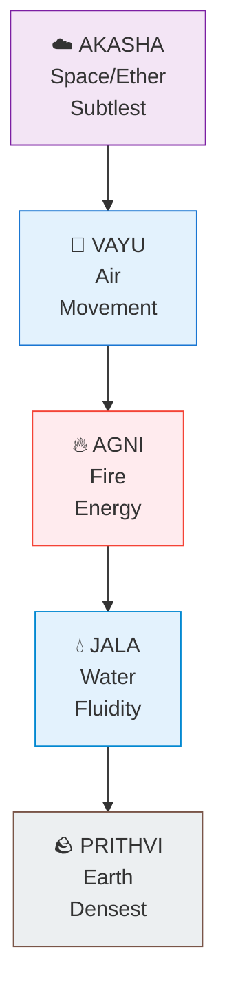
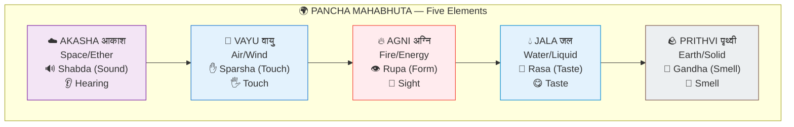
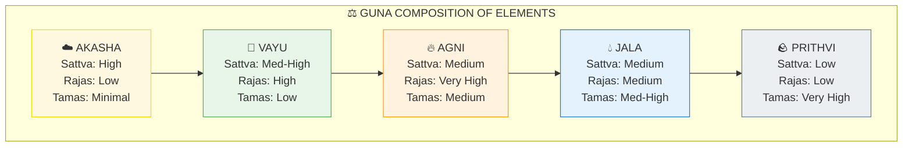

# 🌍 FIVE ELEMENTS — Pancha Mahabhuta

> **"आकाशात् वायुः, वायोरग्निः, अग्नेरापः, अद्भ्यः पृथिवी"**
> "From space came air, from air came fire, from fire came water, from water came earth."
> — Taittiriya Upanishad 2.1.1

The five elements (Pancha Mahabhuta / पञ्च महाभूत) are the building blocks of all manifest reality, emerging in sequence from subtle to gross.

---

## 📊 Diagram 1: Simple Sequence (Beginner)

**What it shows:** The five elements from subtle to dense.

**Key Insight:** Each element contains all previous ones!

---

## 📊 Diagram 2: Elements with Senses (Intermediate)

**What it shows:** Each element has a corresponding sense quality (Tanmatra).

---

## 📊 Diagram 3: Guna Composition (Intermediate)

**What it shows:** How Gunas compose each element.

---

## 📊 Diagram 4: Element Qualities and States (Advanced)

**What it shows:** Detailed properties of each element.

```mermaid
flowchart TD
    subgraph Details["📜 ELEMENT QUALITIES"]
        subgraph Akasha["☁️ AKASHA"]
            A1["Quality: Space"]
            A2["State: Container"]
            A3["Property: Accommodation"]
            A4["Sense: Sound"]
        end
        
        subgraph Vayu["💨 VAYU"]
            V1["Quality: Movement"]
            V2["State: Gaseous"]
            V3["Property: Motion"]
            V4["Sense: Touch"]
        end
        
        subgraph Agni["🔥 AGNI"]
            AG1["Quality: Transformation"]
            AG2["State: Plasma"]
            AG3["Property: Heat/Light"]
            AG4["Sense: Sight"]
        end
        
        subgraph Jala["💧 JALA"]
            J1["Quality: Cohesion"]
            J2["State: Liquid"]
            J3["Property: Fluidity"]
            J4["Sense: Taste"]
        end
        
        subgraph Prithvi["🪨 PRITHVI"]
            P1["Quality: Solidity"]
            P2["State: Solid"]
            P3["Property: Stability"]
            P4["Sense: Smell"]
        end
    end
    
    Akasha --> Vayu --> Agni --> Jala --> Prithvi
    
    style Akasha fill:#F3E5F5,stroke:#7B1FA2
    style Vayu fill:#E3F2FD,stroke:#1976D2
    style Agni fill:#FFEBEE,stroke:#F44336
    style Jala fill:#E3F2FD,stroke:#0288D1
    style Prithvi fill:#ECEFF1,stroke:#795548
```

---

## 📊 Diagram 5: Complete System with Body Mapping (Expert)

**What it shows:** Elements in the body and cosmos.

```mermaid
flowchart TD
    subgraph Complete["🌍 COMPLETE ELEMENT SYSTEM"]
        subgraph Cosmic["🌌 COSMIC LEVEL"]
            CA["☁️ Space<br/>(Vacuum)"]
            CV["💨 Wind<br/>(Atmosphere)"]
            CAG["🔥 Stars<br/>(Fusion)"]
            CJ["💧 Oceans<br/>(Hydrosphere)"]
            CP["🪨 Planets<br/>(Lithosphere)"]
        end
        
        subgraph Human["👤 HUMAN LEVEL"]
            HA["☁️ Spaces<br/>(Cavities)"]
            HV["💨 Breath<br/>(Prana)"]
            HAG["🔥 Metabolism<br/>(Digestion)"]
            HJ["💧 Blood<br/>(Fluids)"]
            HP["🪨 Bones<br/>(Structure)"]
        end
        
        subgraph Chakra["🌈 CHAKRA MAPPING"]
            ChA["Vishuddha<br/>(Throat)"]
            ChV["Anahata<br/>(Heart)"]
            ChAG["Manipura<br/>(Solar Plexus)"]
            ChJ["Svadhisthana<br/>(Sacral)"]
            ChP["Muladhara<br/>(Root)"]
        end
    end
    
    CA --> CV --> CAG --> CJ --> CP
    HA --> HV --> HAG --> HJ --> HP
    ChA --> ChV --> ChAG --> ChJ --> ChP
    
    style Cosmic fill:#FFF8E1,stroke:#D97706
    style Human fill:#E3F2FD,stroke:#1976D2
    style Chakra fill:#E8F5E9,stroke:#4CAF50
```

---

## 📋 Element Properties Table

| Element | Quality | State | Sense | Chakra | Body Part | Cosmic |
|---------|---------|-------|-------|--------|-----------|--------|
| **Akasha** | Space | Ethereal | Sound | Throat | Cavities | Vacuum |
| **Vayu** | Movement | Gas | Touch | Heart | Breath | Wind |
| **Agni** | Transform | Plasma | Sight | Solar Plexus | Metabolism | Fire |
| **Jala** | Cohesion | Liquid | Taste | Sacral | Blood | Water |
| **Prithvi** | Stability | Solid | Smell | Root | Bones | Earth |

---

## 🎯 Practical Understanding

**Element Balancing:**

- **Too much Akasha** → Spacey, ungrounded
- **Too much Vayu** → Anxious, restless
- **Too much Agni** → Angry, inflammatory
- **Too much Jala** → Lethargic, heavy
- **Too much Prithvi** → Stuck, rigid

**How to balance:** Diet, lifestyle, pranayama, meditation aligned with needed elements.

---

## 🔗 Related Topics

- [Chakras](./chakras.md) — Element-chakra mapping
- [Gunas](./gunas.md) — How Gunas create elements
- [Koshas](./koshas.md) — Elements in body sheaths

---

**[← Back to Diagram Library](./README.md)** | **[← Back to Site](../index.md)**
