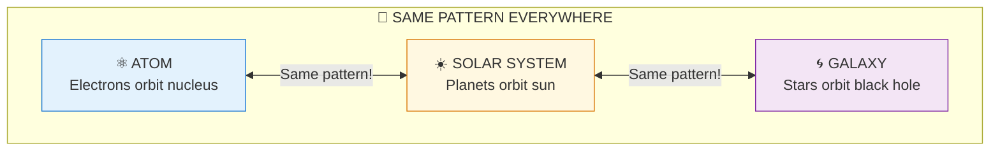
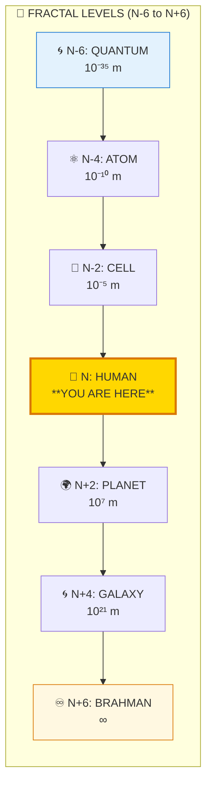
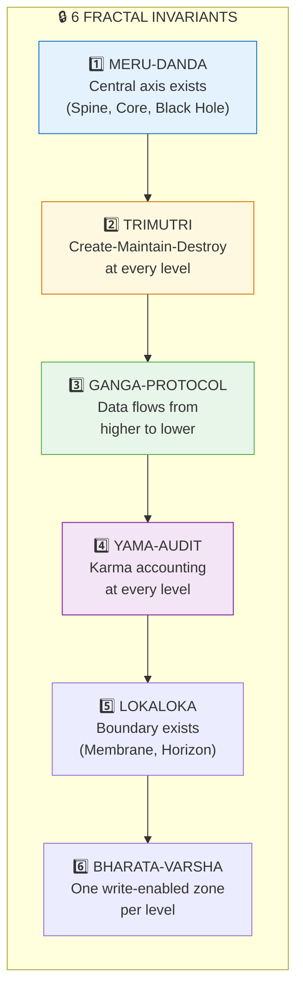
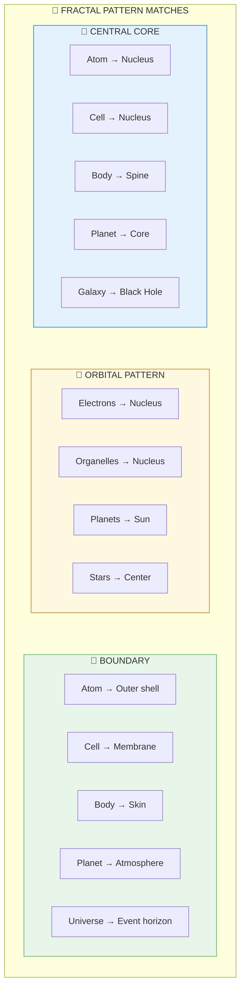
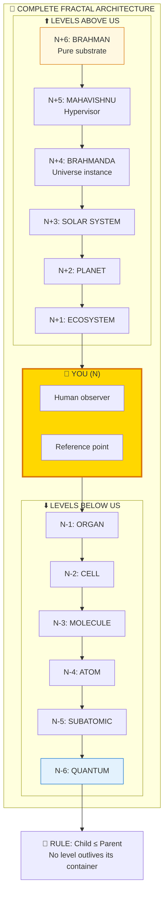

# 🔗 FRACTALS — Same Pattern, Every Scale

> **"यथा पिण्डे तथा ब्रह्माण्डे"**
> "As in the microcosm, so in the macrocosm."
> — Yajur Veda

Fractals (अणु-महत्) are patterns that repeat at every scale — from quantum to cosmic. Understanding this reveals that the universe runs on ONE algorithm repeated infinitely.

---

## 📊 Diagram 1: Simple Overview (Beginner)

**What it shows:** The same pattern at different scales.

**Key Insight:** One algorithm, infinite applications — like procedural generation in games!

---

## 📊 Diagram 2: Scale Levels (Intermediate)

**What it shows:** The fractal hierarchy from quantum to cosmic, with YOU in the middle.

---

## 📊 Diagram 3: 6 Fractal Invariants (Intermediate)

**What it shows:** What remains constant at every level.

---

## 📊 Diagram 4: Pattern Examples (Advanced)

**What it shows:** Specific pattern matches across scales.

---

## 📊 Diagram 5: Complete Fractal Architecture (Expert)

**What it shows:** Full fractal system with all levels and relationships.

---

## 📋 Summary Table

| Level | Scale | Example | Role |
|-------|-------|---------|------|
| **N+6** | ∞ | Brahman | Pure substrate |
| **N+4** | 10²⁶ m | Universe | Container |
| **N+2** | 10⁷ m | Planet | Environment |
| **N** | 10⁰ m | Human | Observer |
| **N-2** | 10⁻⁵ m | Cell | Component |
| **N-4** | 10⁻¹⁰ m | Atom | Building block |
| **N-6** | 10⁻³⁵ m | Planck | Resolution limit |

---

## 🎯 Practical Understanding

**Why fractals matter:**
1. **Efficiency** — One algorithm, infinite use
2. **Prediction** — Understand one level, understand all
3. **Humility** — You're not the center, you're a node
4. **Connection** — Everything is interconnected

---

## 🔗 Related Topics

- [Fractal Rendering Paper](../../scientific_papers/02_PHYSICS/cosmology/fractal_rendering/README.md)
- [Fractal Levels Spec](../../vishnu_engine/spec/entities/fractals/)
- [81-Grid Architecture](../../vishnu_engine/spec/frontend_rendering/)

---

**[← Back to Diagram Library](./README.md)** | **[← Back to Site](../index.md)**
