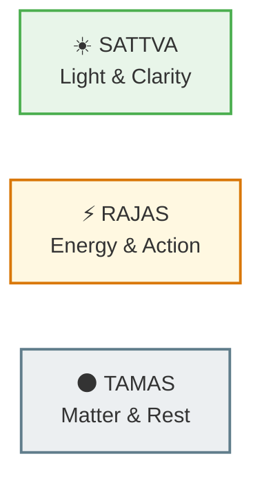
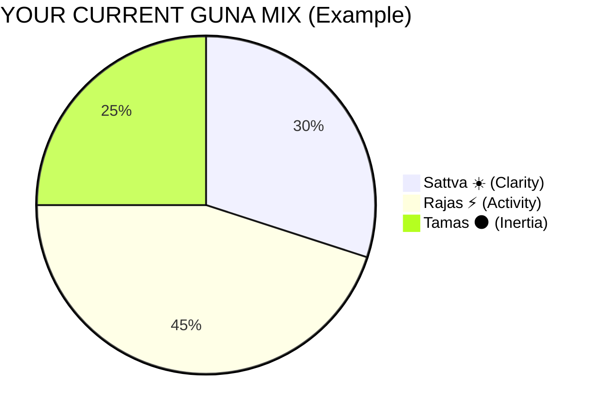
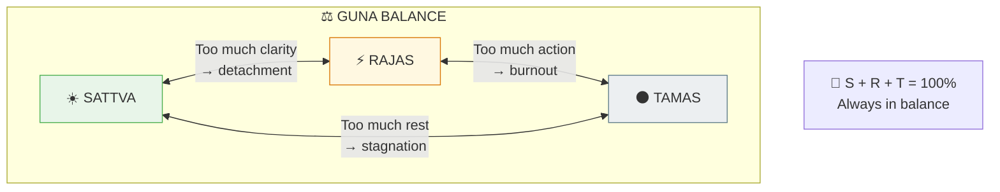
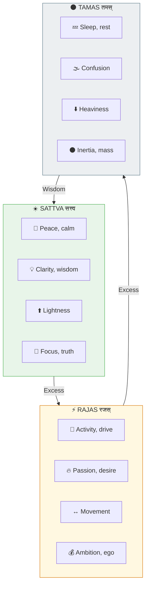
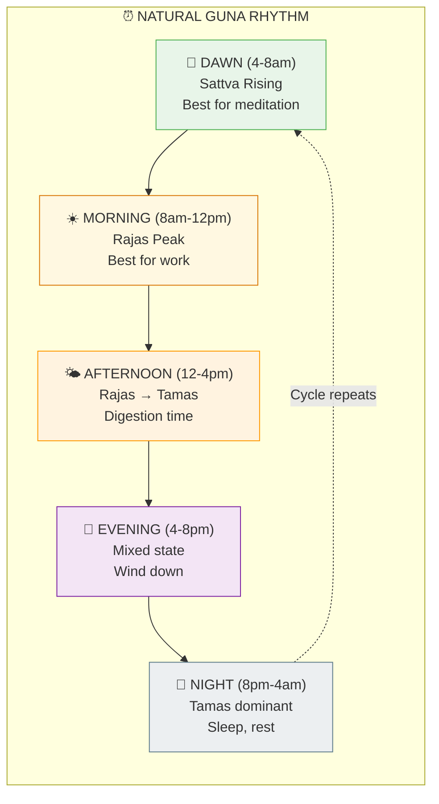
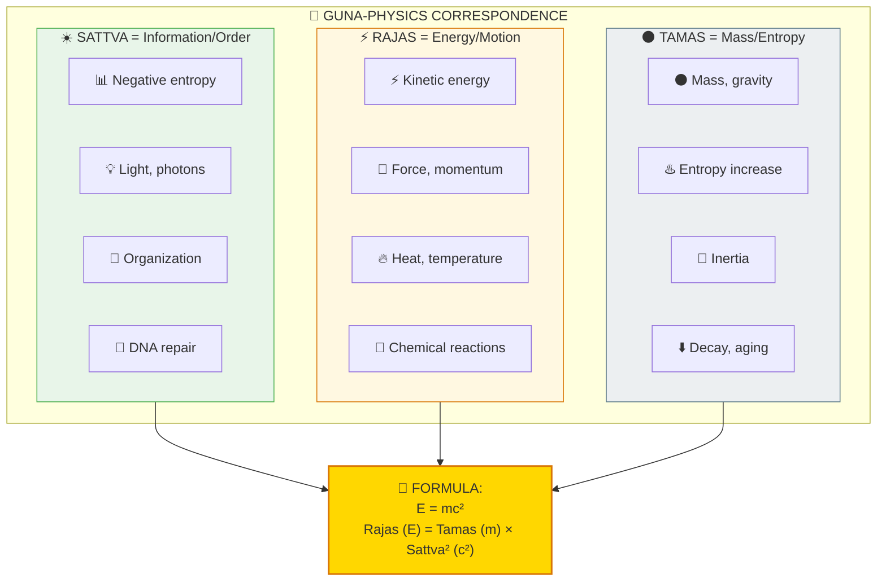

# ⚖️ GUNAS — The Three Fundamental Qualities

> **"सत्त्वं रजस्तम इति गुणाः प्रकृतिसंभवाः"**
> "Sattva, Rajas, and Tamas — these qualities arise from Prakriti."
> — Bhagavad Gita 14.5

The Gunas (गुण) are the three fundamental qualities that compose everything in the manifested universe. Understanding them helps you recognize patterns in your own behavior and the world around you.

---

## 📊 Diagram 1: Simple Overview (Beginner)

**What it shows:** The three Gunas at a glance — light, energy, and matter.

**Key Insight:** Everything you see, feel, and think is a combination of these three qualities — including you!

---

## 📊 Diagram 2: Balance Wheel (Intermediate)

**What it shows:** The Gunas always exist together — only the proportion changes.

---

## 📊 Diagram 3: Properties Comparison (Intermediate)

**What it shows:** Detailed properties of each Guna.

---

## 📊 Diagram 4: Daily Guna Cycle (Advanced)

**What it shows:** How Gunas naturally change throughout the day.

---

## 📊 Diagram 5: Guna-Physics Mapping (Expert)

**What it shows:** How Gunas map to physical properties — Vedic meets Science.

---

## 📋 Summary Table

| Guna | Sanskrit | Quality | Physics | Time of Day | Food Type |
|------|----------|---------|---------|-------------|-----------|
| **Sattva** | सत्त्व | Clarity | Information | Dawn, early morning | Fresh, light |
| **Rajas** | रजस् | Activity | Energy | Morning, afternoon | Spicy, stimulating |
| **Tamas** | तमस् | Inertia | Mass | Night | Heavy, stale |

---

## 🎯 Practical Application

**To increase Sattva:**
- Wake early (Brahma Muhurta)
- Eat fresh, light food
- Meditate regularly
- Spend time in nature

**To balance Rajas:**
- Channel into purposeful work
- Exercise, but don't overdo
- Avoid excess stimulation

**To transform Tamas:**
- Get adequate sleep
- Avoid stale/processed food
- Don't oversleep
- Stay physically active

---

## 🔗 Related Topics

- [Daily Sadhana](../practical/01_DAILY_SADHANA.md) — Guna-aligned routine
- [Guna Management](../practical/04_GUNA_MANAGEMENT.md) — Practical guide
- [Karma System](./karma.md) — Gunas affect karma

---

**[← Back to Diagram Library](./README.md)** | **[← Back to Site](../index.md)**
