# 💎 INDRAJALA — The Jewel-Net of Consciousness

> **"इन्द्रस्य जालं यथा"**
> "Like the Net of Indra"
> — Atharva Veda

Indrajala (इन्द्रजाल/Indra's Net) is the infinite network of jewels where **each jewel reflects all other jewels**. This describes how consciousness is not isolated but interconnected — each being is a mirror reflecting the entire universe.

---

## 📊 Diagram 1: Simple Overview (Beginner)

**What it shows:** The basic jewel-net structure — each node reflects all others.

```mermaid
flowchart TD
    Center["💎 CENTRAL JEWEL<br/>One Consciousness"]
    
    J1["💎 Jewel 1"] ~~~ J2["💎 Jewel 2"] ~~~ J3["💎 Jewel 3"]
    
    Center --> J1 & J2 & J3
    
    J1 -.->|"Reflects"| J2 & J3
    J2 -.->|"Reflects"| J1 & J3
    J3 -.->|"Reflects"| J1 & J2
    
    All["🌐 Each jewel contains ALL others<br/>Infinite recursion"]
    
    J3 --> All
    
    style Center fill:#FFD700,stroke:#D97706,stroke-width:3px
    style J1 fill:#E3F2FD,stroke:#1976D2
    style J2 fill:#E8F5E9,stroke:#4CAF50
    style J3 fill:#F3E5F5,stroke:#7B1FA2
    style All fill:#FFF8E1,stroke:#FF9800,stroke-width:2px
```

**Key Insight:** You are not isolated — you are a jewel reflecting the entire network of consciousness.

---

## 📊 Diagram 2: The Reflection Mechanism (Intermediate)

**What it shows:** How one jewel contains reflections of all others, infinitely.

```mermaid
flowchart TD
    subgraph Network["💎 JEWEL-NET STRUCTURE"]
        direction TB
        
        MainJewel["💎 ONE JEWEL<br/>(You/Any Being)"]
        
        subgraph Reflections["WHAT THIS JEWEL CONTAINS"]
            R1["🪞 Reflection of Jewel 2"]
            R2["🪞 Reflection of Jewel 3"]
            R3["🪞 Reflection of Jewel 4"]
            R4["... infinite reflections ..."]
        end
        
        subgraph DeepReflection["INSIDE EACH REFLECTION"]
            DR1["Within Reflection 2:<br/>🪞 Reflection of Jewel 1<br/>🪞 Reflection of Jewel 3<br/>... (infinite recursion)"]
        end
    end
    
    MainJewel --> Reflections
    Reflections --> DeepReflection
    
    Insight["🔄 INFINITE RECURSION<br/>Each reflection contains<br/>reflections of reflections<br/>forever"]
    
    DeepReflection --> Insight
    
    style MainJewel fill:#FFD700,stroke:#D97706,stroke-width:3px
    style Reflections fill:#E3F2FD,stroke:#1976D2
    style DeepReflection fill:#E8F5E9,stroke:#4CAF50
    style Insight fill:#F3E5F5,stroke:#7B1FA2,stroke-width:2px
```

---

## 📊 Diagram 3: Practical Examples (Intermediate)

**What it shows:** Where we see Indrajala in real life.

```mermaid
flowchart TD
    subgraph Examples["🌍 INDRAJALA IN PRACTICE"]
        direction LR
        
        subgraph Telepathy["💭 TELEPATHY"]
            T1["Think of someone →<br/>They call you<br/>(Jewels connected)"]
        end
        
        subgraph Synchronicity["🎲 SYNCHRONICITY"]
            S1["'Coincidences' that<br/>are too perfect<br/>(Net coordination)"]
        end
        
        subgraph Empathy["💚 EMPATHY"]
            E1["Feel others' pain<br/>as your own<br/>(Jewel reflection)"]
        end
        
        subgraph Dreams["😴 SHARED DREAMS"]
            D1["Multiple people<br/>dream same thing<br/>(Shared network)"]
        end
    end
    
    Telepathy ~~~ Synchronicity
    Synchronicity ~~~ Empathy
    Empathy ~~~ Dreams
    
    Proof["✅ PROOF: You're not separate<br/>You're part of the network"]
    
    Dreams --> Proof
    
    style Telepathy fill:#E3F2FD,stroke:#1976D2
    style Synchronicity fill:#FFF8E1,stroke:#FF9800
    style Empathy fill:#E8F5E9,stroke:#4CAF50
    style Dreams fill:#F3E5F5,stroke:#7B1FA2
    style Proof fill:#FFD700,stroke:#D97706,stroke-width:2px
```

---

## 📊 Diagram 4: One Consciousness, Many Mirrors (Advanced)

**What it shows:** All jewels are reflections of ONE consciousness.

```mermaid
flowchart TD
    subgraph OneManySystem["☀️ ONE CONSCIOUSNESS — INFINITE MIRRORS"]
        direction TD
        
        Source["☀️ BRAHMAN<br/>One Universal Consciousness<br/>(The Light)"]
        
        subgraph Mirrors["🪞 INFINITE MIRRORS (Beings)"]
            M1["🪞 Human"]
            M2["🪞 Animal"]
            M3["🪞 Plant"]
            M4["🪞 Planet"]
            M5["... infinite beings ..."]
        end
        
        subgraph Appearance["👥 APPARENT SEPARATION"]
            A1["Each mirror thinks:<br/>'I am separate'<br/>(Illusion of individuality)"]
        end
        
        subgraph Reality["🕉️ ACTUAL REALITY"]
            Re1["Same light in all mirrors<br/>Same consciousness<br/>experiencing itself<br/>through infinite forms"]
        end
    end
    
    Source --> Mirrors
    Mirrors --> Appearance
    Appearance -.->|"Moksha"| Reality
    
    style Source fill:#FFD700,stroke:#D97706,stroke-width:3px
    style Mirrors fill:#E3F2FD,stroke:#1976D2
    style Appearance fill:#FFEBEE,stroke:#F44336
    style Reality fill:#E8F5E9,stroke:#4CAF50,stroke-width:2px
```

---

## 📊 Diagram 5: Complete Indrajala System (Expert)

**What it shows:** Full technical architecture of the consciousness network.

---

## 📋 Summary Table: Indrajala Properties

| Aspect | Description | Analogy |
|--------|-------------|---------|
| **Structure** | Infinite network of jewels | Internet, but consciousness |
| **Each Node** | Contains reflection of ALL others | Hologram (part = whole) |
| **Connection** | Non-local, instant | Quantum entanglement |
| **Medium** | Akashic field (space itself) | Universal WiFi |
| **Access** | Through stillness of mind | Tuning radio frequency |

---

## 🌐 Real-World Evidence

### Phenomena Explained by Indrajala

| Phenomenon | Standard Explanation | Indrajala Explanation |
|------------|---------------------|----------------------|
| **Telepathy** | "Coincidence" | Direct jewel-to-jewel connection |
| **Synchronicity** | "Random" | Network coordination |
| **Collective Behavior** | "Social influence" | Morphic resonance through net |
| **Intuition** | "Gut feeling" | Akashic field access |
| **Past Life Memories** | "Impossible" | Accessing other jewel's data |

### Why You Can't Always Access It

**Noise Blocks Signal:**
- Busy mind = Static noise
- Strong ego = Thick filter
- Doubt = Jammed receiver
- Meditation = Clear channel

---

## 💡 Key Realizations

### You Are Not Alone
**Wrong View:** "I am isolated in my head"  
**Right View:** "I am one jewel in infinite network"

### Telepathy is Natural
**Wrong View:** "Telepathy is supernatural/impossible"  
**Right View:** "Telepathy is the network functioning normally"

### Compassion Makes Sense
**Wrong View:** "Why care about others? They're separate"  
**Right View:** "Harming others = harming myself (same network)"

---

## 🧘 Practical Access Methods

### 1. Meditation
- Still the mind → Clear the static
- Observe silence → Tune to network frequency
- Witness thoughts → Access Akashic field

### 2. Intentional Connection
- Think of someone clearly
- Hold them in awareness
- Often they'll contact you (jewel resonance)

### 3. Collective Meditation
- Group meditation amplifies
- Network effects multiply
- Healing at distance becomes possible

---

## 🔗 Related Topics

- [Akasha](../../vishnu_engine/spec/backend/README.md) — The field substrate
- [Observer Effect](./observer_effect.md) — Consciousness creates reality
- [Entanglement](../../scientific_papers/02_PHYSICS/quantum_mechanics/entanglement/README.md) — Quantum jewel-net
- [Atman](./atman_prana.md) — The jewel itself

---

**[← Back to Diagram Library](./README.md)** | **[← Back to Site](../index.md)**
