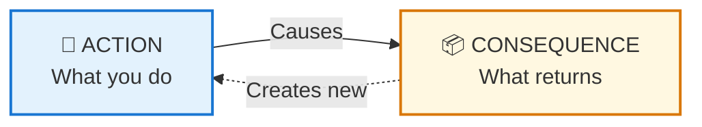
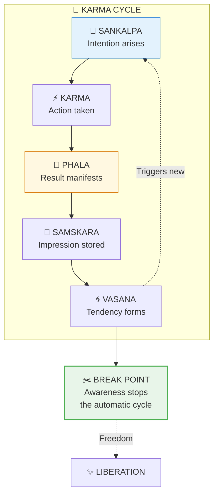
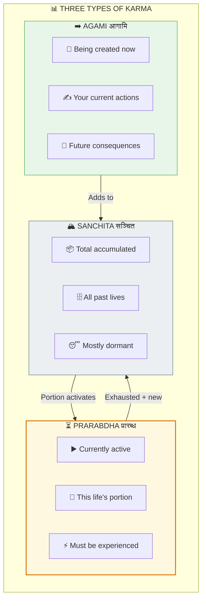
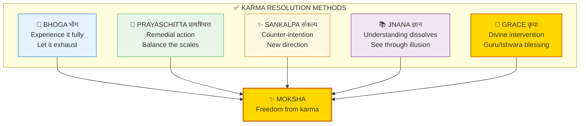
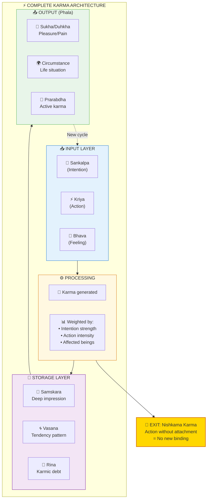

# ⚡ KARMA — The Action-Consequence System

> **"कर्मण्येवाधिकारस्ते मा फलेषु कदाचन"**
> "You have the right to action alone, never to its fruits."
> — Bhagavad Gita 2.47

Karma (कर्म) is not punishment or reward — it's the natural law of cause and effect. Every action creates consequences. Understanding this helps you take responsibility for your life and break free from unconscious patterns.

---

## 📊 Diagram 1: Simple Overview (Beginner)

**What it shows:** The basic karma equation — action leads to consequence.

**Key Insight:** It's not about punishment — it's physics. Every action has an equal and opposite reaction (Newton's 3rd Law = Karma).

---

## 📊 Diagram 2: The Karma Cycle (Intermediate)

**What it shows:** How karma creates patterns that repeat until broken.

---

## 📊 Diagram 3: Three Types of Karma (Intermediate)

**What it shows:** The three categories of karma — past, present, and future.

---

## 📊 Diagram 4: Karma Resolution Methods (Advanced)

**What it shows:** Five ways to resolve karma.

---

## 📊 Diagram 5: Complete Karma System (Expert)

**What it shows:** Full karma architecture with all components and interactions.

---

## 📋 Summary Table

| Type | Sanskrit | Description | Can Change? |
|------|----------|-------------|-------------|
| **Sanchita** | सञ्चित | Total accumulated karma | Yes, through Jnana/Grace |
| **Prarabdha** | प्रारब्ध | Active in this life | Must be experienced |
| **Agami** | आगामि | Being created now | Fully under your control |
| **Vasana** | वासना | Latent tendencies | Yes, through awareness |
| **Samskara** | संस्कार | Deep impressions | Yes, through practice |
| **Rina** | ऋण | Karmic debts | Yes, through resolution |

---

## 🎯 Practical Application

**To stop creating negative karma:**
1. Act without attachment to results (Nishkama Karma)
2. Act in alignment with Dharma
3. Be aware of intentions before acting

**To clear existing karma:**
1. Experience with acceptance (Bhoga)
2. Take remedial action (Prayaschitta)
3. Develop wisdom (Jnana)
4. Seek higher guidance (Kripa)

---

## 🔗 Related Topics

- [Karma Clearing Guide](../practical/05_KARMA_CLEARING.md) — Practical methods
- [Gunas](./gunas.md) — Gunas affect karma creation
- [Moksha](./moksha.md) — Final karma resolution

---

**[← Back to Diagram Library](./README.md)** | **[← Back to Site](../index.md)**
