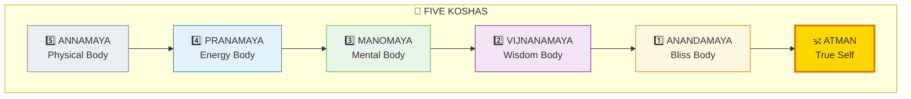
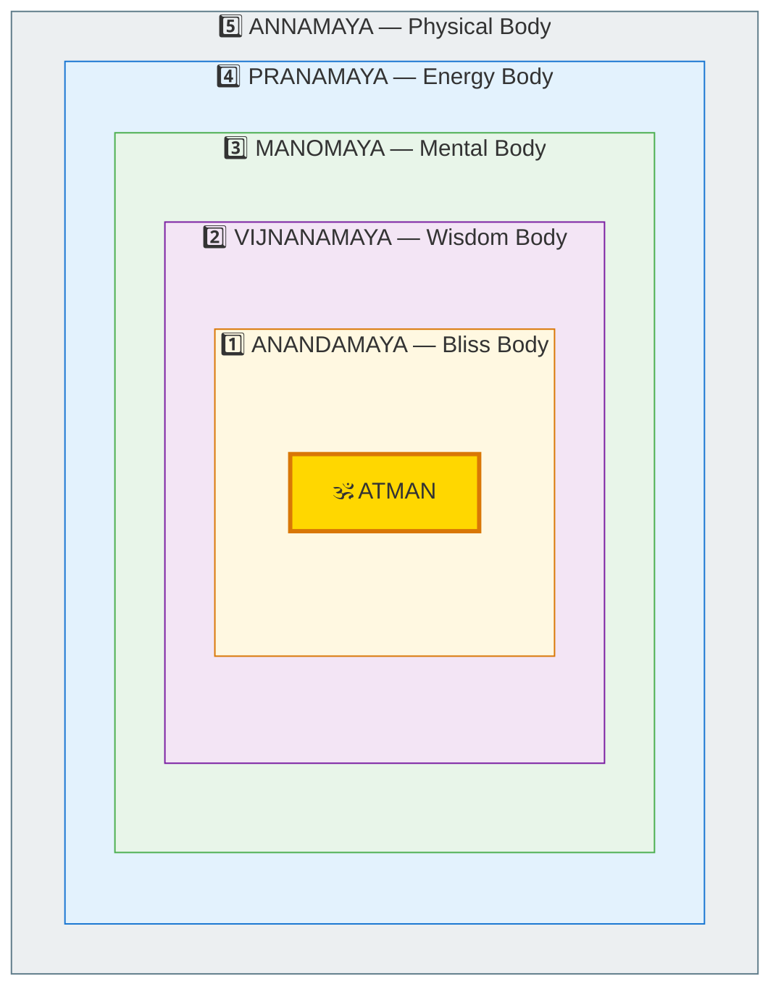
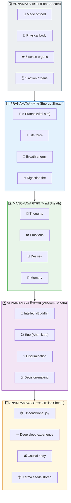
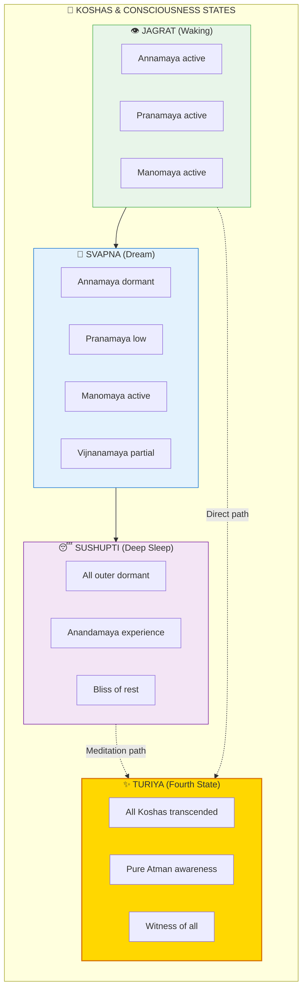
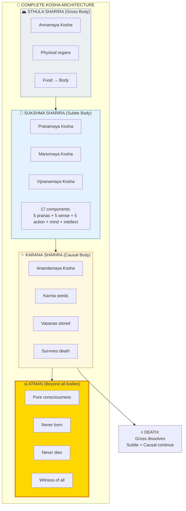

# 🪷 KOSHAS — The Five Sheaths of Being

> **"पञ्च कोशात्मकं ब्रह्म"**
> "Brahman is covered by five sheaths."
> — Taittiriya Upanishad

The Koshas (कोश) are the five "sheaths" or layers that cover the Atman (true self) — like layers of an onion. Understanding them helps you navigate your inner landscape and distinguish between who you ARE and what you HAVE.

---

## 📊 Diagram 1: Simple Overview (Beginner)

**What it shows:** The five layers from outermost (body) to innermost (bliss).

**Key Insight:** You are not any of these layers — you are the Atman that witnesses all of them!

---

## 📊 Diagram 2: Concentric Layers (Intermediate)

**What it shows:** The nested structure — each layer contains the next.

---

## 📊 Diagram 3: Properties of Each Kosha (Intermediate)

**What it shows:** What each layer contains and experiences.

---

## 📊 Diagram 4: Koshas and States (Advanced)

**What it shows:** How Koshas relate to states of consciousness.

---

## 📊 Diagram 5: Complete Kosha System (Expert)

**What it shows:** Full architecture with all bodies and their functions.

---

## 📋 Summary Table

| Kosha | Sanskrit | Body | Function | State |
|-------|----------|------|----------|-------|
| **Annamaya** | अन्नमय | Gross | Physical form | Waking |
| **Pranamaya** | प्राणमय | Subtle | Life force | Waking/Dream |
| **Manomaya** | मनोमय | Subtle | Thinking/Feeling | Waking/Dream |
| **Vijnanamaya** | विज्ञानमय | Subtle | Knowing/Deciding | Waking |
| **Anandamaya** | आनन्दमय | Causal | Bliss/Seed | Deep Sleep |

---

## 🎯 Practical Application

**How to work with Koshas:**

1. **Annamaya** — Care for body (diet, exercise)
2. **Pranamaya** — Practice Pranayama (breathwork)
3. **Manomaya** — Observe thoughts (mindfulness)
4. **Vijnanamaya** — Develop discrimination (Viveka)
5. **Anandamaya** — Access through deep meditation

---

## 🔗 Related Topics

- [Death Mechanics](../../scientific_papers/05_NEUROSCIENCE/death/death_mechanics/README.md)
- [Consciousness States](./consciousness.md)
- [Meditation Guide](../practical/02_MEDITATION_GUIDE.md)

---

**[← Back to Diagram Library](./README.md)** | **[← Back to Site](../index.md)**
