# 🏛️ 14 LOKAS — Frequency Layers of Reality

> **"सप्त लोकाः उर्ध्वं सप्त अधः"**
> "Sapta lokah urdhvam sapta adhah"
> "Seven lokas above, seven below."
> — Puranas

The 14 Lokas (लोक) are frequency layers or dimensional bands of reality — 7 upper (Vyahritis) and 7 lower (Patalas). They're not places in space but different vibrational states.

---

## 📊 Diagram 1: Simple 7+7 Structure (Beginner)

**What it shows:** The 14 layers stacked vertically.

```mermaid
flowchart TD
    subgraph Upper["⬆️ UPPER 7 (Vyahritis)"]
        S["7️⃣ Satya Loka"]
        T["6️⃣ Tapa Loka"]
        J["5️⃣ Jana Loka"]
        M["4️⃣ Mahar Loka"]
    end
    
    subgraph Middle["🌍 MIDDLE 3"]
        Sv["3️⃣ Svarga Loka"]
        Bh["2️⃣ Bhuvar Loka"]
        B["1️⃣ Bhuloka (Earth)"]
    end
    
    subgraph Lower["⬇️ LOWER 7 (Patalas)"]
        A["🔻 Atala"]
        V["🔻 Vitala"]
        Su["🔻 Sutala"]
        T2["🔻 Talatala"]
        Mh["🔻 Mahatala"]
        R["🔻 Rasatala"]
        P["🔻 Patala"]
    end
    
    S --> T --> J --> M --> Sv --> Bh --> B --> A --> V --> Su --> T2 --> Mh --> R --> P
    
    style B fill:#FFD700,stroke:#D97706,stroke-width:3px
```

**Key Insight:** We're in Bhuloka — the middle point!

---

## 📊 Diagram 2: Frequency Bands (Intermediate)

**What it shows:** Lokas as different frequencies, not locations.

```mermaid
flowchart TD
    subgraph Lokas["📡 14 FREQUENCY LAYERS"]
        L7["📡 Highest Frequency<br/>Satya Loka<br/>Subtlest consciousness"]
        L6["📡 High<br/>Tapa, Jana, Mahar"]
        L5["📡 Medium-High<br/>Svarga Loka"]
        L4["📡 Medium<br/>Bhuvar Loka"]
        L3["🌍 BASELINE<br/>Bhuloka (Earth)<br/>Physical reality"]
        L2["📡 Medium-Low<br/>Atala, Vitala"]
        L1["📡 Low<br/>Sutala, Talatala"]
        L0["📡 Lowest<br/>Patala<br/>Densest matter"]
    end
    
    L7 --> L6 --> L5 --> L4 --> L3 --> L2 --> L1 --> L0
    
    style L3 fill:#FFD700,stroke:#D97706,stroke-width:3px
```

---

## 📊 Diagram 3: Access Methods (Intermediate)

**What it shows:** How to access different Lokas.

```mermaid
flowchart TD
    subgraph Access["🚪 ACCESSING LOKAS"]
        subgraph Physical["🌍 PHYSICAL ACCESS"]
            Ph["Bhuloka<br/>(Your current state)"]
        end
        
        subgraph Meditation["🧘 MEDITATION ACCESS"]
            Med1["Bhuvar<br/>(Subtle body)"]
            Med2["Svarga<br/>(Celestial)"]
            Med3["Mahar<br/>(Great sages)"]
        end
        
        subgraph Death["💀 POST-DEATH ACCESS"]
            D1["Based on Karma:<br/>Svarga (heaven)"]
            D2["Or Patalas<br/>(lower realms)"]
        end
        
        subgraph Liberation["✨ MOKSHA ACCESS"]
            Lib["Jana, Tapa, Satya<br/>(No return)"]
        end
    end
    
    Ph --> Med1 --> Med2 --> Med3
    Ph --> D1
    Ph --> D2
    Med3 --> Lib
    
    style Ph fill:#FFD700,stroke:#D97706
    style Lib fill:#E8F5E9,stroke:#4CAF50
```

---

## 📊 Diagram 4: Complete 14 Lokas with Details (Advanced)

**What it shows:** All 14 Lokas with characteristics.

```mermaid
flowchart TD
    subgraph Complete["🏛️ COMPLETE 14 LOKAS"]
        subgraph Upper7["⬆️ UPPER 7 - VYAHRITIS"]
            S["7️⃣ SATYA LOKA सत्य<br/>Brahma's realm<br/>Duration: 1 Kalpa<br/>No return"]
            T["6️⃣ TAPA LOKA तप<br/>Austerity realm<br/>Vairagi sages"]
            J["5️⃣ JANA LOKA जन<br/>People realm<br/>Brahma's sons"]
            M["4️⃣ MAHAR LOKA महर्<br/>Great realm<br/>Siddhas, rishis"]
        end
        
        subgraph Middle3["🌍 MIDDLE 3"]
            Sv["3️⃣ SVARGA LOKA स्वर्ग<br/>Heaven<br/>Indra, Devas<br/>Temporary based on punya"]
            Bh["2️⃣ BHUVAR LOKA भुवः<br/>Atmospheric<br/>Between earth & heaven"]
            Bhu["1️⃣ BHULOKA भू<br/>Earth<br/>Physical plane<br/>⭐ WE ARE HERE"]
        end
        
        subgraph Lower7["⬇️ LOWER 7 - PATALAS"]
            A["🔻 ATALA अतल<br/>Non-foundation"]
            V["🔻 VITALA वितल<br/>Without foundation"]
            Su["🔻 SUTALA सुतल<br/>Great foundation<br/>Bali's realm"]
            Tal["🔻 TALATALA तलातल<br/>Bottom foundation"]
            Mah["🔻 MAHATALA महातल<br/>Great bottom"]
            Ras["🔻 RASATALA रसातल<br/>Essence foundation"]
            Pat["🔻 PATALA पाताल<br/>Fallen/Lowest<br/>Nagas dwell"]
        end
    end
    
    S --> T --> J --> M --> Sv --> Bh --> Bhu
    Bhu --> A --> V --> Su --> Tal --> Mah --> Ras --> Pat
    
    style Bhu fill:#FFD700,stroke:#D97706,stroke-width:4px,color:#000
    style S fill:#E8F5E9,stroke:#4CAF50
    style Pat fill:#ECEFF1,stroke:#607D8B
```

---

## 📊 Diagram 5: Dark Matter Explanation (Expert)

**What it shows:** Why science only sees 5% of the universe.

```mermaid
flowchart TD
    subgraph Science["🔬 WHY DARK MATTER EXISTS"]
        Visible["5% VISIBLE MATTER<br/>🌍 Bhuloka<br/>What we can measure"]
        
        Dark["95% 'DARK' MATTER/ENERGY<br/>❓ Unexplained by science<br/>Missing mass problem"]
        
        Explanation["💡 EXPLANATION:<br/>13 Other Lokas!<br/>Different frequency bands<br/>Not observable from Bhuloka"]
    end
    
    Visible -->|"Science observes"| Dark
    Dark -->|"Vedic explains"| Explanation
    
    AllLokas["All 14 Lokas exist<br/>Only 1 is 'matter' to us<br/>13 are 'dark' to instruments"]
    
    Explanation --> AllLokas
    
    style Visible fill:#FFD700,stroke:#D97706
    style Dark fill:#ECEFF1,stroke:#607D8B
    style Explanation fill:#E3F2FD,stroke:#1976D2
    style AllLokas fill:#E8F5E9,stroke:#4CAF50
```

---

## 📋 Loka Characteristics Table

| Loka | Frequency | Duration | Inhabitants | Access Method |
|------|-----------|----------|-------------|---------------|
| **Satya** | Highest | 311T years | Brahma | Moksha |
| **Tapa** | Very High | 1 Kalpa | Ascetics | Deep Tapas |
| **Jana** | High | 1 Kalpa | Brahma's sons | Jnana Yoga |
| **Mahar** | High | 1 Kalpa | Siddhas | Siddhis |
| **Svarga** | Medium+ | Temporary | Devas | Good Karma |
| **Bhuvar** | Medium | Temporary | Subtle beings | Astral projection |
| **Bhuloka** | Baseline | Birth-Death | Humans, animals | **YOU ARE HERE** |
| **Atala-Patala** | Low-Lowest | Varies | Nagas, Asuras | Bad Karma |

---

## 🎯 Practical Understanding

**Why this matters:**

1. **95% Dark Matter explained** — It's just other Lokas we can't measure
2. **Death isn't the end** — You go to a different Loka based on Karma
3. **Meditation opens gates** — Can access higher Lokas while alive
4. **Liberation is exit** — Moksha means no return to any Loka

**Key insight:** Reality has multiple channels. We're tuned to channel 1 (Bhuloka). Death changes the channel.

---

## 🔗 Related Topics

- [Fractals](./fractals.md) — Same pattern at all scales
- [Consciousness](./consciousness.md) — Different states access different Lokas
- [Dark Matter Paper](../../scientific_papers/02_PHYSICS/cosmology/dark_matter_energy/README.md)

---

**[← Back to Diagram Library](./README.md)** | **[← Back to Site](../index.md)**
