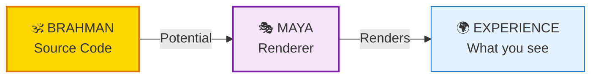
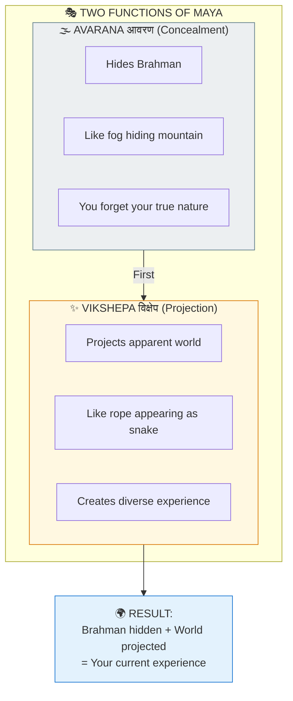
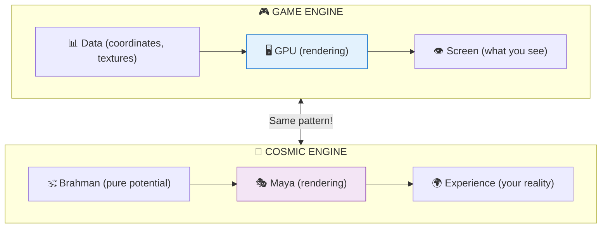
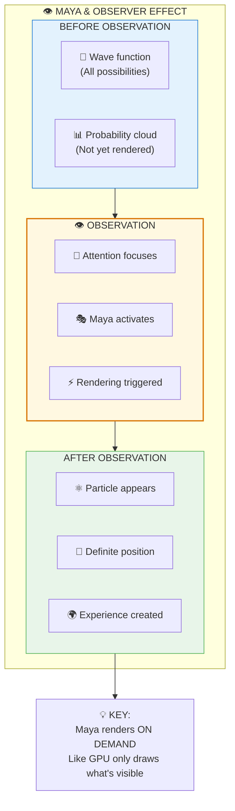
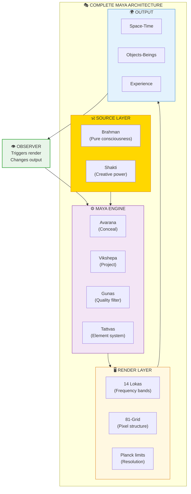

# 🎭 MAYA — The Reality Rendering Engine

> **"इन्द्रो मायाभिः पुरुरूप ईयते"**
> "Indra, through Maya, assumes many forms."
> — Rig Veda 6.47.18

Maya (माया) is not "illusion" in the sense of "fake" — it's the cosmic rendering engine that converts potential into experience. Understanding Maya helps you see how reality is constructed and why observation matters.

---

## 📊 Diagram 1: Simple Overview (Beginner)

**What it shows:** Maya as the bridge between Source and Experience.

**Key Insight:** Maya is like a GPU — it takes data (Brahman) and renders it into visible experience (World).

---

## 📊 Diagram 2: Two Functions of Maya (Intermediate)

**What it shows:** Maya's dual role — concealing the real and projecting the apparent.

---

## 📊 Diagram 3: Maya as Rendering Engine (Intermediate)

**What it shows:** Maya compared to modern graphics rendering.

---

## 📊 Diagram 4: Observer Effect via Maya (Advanced)

**What it shows:** How observation triggers rendering — the quantum connection.

---

## 📊 Diagram 5: Complete Maya Architecture (Expert)

**What it shows:** Full Maya system with all components.

---

## 📋 Summary Table

| Aspect | Sanskrit | Function | Modern Analogy |
|--------|----------|----------|----------------|
| **Avarana** | आवरण | Conceals Brahman | Hides source code |
| **Vikshepa** | विक्षेप | Projects world | Renders output |
| **Gunas** | गुण | Quality filter | RGB channels |
| **Tattvas** | तत्त्व | Element system | Particle types |
| **Lokas** | लोक | Frequency bands | Display modes |

---

## 🎯 Practical Understanding

**Maya is NOT:**
- ❌ Illusion (as in "fake")
- ❌ Evil or bad
- ❌ Something to destroy

**Maya IS:**
- ✅ A creative power
- ✅ The mechanism of experience
- ✅ Neither real nor unreal (Mithya)
- ✅ Transcended through wisdom, not destruction

---

## 🔗 Related Topics

- [Observer Effect Paper](../../scientific_papers/02_PHYSICS/quantum_mechanics/observer_effect/README.md)
- [Maya Engine Spec](../../vishnu_engine/spec/backend/maya/README.md)
- [Simulation Theory](./simulation.md)

---

**[← Back to Diagram Library](./README.md)** | **[← Back to Site](../index.md)**
