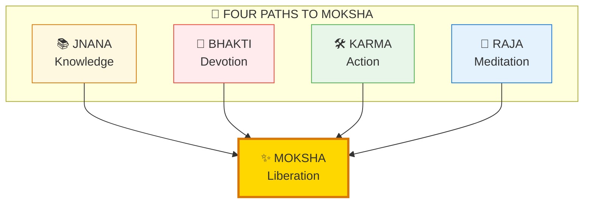
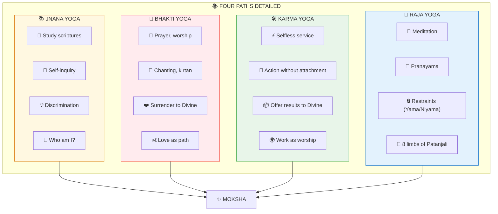
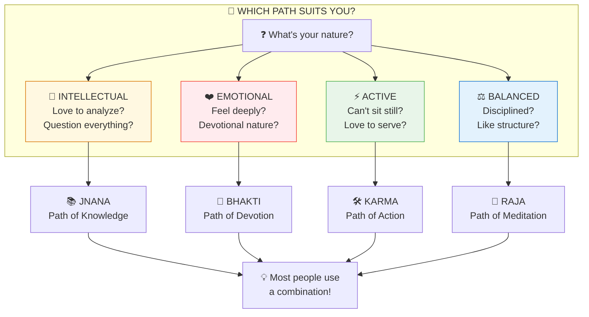
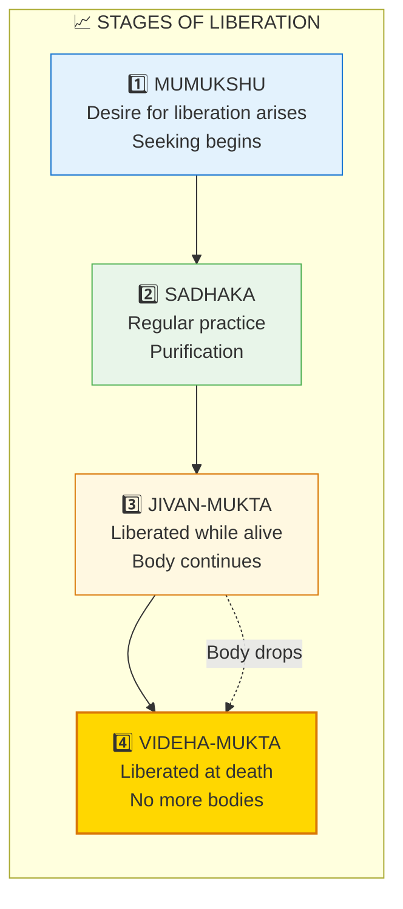
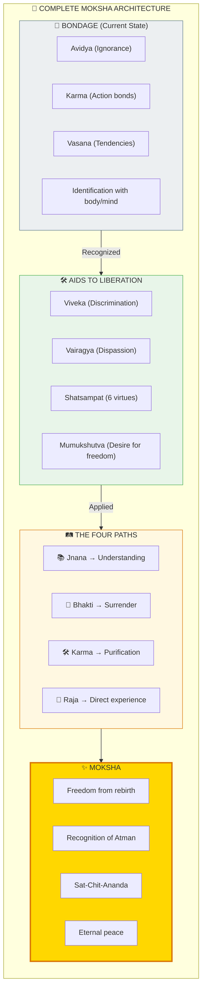

# 🚪 MOKSHA — The Four Paths to Liberation

> **"मुक्तिर्हित्वान्यथाभावं स्वरूपेण व्यवस्थितिः"**
> "Liberation is abiding in one's own true nature, abandoning false identification."
> — Vivekachudamani

Moksha (मोक्ष) is not a place you go — it's the recognition of what you already are. There are four main paths, each suited to different temperaments.

---

## 📊 Diagram 1: Simple Overview (Beginner)

**What it shows:** The four paths to the same goal — Liberation.

**Key Insight:** Different paths for different people — all lead to the same freedom!

---

## 📊 Diagram 2: Path Descriptions (Intermediate)

**What it shows:** What each path involves.

---

## 📊 Diagram 3: Which Path for You? (Intermediate)

**What it shows:** Matching paths to temperaments.

---

## 📊 Diagram 4: Stages of Liberation (Advanced)

**What it shows:** Progressive stages of spiritual development.

---

## 📊 Diagram 5: Complete Liberation Map (Expert)

**What it shows:** Full architecture of liberation including obstacles and aids.

---

## 📋 Summary Table

| Path | Sanskrit | Method | Suited For |
|------|----------|--------|------------|
| **Jnana** | ज्ञान | Knowledge, inquiry | Intellectuals |
| **Bhakti** | भक्ति | Devotion, surrender | Emotional types |
| **Karma** | कर्म | Selfless action | Active types |
| **Raja** | राज | Meditation, discipline | Balanced types |

---

## 🎯 Practical Start

**Immediate steps:**
1. **Notice** — You're already seeking (good sign!)
2. **Study** — Learn about all paths
3. **Try** — Experiment with practices
4. **Find** — Discover what resonates
5. **Commit** — Regular practice on your path

---

## 🔗 Related Topics

- [Karma System](./karma.md) — What keeps us bound
- [Pralaya](./pralaya.md) — Atyantik Pralaya = Moksha
- [Consciousness States](./consciousness.md) — Turiya = Liberation

---

**[← Back to Diagram Library](./README.md)** | **[← Back to Site](../index.md)**
