# 🌀 IDA-PINGALA-SUSHUMNA — The Three Primary Energy Channels

> **"इडा पिङ्गला च सुषुम्ना च त्रयस्तत्र महानडः"**
> "Ida, Pingala, and Sushumna - these three are the great channels."
> — Hatha Yoga Pradipika

The three primary Nadis (नाडी/energy channels) form the **fundamental energy architecture** of all beings. Ida (Moon/Left), Pingala (Sun/Right), and Sushumna (Central Axis) create the spiraling double-helix pattern visible in DNA and found throughout nature.

---

## 📊 Diagram 1: Simple Overview (Beginner)

**What it shows:** The three main energy channels and their basic qualities.

```mermaid
flowchart TD
    Sushumna["🔷 SUSHUMNA सुषुम्ना<br/>Central Channel<br/>(15th Axis)"]
    
    Sushumna --> Ida["🌙 IDA इडा<br/>Left/Moon/Cooling<br/>Feminine/Receptive"]
    
    Sushumna --> Pingala["☀️ PINGALA पिङ्गला<br/>Right/Sun/Heating<br/>Masculine/Active"]
    
    Balance["⚖️ BALANCE<br/>Health & Harmony"]
    
    Ida --> Balance
    Pingala --> Balance
    
    style Sushumna fill:#FFD700,stroke:#D97706,stroke-width:3px
    style Ida fill:#E3F2FD,stroke:#1976D2
    style Pingala fill:#FFEBEE,stroke:#F44336
    style Balance fill:#E8F5E9,stroke:#4CAF50
```

**Key Insight:** Like a double-helix (DNA), Ida and Pingala spiral around the central Sushumna, creating balance through their dance.

---

## 📊 Diagram 2: The Spiraling Pattern (Intermediate)

**What it shows:** How Ida and Pingala cross at each chakra point along the Sushumna.

```mermaid
flowchart TD
    subgraph Spine["🌀 THE SPIRALING CHANNELS"]
        direction TD
        
        Sahasrara["7️⃣ SAHASRARA<br/>👑 Crown<br/>(Union Point)"]
        
        Ajna["6️⃣ AJNA<br/>👁️ Third Eye<br/>(6th Crossing)"]
        
        Vishuddha["5️⃣ VISHUDDHA<br/>🗣️ Throat<br/>(5th Crossing)"]
        
        Anahata["4️⃣ ANAHATA<br/>💚 Heart<br/>(Balance Point)"]
        
        Manipura["3️⃣ MANIPURA<br/>☀️ Solar Plexus<br/>(3rd Crossing)"]
        
        Svadhisthana["2️⃣ SVADHISTHANA<br/>🧡 Sacral<br/>(2nd Crossing)"]
        
        Muladhara["1️⃣ MULADHARA<br/>❤️ Root<br/>(1st Crossing)"]
    end
    
    Muladhara -->|"Ida spirals LEFT"| Svadhisthana
    Svadhisthana -->|"Pingala spirals RIGHT"| Manipura
    Manipura -->|"Ida spirals LEFT"| Anahata
    Anahata -->|"Pingala spirals RIGHT"| Vishuddha
    Vishuddha -->|"Ida spirals LEFT"| Ajna
    Ajna -->|"Pingala spirals RIGHT"| Sahasrara
    
    style Sahasrara fill:#E1BEE7,stroke:#9C27B0
    style Ajna fill:#F3E5F5,stroke:#7B1FA2
    style Vishuddha fill:#E3F2FD,stroke:#1976D2
    style Anahata fill:#E8F5E9,stroke:#4CAF50,stroke-width:2px
    style Manipura fill:#FFF8E1,stroke:#FFD700
    style Svadhisthana fill:#FFECB3,stroke:#FFC107
    style Muladhara fill:#FFEBEE,stroke:#F44336
```

---

## 📊 Diagram 3: DNA as Ida-Pingala (Intermediate)

**What it shows:** The direct correspondence between Nadi structure and DNA double helix.

```mermaid
flowchart TD
    subgraph DNA["🧬 DNA AS IDA-PINGALA MANIFESTATION"]
        direction LR
        
        subgraph Backend["BACKEND (Energetic)"]
            B1["🌙 IDA<br/>(Moon Strand)<br/>From Mother"]
            B2["☀️ PINGALA<br/>(Sun Strand)<br/>From Father"]
            B3["🔷 SUSHUMNA<br/>(Central Axis)<br/>Invisible Core)"]
        end
        
        subgraph Frontend["FRONTEND (Physical)"]
            F1["🧬 DNA Strand 1<br/>(Maternal)<br/>Anti-parallel"]
            F2["🧬 DNA Strand 2<br/>(Paternal)<br/>Anti-parallel"]
            F3["⚛️ Central Axis<br/>(Invisible)<br/>Cannot be seen"]
        end
    end
    
    B1 -->|"Manifests as"| F1
    B2 -->|"Manifests as"| F2
    B3 -->|"Manifests as"| F3
    
    Crossing["🔄 BASE PAIRS = CROSSING POINTS<br/>Like Chakras on Spine"]
    
    Frontend --> Crossing
    
    style Backend fill:#E3F2FD,stroke:#1976D2
    style Frontend fill:#FFEBEE,stroke:#F44336
    style Crossing fill:#E8F5E9,stroke:#4CAF50
```

---

## 📊 Diagram 4: Qualities & Functions (Advanced)

**What it shows:** Detailed attributes and functions of each Nadi.

```mermaid
flowchart TB
    subgraph Nadis["🌀 THREE NADIS — Detailed Attributes"]
        direction TB
        
        subgraph IdaDetails["🌙 IDA नाडी"]
            I1["Direction: Left side"]
            I2["Temperature: Cooling"]
            I3["Element: Water (Soma)"]
            I4["Nostril: Left"]
            I5["Energy: Feminine/Receptive"]
            I6["Mind: Intuitive/Emotional"]
            I7["System: Parasympathetic"]
        end
        
        subgraph SushumnaDetails["🔷 SUSHUMNA नाडी"]
            S1["Direction: Central (Spine)"]
            S2["Temperature: Neutral"]
            S3["Element: Akasha (Space)"]
            S4["Nostril: Both balanced"]
            S5["Energy: Transcendent"]
            S6["Mind: Witness/Pure"]
            S7["System: Balanced"]
        end
        
        subgraph PingalaDetails["☀️ PINGALA नाडी"]
            P1["Direction: Right side"]
            P2["Temperature: Heating"]
            P3["Element: Fire (Surya)"]
            P4["Nostril: Right"]
            P5["Energy: Masculine/Active"]
            P6["Mind: Logical/Rational"]
            P7["System: Sympathetic"]
        end
    end
    
    IdaDetails ~~~ SushumnaDetails ~~~ PingalaDetails
    
    style IdaDetails fill:#E3F2FD,stroke:#1976D2
    style SushumnaDetails fill:#FFD700,stroke:#D97706,stroke-width:2px
    style PingalaDetails fill:#FFEBEE,stroke:#F44336
```

---

## 📊 Diagram 5: Complete Nadi System (Expert)

**What it shows:** From the three primary Nadis to the complete 72,000 Nadi network.

```mermaid
flowchart TD
    subgraph Complete["🌀 COMPLETE NADI SYSTEM"]
        direction TB
        
        subgraph Primary["PRIMARY NADIS (3)"]
            N3["🔷 Sushumna<br/>🌙 Ida<br/>☀️ Pingala"]
        end
        
        subgraph Secondary["SECONDARY NADIS (10)"]
            N10["10 Major Branches<br/>Including:<br/>• Gandhari<br/>• Hastijihva<br/>• Kuhu<br/>• Sarasvati<br/>• Pusha<br/>• Shankhini<br/>• Payasvini<br/>• Varuni<br/>• Alambusa<br/>• Vishvodhara"]
        end
        
        subgraph Tertiary["TERTIARY NADIS (72)"]
            N72["72 Sub-channels<br/>(Major distribution)"]
        end
        
        subgraph Complete_Network["COMPLETE NETWORK"]
            N72000["72,000 Nadis<br/>(Entire body network)<br/>Like nervous system"]
        end
        
        subgraph Chakras["CROSSING POINTS"]
            Ch7["7 Major Chakras<br/>(Ida-Pingala crossings)"]
            Ch27["27 Sub-chakras"]
            Ch81["81 Micro-energy nodes"]
        end
    end
    
    N3 --> N10 --> N72 --> N72000
    N3 --> Ch7 --> Ch27 --> Ch81
    
    style Primary fill:#FFD700,stroke:#D97706,stroke-width:3px
    style Secondary fill:#E3F2FD,stroke:#1976D2
    style Tertiary fill:#E8F5E9,stroke:#4CAF50
    style Complete_Network fill:#F3E5F5,stroke:#7B1FA2
    style Chakras fill:#FFECB3,stroke:#FFC107
```

---

## 📋 Summary Table: The Three Primary Nadis

| Nadi | Sanskrit | Side | Quality | Element | Nostril | Function |
|------|----------|------|---------|---------|---------|----------|
| **Ida** | इडा | Left | Cooling, Feminine | Water (Soma) | Left | Intuition, Emotion, Rest |
| **Sushumna** | सुषुम्ना | Center | Neutral, Transcendent | Space (Akasha) | Both | Spiritual awakening |
| **Pingala** | पिङ्गला | Right | Heating, Masculine | Fire (Surya) | Right | Logic, Action, Activity |

**Balance:** When Ida and Pingala are balanced, Sushumna activates naturally.

---

## 🧬 DNA Correspondence

| Energetic (Backend) | Physical (Frontend) | Function |
|---------------------|---------------------|----------|
| **Ida Nadi** | Maternal DNA Strand | Left-spiraling, cooling |
| **Pingala Nadi** | Paternal DNA Strand | Right-spiraling, heating |
| **Sushumna** | Central Axis (invisible) | Cannot be observed by cell |
| **Chakra Crossings** | Base pair sequences | Critical genetic switches |

**Key Insight:** DNA double-helix is the PHYSICAL manifestation of Ida-Pingala spiral structure.

---

## 🌡️ Nostril Breathing Test

**How to know which Nadi is active:**

1. Close one nostril and breathe
2. Switch and try the other
3. Whichever flows easier is currently dominant

| Dominant Nostril | Active Nadi | State | Best For |
|-----------------|-------------|-------|----------|
| **Left** | Ida (Moon) | Cooling, receptive | Creative work, meditation, rest |
| **Right** | Pingala (Sun) | Heating, active | Physical work, decision-making |
| **Both Equal** | Sushumna | Balanced | Spiritual practice, deep insight |

---

## 🧘 Pranayama Effects

| Practice | Effect | Purpose |
|----------|--------|---------|
| **Nadi Shodhana** | Balances Ida-Pingala | Purification, balance |
| **Left Nostril Only** | Activates Ida | Cooling, calming |
| **Right Nostril Only** | Activates Pingala | Energizing, warming |
| **Both Nostrils** | Activates Sushumna | Spiritual awakening |

---

## 🔗 Related Topics

- [Chakras](./chakras.md) — The 7 crossing points
- [Koshas](./koshas.md) — The energy sheaths
- [Atman vs Prana](./atman_prana.md) — Consciousness vs Life force
- [15th Axis](./15th_axis.md) — Sushumna as cosmic axis

---

**[← Back to Diagram Library](./README.md)** | **[← Back to Site](../index.md)**
