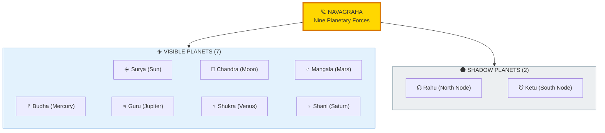
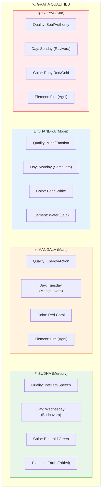
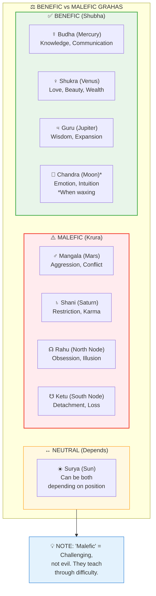
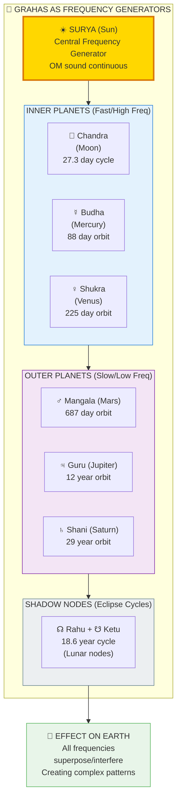
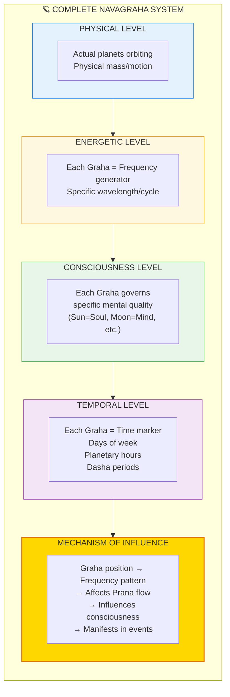

# 🪐 NAVAGRAHA — The Nine Planetary Influences

> **"ग्रहाः खेटाः ज्योतींषि"**
> "Grahas, the wandering lights"
> — Jyotisha Shastras

Navagraha (नवग्रह/Nine Planets) are not just physical bodies — they are **frequency generators** influencing consciousness and matter at all scales. Each Graha represents a specific quality/state in the cosmic system.

---

## 📊 Diagram 1: The Nine Grahas (Beginner)

**What it shows:** The nine planetary forces and their basic qualities.

**Key Insight:** 7 physical planets + 2 mathematical points (eclipse nodes) = 9 influences on consciousness.

---

## 📊 Diagram 2: Graha Qualities & Associations (Intermediate)

**What it shows:** Each Graha's quality, day, color, and influence.

---

## 📊 Diagram 3: Benefic vs Malefic Classification (Intermediate)

**What it shows:** Which planets are naturally beneficial vs challenging.

---

## 📊 Diagram 4: Graha as Frequency Generators (Advanced)

**What it shows:** How planets generate specific frequencies affecting all levels of reality.

---

## 📊 Diagram 5: Complete Navagraha System (Expert)

**What it shows:** Full technical architecture of planetary influence system.

---

## 📋 Summary Table: The Nine Grahas

| # | Graha | Sanskrit | Quality | Day | Color | Type |
|---|-------|----------|---------|-----|-------|------|
| 1 | **Sun** | Surya (सूर्य) | Soul/Authority | Sunday | Ruby/Gold | Neutral |
| 2 | **Moon** | Chandra (चन्द्र) | Mind/Emotion | Monday | Pearl/White | Benefic* |
| 3 | **Mars** | Mangala (मंगल) | Energy/Action | Tuesday | Red Coral | Malefic |
| 4 | **Mercury** | Budha (बुध) | Intellect/Speech | Wednesday | Emerald/Green | Benefic |
| 5 | **Jupiter** | Guru (गुरु) | Wisdom/Expansion | Thursday | Yellow Sapphire | Benefic |
| 6 | **Venus** | Shukra (शुक्र) | Love/Beauty | Friday | Diamond/White | Benefic |
| 7 | **Saturn** | Shani (शनि) | Karma/Restriction | Saturday | Blue Sapphire | Malefic |
| 8 | **Rahu** | Rahu (राहु) | Obsession/Illusion | — | Hessonite/Brown | Malefic |
| 9 | **Ketu** | Ketu (केतु) | Detachment/Moksha | — | Cat's Eye/Gray | Malefic |

*Moon is benefic when waxing, neutral when full, malefic when waning

---

## 💡 Key Realizations

### Grahas Are Not "Gods"
**Wrong View:** Grahas control your fate  
**Right View:** Grahas are frequency patterns you can work WITH

### Retrograde = Z-DNA State
**When planet appears to move backward:**
- Same pattern as left-handed DNA helix
- Energy flow reversed
- Effects intensified/internalized

### Shadow Planets Are Real
**Rahu & Ketu:**
- Not physical bodies
- Mathematical points (eclipse nodes)
- But VERY real energetic influence
- Rahu = Amplify desires
- Ketu = Dissolve attachments

---

## 🎯 Practical Applications

### Daily Rhythm (Vara)
- **Sunday (Surya):** Soul work, leadership, father activities
- **Monday (Chandra):** Emotion work, mother activities, creativity
- **Tuesday (Mangala):** Physical work, sports, courage-building
- **Wednesday (Budha):** Study, communication, contracts
- **Thursday (Guru):** Teaching, learning, wisdom pursuits
- **Friday (Shukra):** Relationships, art, beauty, wealth
- **Saturday (Shani):** Discipline, karma work, serious matters

### Planetary Hours (Hora)
Each day divided into planetary hours  
First hour after sunrise = Ruling planet of that day

### Dasha Periods (Life Cycles)
Major life phases ruled by different planets  
(Requires full birth chart calculation)

---

## 🧘 Working With Grahas

### Strengthen Benefic Planets
- **Jupiter:** Study scriptures, teach, be generous
- **Venus:** Appreciate beauty, practice love, create art
- **Mercury:** Read, write, communicate clearly

### Appease Malefic Planets
- **Saturn:** Discipline, serve the poor, accept delays
- **Mars:** Channel energy constructively, practice patience
- **Rahu:** Meditate, ground yourself, reduce obsessions
- **Ketu:** Spiritual practice, accept loss, detach

### Universal Remedy
**Gayatri Mantra** balances ALL nine Grahas:
> "Om Bhur Bhuvah Svaha..."

---

## 🔗 Related Topics

- [Chakras](./chakras.md) — Planets govern specific chakras
- [81-Grid](./81_grid.md) — 9 is 3² in the progression
- [Fractals](./fractals.md) — Same pattern at solar/galactic scales
- [Solar System](../../vishnu_engine/spec/entities/fractals/N+3_SOLAR_SYSTEM.md) — Technical specs

---

**[← Back to Diagram Library](./README.md)** | **[← Back to Site](../index.md)**
