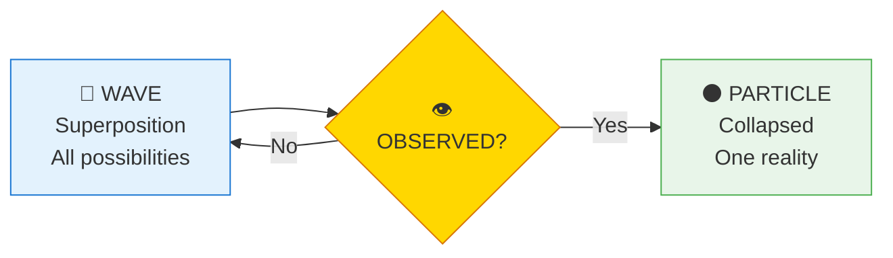
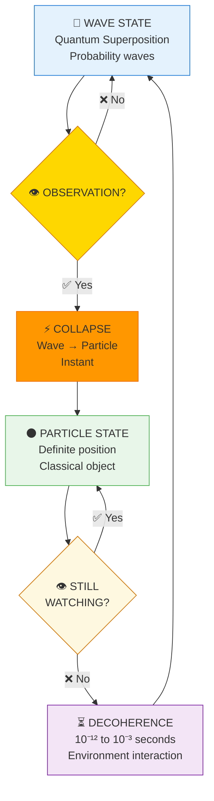
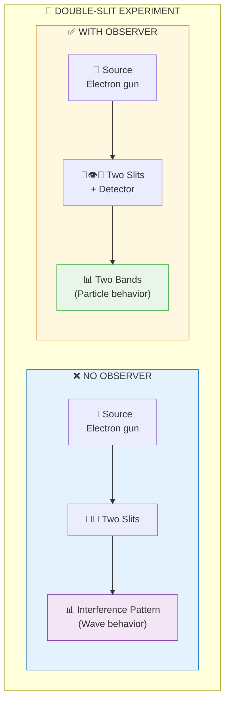
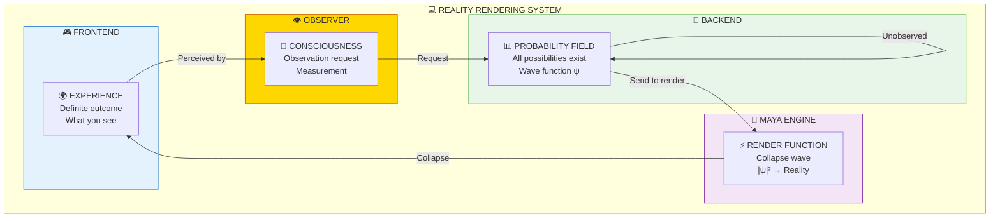
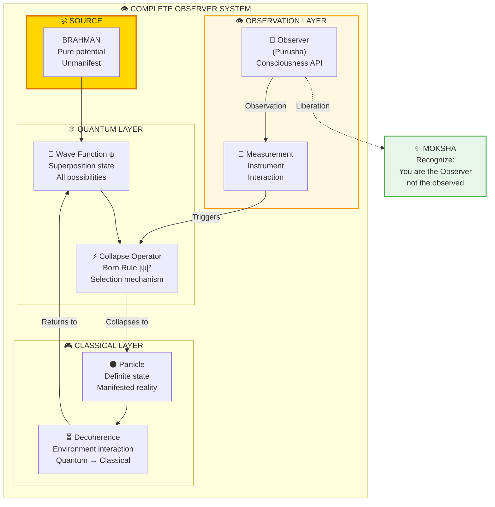

# 👁️ OBSERVER EFFECT — Reality Renders on Observation

> **"यथा दृष्टिः तथा सृष्टिः"**
> "Yatha drishti tatha srishti"
> "As is the seeing, so is the creation."
> — Yoga Vasishtha

The Observer Effect shows that reality behaves differently when observed versus when not observed. This isn't philosophy — it's what quantum physics experiments consistently demonstrate.

---

## 📊 Diagram 1: Simple Wave-Particle (Beginner)

**What it shows:** Observation changes reality.

**Key Insight:** Like a game that only renders what you're looking at!

---

## 📊 Diagram 2: Observation Cycle with Decoherence (Intermediate)

**What it shows:** What happens when observation starts and stops.

---

## 📊 Diagram 3: Double-Slit Experiment (Intermediate)

**What it shows:** The famous experiment that proved observer effect.

**Result:** Adding an observer CHANGES what happens!

---

## 📊 Diagram 4: Reality Rendering Model (Advanced)

**What it shows:** Observer effect as on-demand rendering.

---

## 📊 Diagram 5: Complete Observer Architecture (Expert)

**What it shows:** Full system with all components.

---

## 📋 Experimental Evidence

| Experiment | Year | Result | Implication |
|------------|------|--------|-------------|
| **Double-Slit** | 1801, replicated 1000s of times | Interference pattern disappears with observer | Observation changes behavior |
| **Delayed Choice** | 1978 (Wheeler) | Decision made AFTER photon passes still affects result | Retroactive collapse |
| **Quantum Eraser** | 1982 | Erasing which-path info restores interference | Information matters, not measurement |
| **Weak Measurement** | 2011 | Minimal observation shows wave nature | Observer effect is continuous |

---

## 🎯 Practical Implications

**What this means for you:**

1. **Reality is participatory** — You're not a passive observer
2. **Consciousness matters** — It's not just "brain chemistry"
3. **Attention shapes reality** — What you focus on manifests
4. **Liberation is recognition** — You're the observer, not the observed

**Key insight:** The universe isn't "out there" being observed. It's being co-created through observation.

---

## 🔗 Related Topics

- [Consciousness](./consciousness.md) — The observer itself
- [Maya](./maya.md) — The rendering engine
- [Quantum Paper](../../scientific_papers/02_PHYSICS/quantum_mechanics/observer_effect/README.md) — Full academic treatment

---

**[← Back to Diagram Library](./README.md)** | **[← Back to Site](../index.md)**
