# ⚛️ PERIODIC TABLE — Elements as Guna Combinations

> **"गुणाः गुणेषु वर्तन्ते"**
> "Gunas interact with Gunas"
> — Bhagavad Gita 3.28

The Periodic Table reveals elements as **specific Guna combinations**. Each element has a unique Sattva:Rajas:Tamas ratio, explaining its chemical properties, stability, and behavior.

---

## 📊 Diagram 1: Simple Overview (Beginner)

**What it shows:** Elements classified by dominant Guna.

```mermaid
flowchart TD
    Elements["⚛️ CHEMICAL ELEMENTS<br/>As Guna Combinations"]
    
    Elements --> Sattva["☀️ SATTVA-DOMINANT<br/>Noble Gases<br/>(Stable, complete)"]
    Elements --> Rajas["🔥 RAJAS-DOMINANT<br/>Reactive Metals<br/>(Active, seeking)"]
    Elements --> Tamas["🌑 TAMAS-DOMINANT<br/>Heavy Metals<br/>(Dense, inert)"]
    
    style Elements fill:#FFD700,stroke:#D97706,stroke-width:3px
    style Sattva fill:#FFF8E1,stroke:#FFD700
    style Rajas fill:#FFEBEE,stroke:#F44336
    style Tamas fill:#ECEFF1,stroke:#607D8B
```

**Key Insight:** Chemical reactivity = Rajas level. Stability = Sattva level. Density = Tamas level.

---

## 📊 Diagram 2: Noble Gases = Pure Sattva (Intermediate)

**What it shows:** Noble gases as elements with complete, balanced nature.

```mermaid
flowchart TD
    subgraph NobleGases["☀️ NOBLE GASES — Maximum Sattva"]
        direction TB
        
        Noble["NOBLE GASES<br/>Sattvic Elements"]
        
        subgraph Properties["PROPERTIES"]
            P1["✅ Complete electron shells"]
            P2["✅ No need to react"]
            P3["✅ Stable, serene"]
            P4["✅ Self-sufficient"]
        end
        
        subgraph Elements["ELEMENTS"]
            E1["He (Helium)"]
            E2["Ne (Neon)"]
            E3["Ar (Argon)"]
            E4["Kr (Krypton)"]
            E5["Xe (Xenon)"]
        end
        
        subgraph Analogy["SPIRITUAL ANALOGY"]
            A1["🧘 Like a Jnani<br/>Complete, at peace<br/>No craving/aversion"]
        end
    end
    
    Noble --> Properties
    Properties --> Elements
    Elements --> Analogy
    
    style Noble fill:#FFD700,stroke:#D97706,stroke-width:2px
    style Properties fill:#FFF8E1,stroke:#FFD700
    style Elements fill:#E3F2FD,stroke:#1976D2
    style Analogy fill:#E8F5E9,stroke:#4CAF50
```

---

## 📊 Diagram 3: Alkali Metals = High Rajas (Intermediate)

**What it shows:** Highly reactive elements as Rajas-dominant.

```mermaid
flowchart TD
    subgraph AlkaliMetals["🔥 ALKALI METALS — Maximum Rajas"]
        direction TB
        
        Alkali["ALKALI METALS<br/>Rajasic Elements"]
        
        subgraph Properties["PROPERTIES"]
            P1["⚡ One extra electron"]
            P2["⚡ Desperate to give away"]
            P3["⚡ Highly reactive"]
            P4["⚡ Explosive in water"]
        end
        
        subgraph Elements["ELEMENTS"]
            E1["Li (Lithium)"]
            E2["Na (Sodium)"]
            E3["K (Potassium)"]
            E4["Rb (Rubidium)"]
            E5["Cs (Cesium)"]
        end
        
        subgraph Analogy["SPIRITUAL ANALOGY"]
            A1["😤 Like an anxious person<br/>Has excess (karma)<br/>Seeking to discharge"]
        end
    end
    
    Alkali --> Properties
    Properties --> Elements
    Elements --> Analogy
    
    style Alkali fill:#FFEBEE,stroke:#F44336,stroke-width:2px
    style Properties fill:#FFF3E0,stroke:#FF9800
    style Elements fill:#E3F2FD,stroke:#1976D2
    style Analogy fill:#FFCDD2,stroke:#E57373
```

---

## 📊 Diagram 4: Heavy Metals = High Tamas (Advanced)

**What it shows:** Dense, heavy elements as Tamas-dominant.

```mermaid
flowchart TD
    subgraph HeavyMetals["🌑 HEAVY METALS — Maximum Tamas"]
        direction TB
        
        Heavy["HEAVY METALS<br/>Tamasic Elements"]
        
        subgraph Properties["PROPERTIES"]
            P1["⬇️ High density"]
            P2["⬇️ Slow/sluggish"]
            P3["⬇️ Often toxic"]
            P4["⬇️ Radioactive (unstable Tamas)"]
        end
        
        subgraph Elements["ELEMENTS"]
            E1["Pb (Lead)"]
            E2["Hg (Mercury)"]
            E3["U (Uranium)"]
            E4["Pu (Plutonium)"]
        end
        
        subgraph Analogy["SPIRITUAL ANALOGY"]
            A1["😴 Like a person in Moha<br/>Dense, heavy<br/>Resistant to change"]
        end
    end
    
    Heavy --> Properties
    Properties --> Elements
    Elements --> Analogy
    
    style Heavy fill:#ECEFF1,stroke:#607D8B,stroke-width:2px
    style Properties fill:#CFD8DC,stroke:#90A4AE
    style Elements fill:#E3F2FD,stroke:#1976D2
    style Analogy fill:#FFECB3,stroke:#FFC107
```

---

## 📊 Diagram 5: Complete Periodic Guna Mapping (Expert)

**What it shows:** Full conceptual mapping of periodic table to Gunas.

---

## 📋 Summary Table: Element-Guna Correspondence

| Element Group | Dominant Guna | Behavior | Spiritual Analogy |
|---------------|---------------|----------|-------------------|
| **Noble Gases** | Sattva | Complete, stable | Enlightened being |
| **Alkali Metals** | Rajas | Reactive, giving | Anxious, discharging karma |
| **Halogens** | Rajas | Reactive, taking | Greedy, seeking more |
| **Transition Metals** | Rajas+Tamas | Catalytic, variable | Active worker |
| **Heavy Metals** | Tamas | Dense, slow, toxic | Deluded, heavy |
| **Radioactive** | Unstable Tamas | Decaying | Transformation through destruction |

---

## 💡 Key Realizations

### Reactivity = Karmic Debt
**Elements with incomplete shells** = Have karma to work out  
**Noble gases (complete)** = No karma, fully liberated (in element terms)

### Periodic Trends = Guna Gradients
- **Left to Right:** Rajas decreases, stability increases
- **Top to Bottom:** Tamas increases, density increases
- **Diagonal:** Optimal balance zones

### Transmutation = Guna Transformation
Alchemy (turning lead to gold) = Transforming high-Tamas to balanced element.  
Requires enormous energy (just like spiritual transformation).

---

## 🎯 Practical Connections

### Why Heavy Metals Are Toxic
- High Tamas disrupts biological Sattva
- Accumulates (Tamas is sticky)
- Blocks prana flow in cells

### Why Noble Gases Are Safe
- High Sattva doesn't interfere
- No reactivity = No disruption
- Used as safe medical anesthetics

### Why Catalysts Work
- Transition metals have flexible Guna ratios
- Can shift states to facilitate reactions
- Like a wise teacher who adapts

---

## 🔬 Deep Pattern: Electron Shells = Koshas

| Electron Shell | Kosha Parallel | Function |
|----------------|----------------|----------|
| **Innermost** | Anandamaya | Core stability |
| **Middle** | Vijnanamaya | Intelligence |
| **Outer** | Manomaya | Reactivity |
| **Valence** | Pranamaya | Exchange |
| **Beyond** | Annamaya | Physical form |

Filling shells = Soul development through Koshas!

---

## 🔗 Related Topics

- [Gunas](./gunas.md) — The three qualities
- [Five Elements](./five_elements.md) — Akasha-Vayu-Agni-Jala-Prithvi
- [Fractals](./fractals.md) — Pattern at all scales
- [Validation](./validation.md) — Guna classification in 7-concept stack

---

**[← Back to Diagram Library](./README.md)** | **[← Back to Site](../index.md)**
