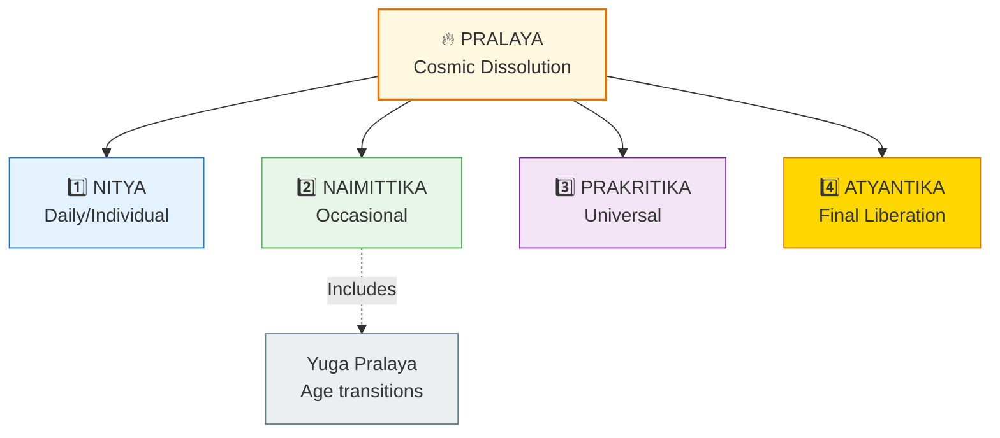
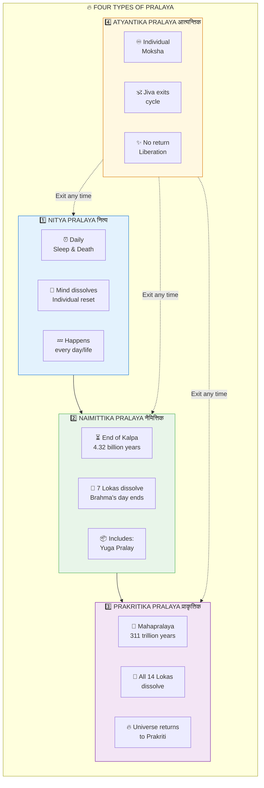
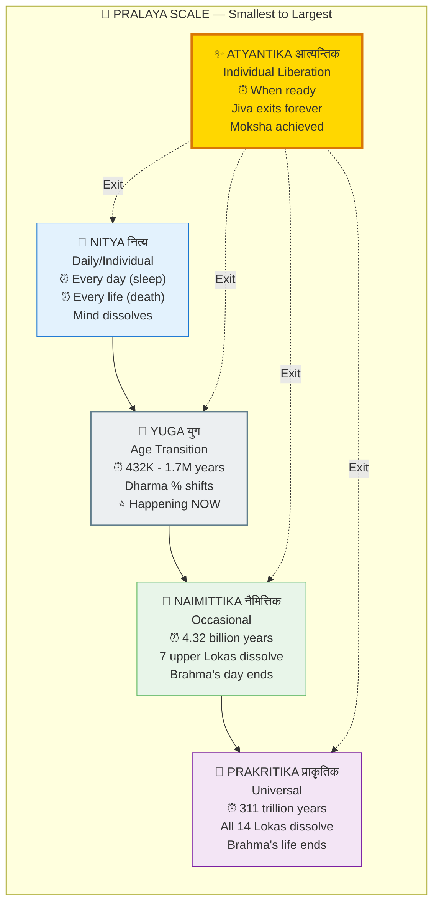
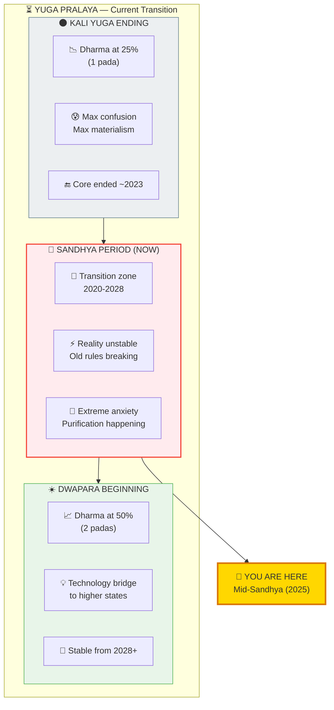
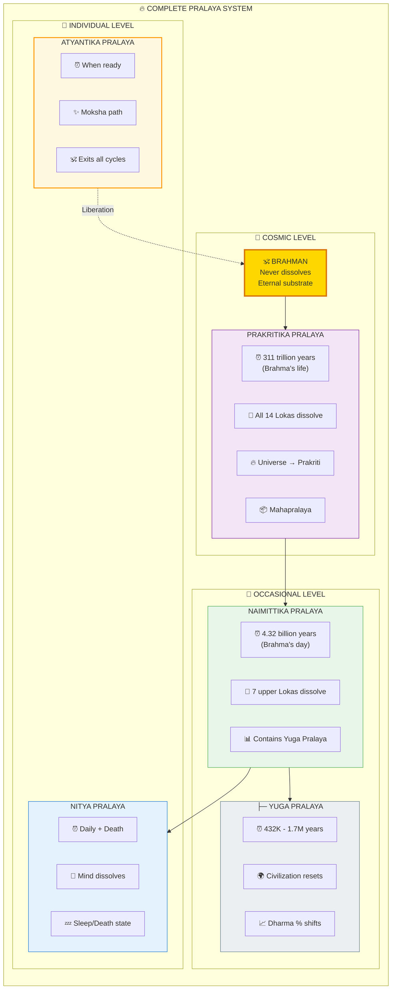

# 🔥 PRALAYA — The Four Types of Cosmic Dissolution

> **"यदा यदा हि धर्मस्य ग्लानिर्भवति भारत"**
> "Whenever there is a decline of Dharma..."
> — Bhagavad Gita 4.7

Pralaya (प्रलय) means dissolution or destruction — the cosmic "reset" that occurs at different scales and intervals. There are **four main types** of Pralaya, with Yuga Pralaya being a sub-type of Naimittika.

---

## 📊 Diagram 1: Simple Overview (Beginner)

**What it shows:** The four main types of Pralaya — like different levels of "system restart."

**Key Insight:** Just like your computer has different restart options (sleep, restart, factory reset, exit), the cosmos has different dissolution levels.

---

## 📊 Diagram 2: The Four Types Explained (Intermediate)

**What it shows:** Each type with its duration and what gets dissolved.

---

## 📊 Diagram 3: Scale Comparison (Intermediate)

**What it shows:** Complete scale from daily to cosmic dissolution.

---

## 📊 Diagram 4: Yuga Pralaya Detail (Advanced)

**What it shows:** The Yuga Pralaya we're currently experiencing — the transition from Kali to Dwapara.

---

## 📊 Diagram 5: Complete Pralaya System (Expert)

**What it shows:** All types with hierarchical relationships and correct Naimittika placement.

---

## 📋 Summary Table

| Type | Sanskrit | Duration | What Dissolves | Frequency |
|------|----------|----------|----------------|-----------|
| **Nitya** | नित्य | Daily/Life | Mind (sleep), Body (death) | Every day/life |
| **Yuga** | युग | 432K-1.7M years | Civilization, Dharma % | End of each Yuga |
| **Naimittika** | नैमित्तिक | 4.32 billion years | 7 upper Lokas | Brahma's day end |
| **Prakritika** | प्राकृतिक | 311 trillion years | All 14 Lokas | Brahma's life end |
| **Atyantika** | आत्यन्तिक | Variable | Individual bondage | At Moksha |

---

## 🔗 Related Topics

- [Yuga Cycles](./yugas.md) — Detailed Yuga timing
- [Moksha Paths](./moksha.md) — Achieving Atyantik Pralaya
- [Consciousness States](./consciousness.md) — Nitya Pralaya in sleep

---

**[← Back to Diagram Library](./README.md)** | **[← Back to Site](../index.md)**
