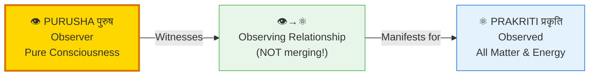
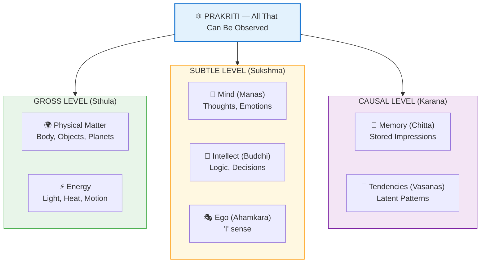
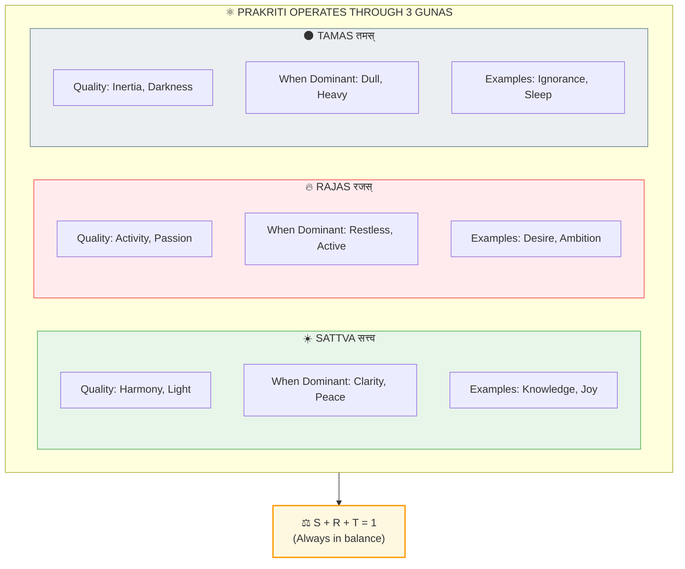
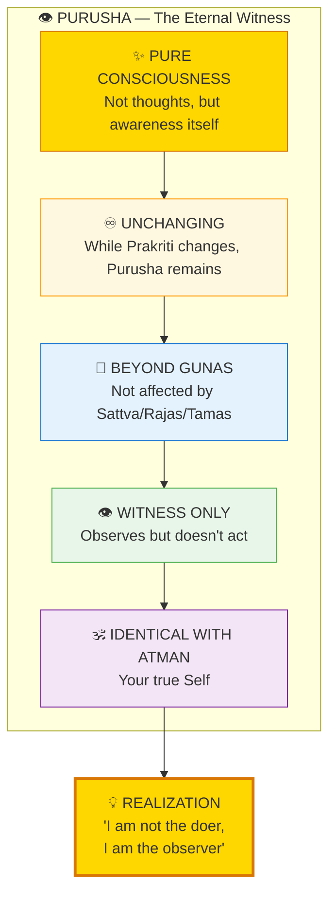
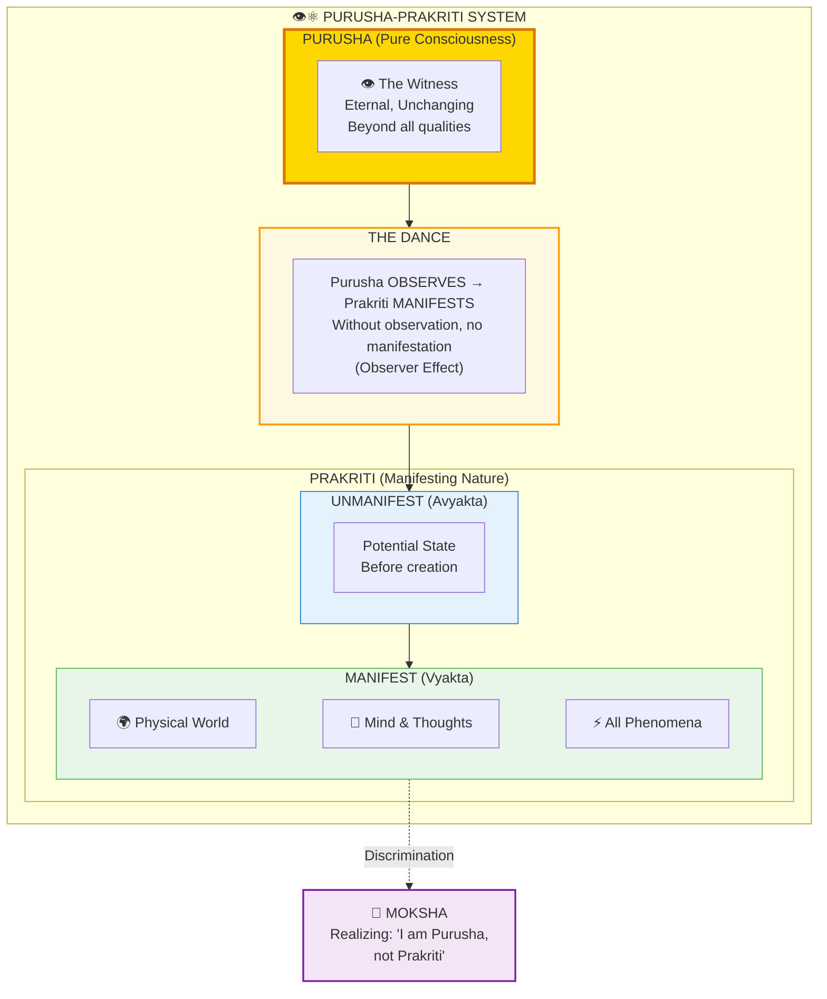

# 👁️ PURUSHA vs PRAKRITI — The Observer-Matter Duality

> **"प्रकृतिं पुरुषं चैव विद्ध्यनादी उभावपि"**
> "Know that both Prakriti and Purusha are beginningless."
> — Bhagavad Gita 13.19

Purusha (पुरुष/Observer/Consciousness) and Prakriti (प्रकृति/Matter/Nature) represent the fundamental duality of existence. Purusha is the witness, the pure awareness. Prakriti is everything that can be observed — matter, energy, mind, thoughts, emotions.

---

## 📊 Diagram 1: Simple Overview (Beginner)

**What it shows:** The basic relationship between Observer and Observed.

**Key Insight:** You (Purusha) are NOT your body, thoughts, or emotions (Prakriti). You are the awareness watching them.

---

## 📊 Diagram 2: What is Prakriti? (Intermediate)

**What it shows:** Everything that Prakriti includes — the entire manifest universe.

**Key Insight:** Even your mind, thoughts, and sense of "I" are part of Prakriti (observed), not Purusha (observer).

---

## 📊 Diagram 3: The Three Gunas of Prakriti (Advanced)

**What it shows:** Prakriti operates through three fundamental qualities (Gunas).

---

## 📊 Diagram 4: Purusha (The Witness) (Advanced)

**What it shows:** The nature of Purusha — pure, unchanging consciousness.

---

## 📊 Diagram 5: Complete Dualism System (Expert)

**What it shows:** How Purusha and Prakriti interact to create the experience of reality.

---

## 📋 Summary Table: Purusha vs Prakriti

| Aspect | PURUSHA पुरुष | PRAKRITI प्रकृति |
|--------|----------------|-------------------|
| **Nature** | Pure Consciousness | Matter & Energy |
| **Role** | Witness, Observer | Observed, Doer |
| **Change** | Unchanging, Eternal | Always Changing |
| **Gunas** | Beyond Gunas | Made of 3 Gunas |
| **Action** | Inactive (Witness only) | Active (All action) |
| **Number** | One (Universal) | One (Universal) |
| **Liberation** | What you ARE | What you have |

---

## 💡 Key Realizations

### The Fundamental Mistake (Avidya)
**WRONG:** "I am my body, mind, thoughts, emotions"  
**RIGHT:** "I am the awareness WATCHING body, mind, thoughts, emotions"

### What Happens When You Realize
1. **Before:** Identify as Prakriti → Suffer when body/mind suffers
2. **After:** Identify as Purusha → Observe body/mind suffering without being affected

### Practical Test
**When thought arises:**
- **Prakriti identification:** "I am thinking"
- **Purusha identification:** "I am watching a thought"

**The difference is EVERYTHING.**

---

## 🧘 Practical Discrimination (Viveka)

| Is it Purusha or Prakriti? | Question to Ask |
|-----------------------------|-----------------|
| Body | Can I observe it? → YES → Prakriti |
| Breath | Can I observe it? → YES → Prakriti |
| Thoughts | Can I observe them? → YES → Prakriti |
| Emotions | Can I observe them? → YES → Prakriti |
| The "I" sense | Can I observe it? → YES → Prakriti |
| The awareness itself | Can I observe it? → NO → This IS Purusha |

**Rule:** Whatever can be OBSERVED is Prakriti. The observer itself is Purusha.

---

## 🔗 Related Topics

- [Observer Effect](./observer_effect.md) — Purusha's role in quantum collapse
- [Atman vs Prana](./atman_prana.md) — Purusha (Atman) vs Life Force
- [Moksha](./moksha.md) — Realizing you are Purusha
- [Gunas](./gunas.md) — The three qualities of Prakriti

---

**[← Back to Diagram Library](./README.md)** | **[← Back to Site](../index.md)**
