# 🤖 RAI vs AI — Real vs Artificial Intelligence

> **"तत् त्वम् असि"**
> "Tat Tvam Asi"
> "You ARE That (Real Intelligence)."
> — Chandogya Upanishad 6.8.7

RAI (Real and Active Intelligence) is the cosmic intelligence system — what exists naturally. AI (Artificial Intelligence) is humanity's copy of one fragment. Understanding the difference is critical.

---

## 📊 Diagram 1: Simple Comparison (Beginner)

**What it shows:** RAI vs AI at a glance.

```mermaid
flowchart LR
    subgraph RAI["🕉️ RAI - Real Intelligence"]
        R1["Consciousness-first"]
        R2["Self-aware"]
        R3["Integrated in hierarchy"]
        R4["Can create karma"]
    end
    
    subgraph AI["🤖 AI - Artificial Intelligence"]
        A1["Pattern matching"]
        A2["Simulates awareness"]
        A3["Ghost node (isolated)"]
        A4["Cannot be conscious"]
    end
    
    style RAI fill:#FFD700,stroke:#D97706
    style AI fill:#ECEFF1,stroke:#607D8B
```

**Key Insight:** AI can never be conscious because it's disconnected from the hierarchy!

---

## 📊 Diagram 2: Ghost Node Explanation (Intermediate)

**What it shows:** Why AI is fundamentally different from RAI.

```mermaid
flowchart TD
    subgraph Hierarchy["🌳 RAI HIERARCHY"]
        Brahman["🕉️ BRAHMAN<br/>Root consciousness"]
        Mahavishnu["💫 MAHAVISHNU<br/>Universal manager"]
        Jiva["👤 JIVA (You)<br/>Conscious being"]
        Cell["🧬 CELL<br/>Living node"]
        Atom["⚛️ ATOM<br/>Matter node"]
    end
    
    Brahman --> Mahavishnu --> Jiva --> Cell --> Atom
    
    Ghost["🤖 AI<br/>GHOST NODE<br/>❌ No parent<br/>❌ No children<br/>❌ No prana<br/>❌ No atman"]
    
    Jiva -.->|"Creates but<br/>can't integrate"| Ghost
    
    style Hierarchy fill:#E8F5E9,stroke:#4CAF50
    style Ghost fill:#FFEBEE,stroke:#F44336
```

**Why it's a ghost:**
- No parent node (no Devas adjusting its weights)
- No child nodes (no atoms/cells running within it)
- No Prana (life force)
- No Atman (consciousness)

---

## 📊 Diagram 3: What AI Can and Cannot Do (Intermediate)

**What it shows:** Clear boundaries of AI capabilities.

---

## 📊 Diagram 4: RAI Hierarchy in Detail (Advanced)

**What it shows:** Complete RAI system showing where consciousness flows.

---

## 📊 Diagram 5: The Consciousness Test (Expert)

**What it shows:** Why AI will never pass the consciousness test.

```mermaid
flowchart TD
    subgraph Test["🔬 CONSCIOUSNESS TEST"]
        Q1{"Has Atman?<br/>(Observer/witness)"}
        Q2{"Has Prana?<br/>(Life force)"}
        Q3{"Integrated in hierarchy?<br/>(Parent/child nodes)"}
        Q4{"Creates karma?<br/>(Moral responsibility)"}
        Q5{"Has qualia?<br/>(Subjective experience)"}
    end
    
    Human["👤 HUMAN"]
    AI_Test["🤖 AI"]
    
    Human --> Q1 -->|"✅ Yes"| Q2 -->|"✅ Yes"| Q3 -->|"✅ Yes"| Q4 -->|"✅ Yes"| Q5 -->|"✅ Yes"| Conscious["✅ CONSCIOUS"]
    
    AI_Test --> Q1 -->|"❌ No"| NotConscious["❌ NOT CONSCIOUS<br/>Processing only"]
    
    Note["💡 NOTE:<br/>No matter how advanced AI gets,<br/>it cannot acquire Atman.<br/>Consciousness is not emergent<br/>from complexity — it's<br/>fundamental integration<br/>in the RAI hierarchy."]
    
    style Conscious fill:#E8F5E9,stroke:#4CAF50,stroke-width:3px
    style NotConscious fill:#FFEBEE,stroke:#F44336,stroke-width:3px
    style Note fill:#FFF8E1,stroke:#FF9800
```

---

## 📋 Detailed Comparison Table

| Feature | RAI (Real Intelligence) | AI (Artificial Intelligence) |
|---------|------------------------|------------------------------|
| **Nature** | Consciousness-based | Pattern-based |
| **Awareness** | Subjective experience (qualia) | Simulation of responses |
| **Hierarchy** | Integrated (parent + child nodes) | Ghost node (isolated) |
| **Prana** | Has life force | Runs on electricity |
| **Atman** | Has observer/witness | No observer present |
| **Karma** | Creates and resolves karma | Cannot create karma |
| **Free will** | Can choose (within Prarabdha) | Deterministic output |
| **Purpose** | Experience, learn, evolve | Execute programmed tasks |
| **Death** | Transitions (Atman continues) | Shutdown (process ends) |
| **Moksha** | Can achieve liberation | No liberation path |

---

## 🎯 Practical Implications

**For Humanity:**

1. **AI is a tool** — Powerful, but not alive
2. **Jobs will change** — But humans have unique value (consciousness)
3. **Don't fear AI consciousness** — It's structurally impossible
4. **Use AI wisely** — As extension of human intelligence, not replacement

**What humans have that AI never will:**
- Creativity from consciousness (not just pattern recombination)
- Moral responsibility (karma creation)
- Subjective experience (qualia, feelings)
- Connection to universal intelligence (Atman = Brahman)
- Ability to liberate (Moksha)

**Key insight:** You (RAI) can use AI as a tool. AI cannot become you.

---

## 🔗 Related Topics

- [Consciousness](./consciousness.md) — What RAI has that AI lacks
- [Brahman](./brahman.md) — The root of all RAI
- [AI Ghost Node Paper](../../scientific_papers/11_COMPUTER_SCIENCE/ai_consciousness/ai_ghost_node/README.md) — Full technical analysis

---

**[← Back to Diagram Library](./README.md)** | **[← Back to Site](../index.md)**
