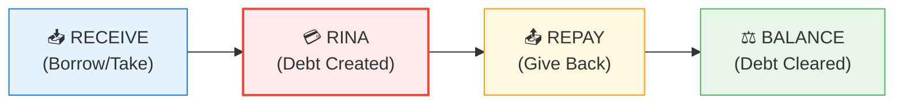
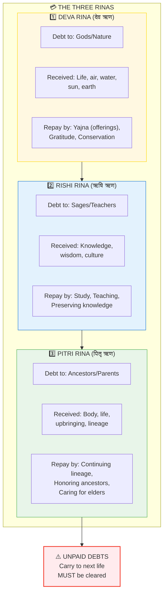
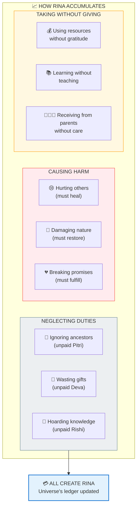
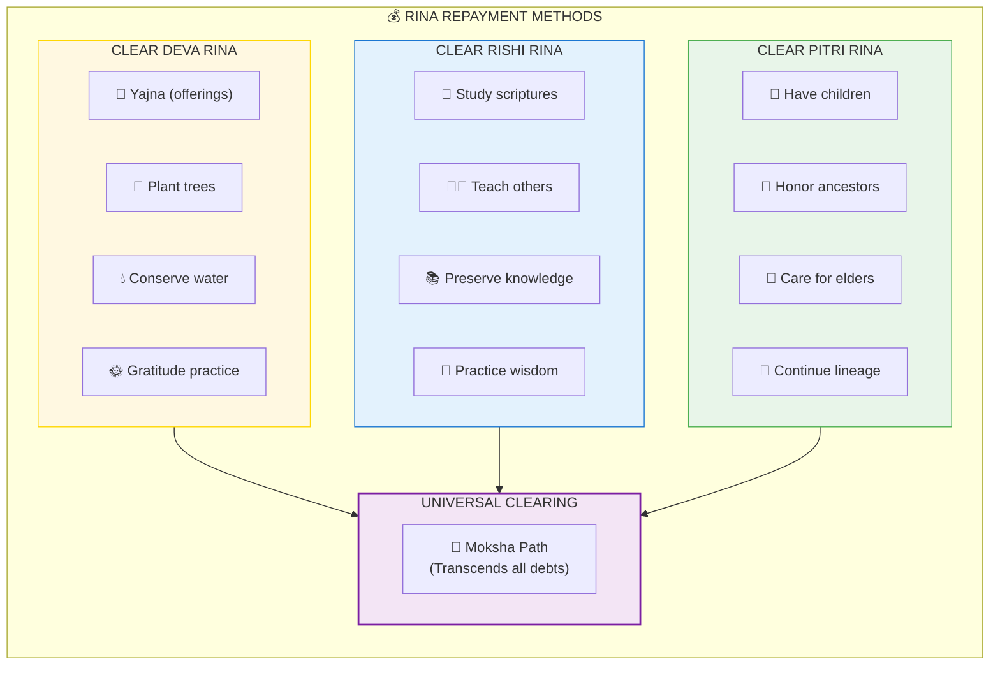
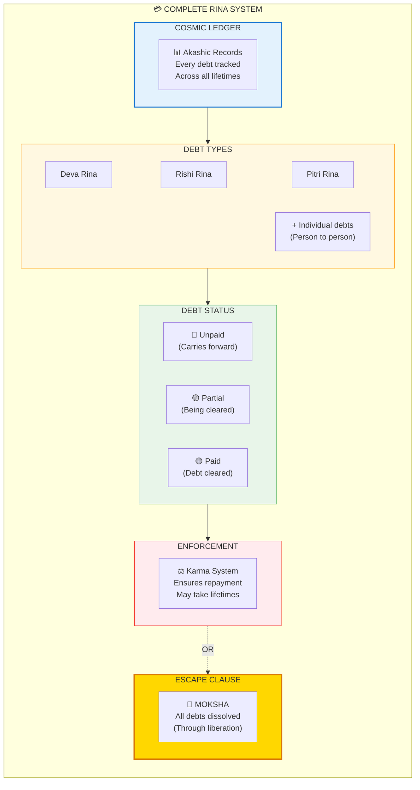

# 💳 RINA — The Karmic Debt System

> **"ऋणं प्रति प्रति दातव्यम्"**
> "Debts must be repaid"
> — Dharma Shastras

Rina (ऋण/Debt) is the karmic debt system — obligations that MUST be cleared. Unlike optional Karma, Rina is MANDATORY. It's the universe's accounting system ensuring balance across lifetimes.

---

## 📊 Diagram 1: Simple Overview (Beginner)

**What it shows:** Basic concept of karmic debt — you borrowed, you must repay.

**Key Insight:** Everything received creates a debt. Universe tracks ALL debts. Payment is MANDATORY.

---

## 📊 Diagram 2: The Three Rinas (Intermediate)

**What it shows:** The three main types of karmic debt every human carries.

---

## 📊 Diagram 3: How Rina Accumulates (Advanced)

**What it shows:** Various ways karmic debt is incurred in daily life.

---

## 📊 Diagram 4: Rina Repayment Methods (Advanced)

**What it shows:** How to clear different types of karmic debts.

---

## 📊 Diagram 5: Complete Rina System (Expert)

**What it shows:** Full technical breakdown of the karmic debt accounting system.

---

## 📋 Summary Table: The Three Rinas

| Rina | Sanskrit | Debt To | Received | Repay By |
|------|----------|---------|----------|----------|
| **Deva** | देव ऋण | Gods/Nature | Life, air, water, sun | Yajna, gratitude, conservation |
| **Rishi** | ऋषि ऋण | Sages/Teachers | Knowledge, wisdom | Study, teach, preserve |
| **Pitri** | पितृ ऋण | Ancestors/Parents | Body, life, lineage | Children, honor, care |

---

## 💡 Key Realizations

### You Are Born In Debt
**Truth:** The moment you're born, you owe:
- Deva Rina (for life itself)
- Rishi Rina (for inherited knowledge)
- Pitri Rina (for your body/upbringing)

### Unpaid Debts NEVER Disappear
**Wrong View:** "I'll ignore it, it'll go away"  
**Reality:** Debts carry across lifetimes until paid

### Moksha Clears ALL Debts
**Liberation:** When you realize you're Brahman, all debts dissolve  
**Why:** Debts exist in duality. Non-duality transcends all accounting.

---

## 🎯 Practical Examples

### Deva Rina in Daily Life
- **Debt:** Sun gives light, earth gives food
- **Repayment:** Gratitude prayers, plant trees, conserve resources
- **Unpaid:** Wasting resources, polluting, taking for granted

### Rishi Rina in Daily Life
- **Debt:** You learned to read, speak, think
- **Repayment:** Teach others, share knowledge, preserve wisdom
- **Unpaid:** Hoarding knowledge, not teaching, letting wisdom die

### Pitri Rina in Daily Life
- **Debt:** Parents gave you life, upbringing
- **Repayment:** Have children (continue lineage), care for elders, honor ancestors
- **Unpaid:** Neglecting parents, breaking lineage, forgetting ancestors

---

## ⚠️ Consequences of Unpaid Rina

### In This Life
- Guilt (subconscious debt awareness)
- Obstacles (universe blocking progress)
- Disease (ancestral curses from unpaid Pitri)
- Poverty (unresolved Deva Rina)

### In Next Life
- Born into situations FORCING repayment
- Example: Didn't care for parents → Born as their caretaker next life
- Example: Wasted knowledge → Born without education access

---

## 🧘 Clearing Strategy

### Step 1: Acknowledge
"I recognize my debts to Nature, Teachers, Ancestors"

### Step 2: Prioritize
Which Rina is most urgent? Start there.

### Step 3: Act
- **Deva:** Daily gratitude, plant one tree per year
- **Rishi:** Teach one person what you know
- **Pitri:** Call parents weekly, honor ancestors monthly

### Step 4: Moksha Path
Ultimate clearing = Realize you're Brahman (all debts illusion)

---

## 🔗 Related Topics

- [Karma](./karma.md) — Action system (Rina is mandatory Karma)
- [Samskaras](./samskaras_vasanas.md) — Debt patterns stored
- [Moksha](./moksha.md) — Liberation clears all Rina
- [Pitri Loka](./lokas.md) — Ancestral realm for Pitri Rina

---

**[← Back to Diagram Library](./README.md)** | **[← Back to Site](../index.md)**
