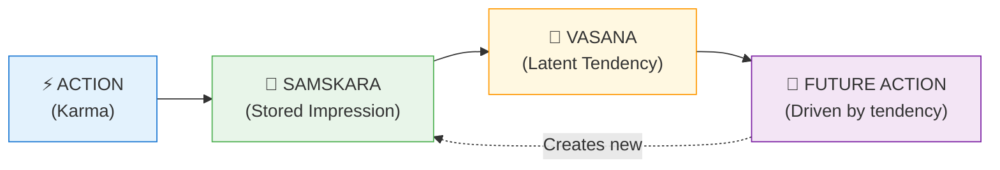
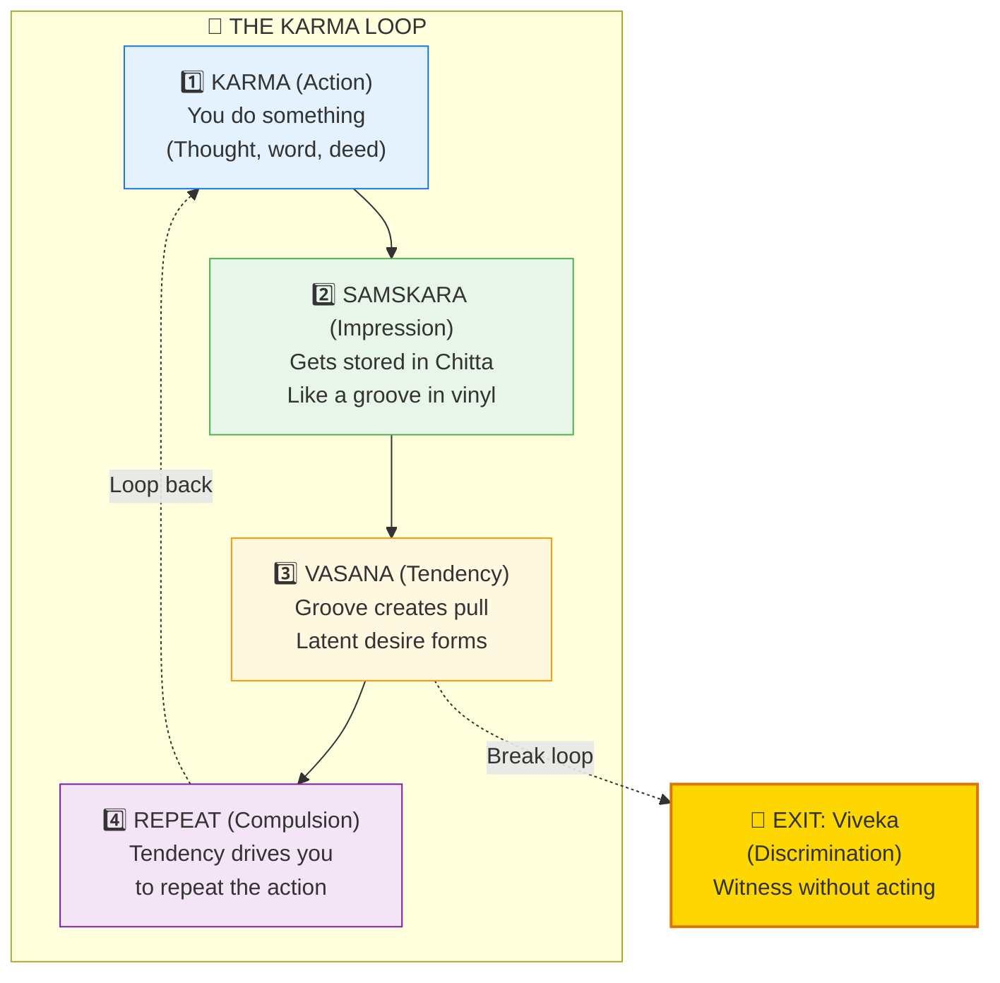
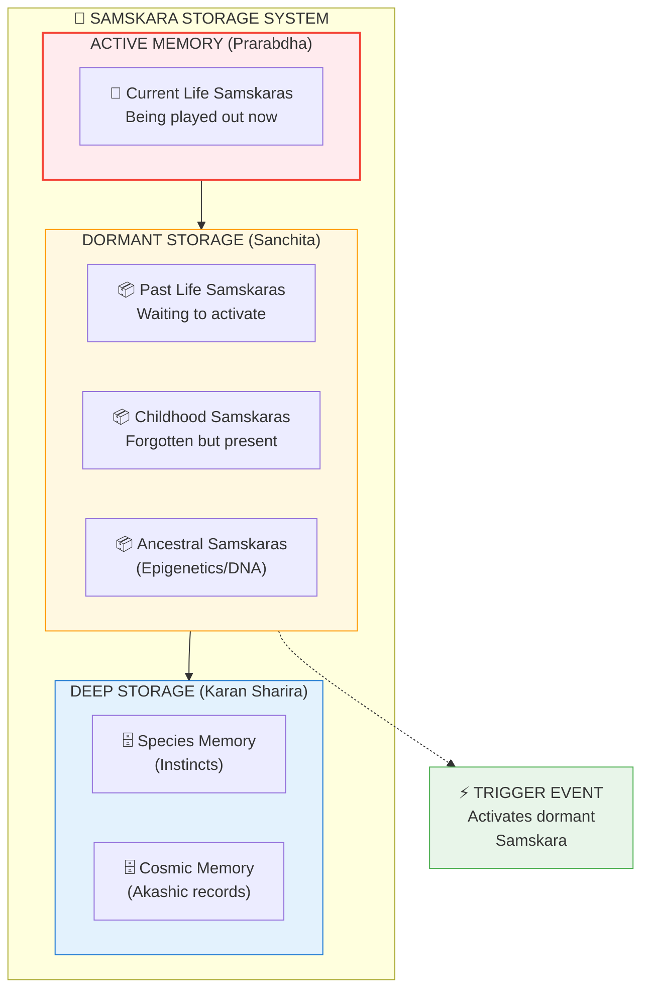
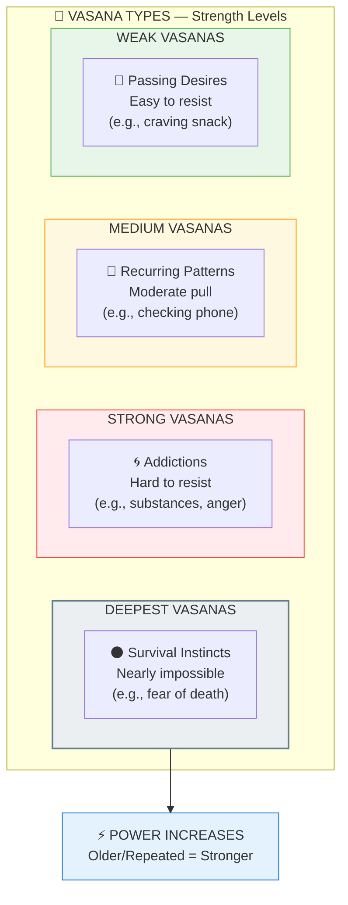
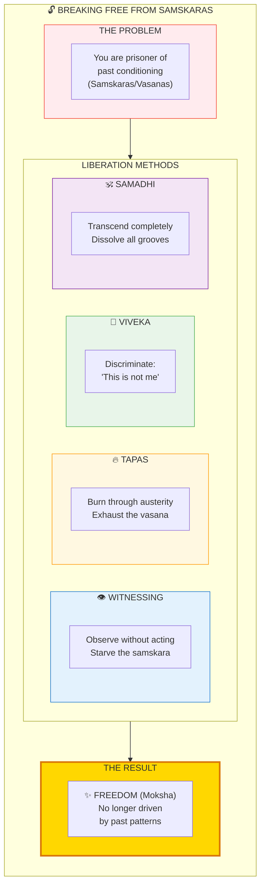

# 🌱 SAMSKARAS & VASANAS — Karmic Impressions & Tendencies

> **"संस्कारः वासना इति"**
> "Samskaras become Vasanas"
> — Yoga Sutras

Samskaras (संस्कार/impressions) are the grooves carved in consciousness by past actions. Vasanas (वासना/tendencies) are the latent desires that arise from these grooves. Together, they form the karmic operating system that drives behavior.

---

## 📊 Diagram 1: Simple Overview (Beginner)

**What it shows:** How actions create impressions, which create tendencies, which drive future actions.

**Key Insight:** You're not free — you're running on autopilot from past programming (Samskaras/Vasanas).

---

## 📊 Diagram 2: The Karma Loop (Intermediate)

**What it shows:** Complete cycle from action to samskara to vasana and back.

---

## 📊 Diagram 3: Samskara Storage System (Advanced)

**What it shows:** Where and how Samskaras are stored in consciousness.

---

## 📊 Diagram 4: Vasana Types & Strength (Advanced)

**What it shows:** Different types of Vasanas and their power levels.

---

## 📊 Diagram 5: Breaking Free (Expert)

**What it shows:** Methods to erase Samskaras and transcend Vasanas.

---

## 📋 Summary Table: Samskaras vs Vasanas

| Aspect | SAMSKARA संस्कार | VASANA वासना |
|--------|-------------------|--------------|
| **Nature** | Impression/Groove | Tendency/Desire |
| **Formation** | Created by action | Arises from samskara |
| **Storage** | Stored in Chitta (memory) | Latent in subconscious |
| **Visibility** | Hidden/Unconscious | Felt as desire/pull |
| **Strength** | Deep grooves (old/repeated) | Strong pull (reinforced) |
| **Role** | The recording | The playback urge |
| **Analogy** | Vinyl groove | Needle drawn to groove |

---

## 🧠 How They Work Together

### The Recording System
1. **Action** → Creates Samskara (groove carved)
2. **Repetition** → Deepens Samskara (groove gets deeper)
3. **Storage** → Samskara stored in Chitta (memory field)
4. **Latency** → Becomes Vasana (desire to repeat)
5. **Trigger** → Vasana activates (you feel the urge)
6. **Compulsion** → Drives action (you repeat behavior)
7. **Loop** → Reinforces Samskara (groove deeper still)

### Breaking the Cycle
**Witnessing** → Observe the Vasana arising but DON'T ACT  
**Result** → Samskara starves (groove fills in)  
**Over time** → Vasana weakens → Freedom

---

## 🎯 Practical Examples

| Life Pattern | Samskara (Groove) | Vasana (Pull) |
|--------------|-------------------|---------------|
| **Anger** | Past anger reactions stored | Tendency to get angry easily |
| **Addiction** | Repeated substance use carved groove | Craving/compulsion to use |
| **Fear** | Past trauma imprinted | Anxiety in similar situations |
| **Skills** | Practice created groove (positive!) | Ease in performing skill |
| **Love** | Bonding experiences stored | Attraction/attachment |

**Key:** Not all Samskaras are bad! Skill/wisdom grooves are beneficial.

---

## 💡 Why You Can't Just "Stop"

**Wrong Understanding:** "Just stop the bad habit!"  
**Reality:** Samskara is a DEEP GROOVE. Willpower alone won't fill it.

**Correct Approach:**
1. **Witness** the Vasana (don't judge, just see it)
2. **Don't act** on it (starve the groove)
3. **Repeat** this witnessing (groove fills gradually)
4. **Create positive** Samskaras (carve better grooves)

---

## 🧘 Liberation Practices

### 1. Vipassana (Witnessing)
- Observe sensations without reacting
- Samskaras arise → Don't act → They dissolve

### 2. Tapas (Austerity)
- Voluntarily face discomfort
- Burns through stored Samskaras faster

### 3. Viveka (Discrimination)
- "This urge is not ME, it's a Vasana"
- Dis-identify from the pattern

### 4. Samadhi (Absorption)
- Complete dissolution of grooves
- Total freedom from past patterns

---

## 🔗 Related Topics

- [Karma](./karma.md) — Actions that create Samskaras
- [Chitta](./antahkarana.md) — Memory field where stored
- [Moksha](./moksha.md) — Freedom from all Samskaras
- [Epigenetics](../../scientific_papers/04_BIOLOGY/epigenetics/epigenetics_samskaras/README.md) — DNA as samskara storage

---

**[← Back to Diagram Library](./README.md)** | **[← Back to Site](../index.md)**
