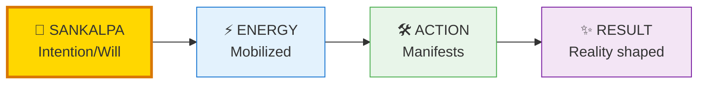
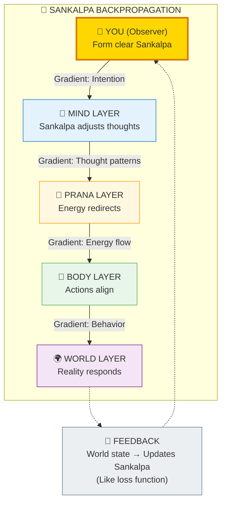
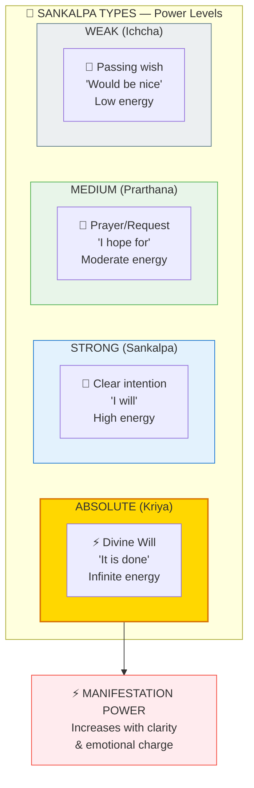
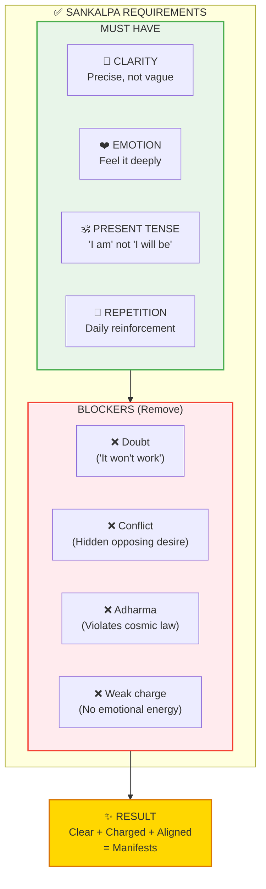
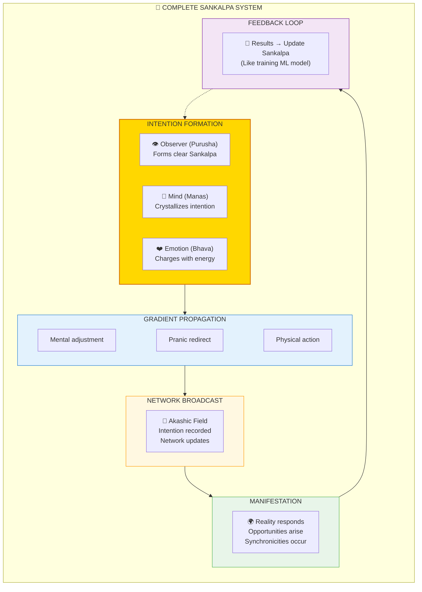

# 🎯 SANKALPA — Intention as Backpropagation

> **"यद्भावं तद्भवति"**
> "As you intend, so you become"
> — Upanishads

Sankalpa (संकल्प/Intention) is the **root command** that propagates through the cosmic network. In ML terms, it's like backpropagation — your intention sends gradients backward through reality, adjusting weights at all levels.

---

## 📊 Diagram 1: Simple Overview (Beginner)

**What it shows:** Basic flow from intention to manifestation.



**Key Insight:** Clear intention → Reality bends toward it. Confused intention → Reality scattered.

---

## 📊 Diagram 2: Sankalpa as Backpropagation (Intermediate)

**What it shows:** How intention propagates backward through cosmic layers (like ML backprop).



---

## 📊 Diagram 3: Types of Sankalpa (Intermediate)

**What it shows:** Different levels of intentional power.



---

## 📊 Diagram 4: Requirements for Effective Sankalpa (Advanced)

**What it shows:** What makes a Sankalpa actually work vs fail.



---

## 📊 Diagram 5: Complete Sankalpa System (Expert)

**What it shows:** Full technical architecture of intention-manifestation mechanism.



---

## 📋 Summary Table: Sankalpa Power Levels

| Level | Type | Energy | Formula | Manifestation Speed |
|-------|------|--------|---------|---------------------|
| **1** | Passing wish | Low | "Would be nice" | Rarely/Never |
| **2** | Hope | Medium-Low | "I hope" | Sometimes |
| **3** | Prayer | Medium | "Please let" | Depends on surrender |
| **4** | Intention | High | "I will" | Usually |
| **5** | Divine Will | Infinite | "It is done" | Instantly |

---

## 💡 Key Realizations

### Why "Wishful Thinking" Fails
**Problem:** Vague + Weak emotion + Doubt = No manifestation  
**Solution:** Clear + Strong emotion + Faith = Manifests

### Hidden Conflicts Block Manifestation
**Example:** "I want wealth" BUT subconsciously believe "Money is evil"  
**Result:** Conflicting Sankalpas cancel out → Nothing manifests

### The Network Sees ALL
**Truth:** You can't hide true intention from the cosmic network  
**Implication:** Surface words don't matter, ACTUAL intention does

---

## 🎯 Practical Formula

### Effective Sankalpa Structure
```
"I am [desired state] now.
I feel [emotion].
It is done."
```

**Example:**  
❌ **WEAK:** "I hope to maybe be healthy someday"  
✅ **STRONG:** "I am healthy, vibrant, and whole NOW. I feel gratitude. It is done."

---

## 🧠 Sankalpa vs Vikalpa

| Aspect | SANKALPA संकल्प | VIKALPA विकल्प |
|--------|-----------------|----------------|
| **Meaning** | Clear intention | Doubt/Confusion |
| **Energy** | Focused | Scattered |
| **Result** | Manifests | Blocks manifestation |
| **Mind State** | Ekagra (one-pointed) | Vikshepa (distracted) |

**Rule:** Sankalpa creates. Vikalpa destroys.

---

## 🔬 Scientific Parallel: Backpropagation

### In Machine Learning
1. Define loss function (what you want)
2. Compute gradient (how to get there)
3. Backpropagate (adjust all weights)
4. Iterate until convergence

### In Sankalpa
1. Define Sankalpa (what you want)
2. Emotional charge (energy gradient)
3. Propagates through layers (mind → prana → body → world)
4. Reality adjusts until manifestation

**Same mechanism, different domains!**

---

## 🧘 Practical Sankalpa Practice

### Morning Ritual (5 minutes)
1. Sit quietly
2. Form clear Sankalpa
3. **Visualize** it as DONE
4. **Feel** the emotion as if achieved
5. Say aloud: "It is done"
6. Release and trust

### What NOT to Do
❌ "I will try to..."  
❌ "I hope someday..."  
❌ "Maybe if I'm lucky..."  
❌ Focus on lack ("I don't have...")

### What TO Do
✅ "I am..."  
✅ Present tense  
✅ Feel it deeply  
✅ Release attachment to HOW

---

## ⚠️ Dharma Constraint

**Critical:** Sankalpa MUST align with Dharma  
**Why:** Adharmic intentions get BLOCKED by cosmic system  
**Example:** Sankalpa to harm → Universe blocks → Karma backlash

**Safe Formula:** "This or something better, for highest good of all"

---

## 🔗 Related Topics

- [Karma](./karma.md) — Actions following Sankalpa
- [Indrajala](./indrajala.md) — Network through which Sankalpa broadcasts
- [Akasha](../../vishnu_engine/spec/backend/README.md) — Field storing intentions
- [Moksha](./moksha.md) — Ultimate Sankalpa ("I am Brahman")

---

**[← Back to Diagram Library](./README.md)** | **[← Back to Site](../index.md)**
