# ⭐ SAPTARISHI — The Seven Cosmic Principles

> **"सप्त ऋषयः प्रजाः"**
> "The Seven Rishis are the progenitors"
> — Vishnu Purana

Saptarishi (सप्तऋषि/Seven Sages) represent the **seven fundamental principles** that govern reality at ALL fractal levels. They appear as the Big Dipper constellation, seven chakra energies, seven musical notes, seven colors, and seven days — the same pattern everywhere.

---

## 📊 Diagram 1: The Seven Rishis (Beginner)

**What it shows:** The seven cosmic principles and their domains.

```mermaid
flowchart TD
    Sapta["⭐ SAPTARISHI<br/>Seven Cosmic Principles"]
    
    Sapta --> R1["1️⃣ MARICHI मरीचि<br/>Light/Ray"]
    Sapta --> R2["2️⃣ ATRI अत्रि<br/>Transcendence"]
    Sapta --> R3["3️⃣ ANGIRAS अंगिरस<br/>Fire/Energy"]
    Sapta --> R4["4️⃣ PULASTYA पुलस्त्य<br/>Smoothness/Flow"]
    Sapta --> R5["5️⃣ PULAHA पुलह<br/>Connection/Bridge"]
    Sapta --> R6["6️⃣ KRATU क्रतु<br/>Sacrifice/Action"]
    Sapta --> R7["7️⃣ VASISHTHA वसिष्ठ<br/>Excellence/Wealth"]
    
    style Sapta fill:#FFD700,stroke:#D97706,stroke-width:3px
    style R1 fill:#FFEBEE,stroke:#F44336
    style R2 fill:#FFF3E0,stroke:#EF6C00
    style R3 fill:#FFF8E1,stroke:#FFD700
    style R4 fill:#E8F5E9,stroke:#4CAF50
    style R5 fill:#E3F2FD,stroke:#2196F3
    style R6 fill:#EDE7F6,stroke:#673AB7
    style R7 fill:#F3E5F5,stroke:#9C27B0
```

**Key Insight:** These aren't just mythological figures — they're universal principles appearing at every scale.

---

## 📊 Diagram 2: Seven Pattern Across Domains (Intermediate)

**What it shows:** How the "seven" pattern appears across different domains.

```mermaid
flowchart TD
    subgraph SevenPattern["7️⃣ THE SEVEN PATTERN EVERYWHERE"]
        direction TB
        
        subgraph Cosmic["🌌 COSMIC"]
            C1["⭐ Saptarishi Stars<br/>(Big Dipper)"]
            C2["🪐 7 Classical Planets"]
            C3["📅 7 Days of Week"]
        end
        
        subgraph Human["👤 HUMAN"]
            H1["🌈 7 Chakras"]
            H2["🧬 7 Dhatus (Tissues)"]
            H3["🔄 7 Stages of Life"]
        end
        
        subgraph Nature["🌍 NATURE"]
            N1["🌈 7 Colors (Rainbow)"]
            N2["🎵 7 Musical Notes"]
            N3["🌊 7 Samudras"]
        end
        
        subgraph Time["⏰ TIME"]
            T1["📆 7 Days"]
            T2["🔄 7 Year Cycles"]
            T3["⏳ 7 Yugas Pattern"]
        end
    end
    
    Cosmic ~~~ Human
    Human ~~~ Nature
    Nature ~~~ Time
    
    Insight["🔗 SAME PRINCIPLE<br/>Different manifestations"]
    
    Time --> Insight
    
    style Cosmic fill:#E3F2FD,stroke:#1976D2
    style Human fill:#E8F5E9,stroke:#4CAF50
    style Nature fill:#FFF8E1,stroke:#FF9800
    style Time fill:#F3E5F5,stroke:#7B1FA2
    style Insight fill:#FFD700,stroke:#D97706,stroke-width:2px
```

---

## 📊 Diagram 3: Chakra-Rishi Correspondence (Advanced)

**What it shows:** How each Rishi maps to a chakra energy.

```mermaid
flowchart BT
    subgraph ChakraRishi["⭐ RISHI-CHAKRA MAPPING"]
        direction BT
        
        M["1️⃣ MULADHARA<br/>🔴 Root<br/>MARICHI (Light of Matter)"]
        
        S["2️⃣ SVADHISTHANA<br/>🟠 Sacral<br/>ATRI (Transcend duality)"]
        
        Ma["3️⃣ MANIPURA<br/>🟡 Solar Plexus<br/>ANGIRAS (Fire/Power)"]
        
        A["4️⃣ ANAHATA<br/>🟢 Heart<br/>PULASTYA (Smooth flow)"]
        
        V["5️⃣ VISHUDDHA<br/>🔵 Throat<br/>PULAHA (Bridge/Connect)"]
        
        Aj["6️⃣ AJNA<br/>🟣 Third Eye<br/>KRATU (Sacrifice ego)"]
        
        Sa["7️⃣ SAHASRARA<br/>⚪ Crown<br/>VASISHTHA (Excellence)"]
    end
    
    M --> S --> Ma --> A --> V --> Aj --> Sa
    
    style M fill:#F44336,stroke:#C62828,color:#fff
    style S fill:#FF9800,stroke:#EF6C00,color:#fff
    style Ma fill:#FFEB3B,stroke:#FBC02D,color:#000
    style A fill:#4CAF50,stroke:#388E3C,color:#fff
    style V fill:#2196F3,stroke:#1976D2,color:#fff
    style Aj fill:#673AB7,stroke:#512DA8,color:#fff
    style Sa fill:#9C27B0,stroke:#7B1FA2,color:#fff
```

---

## 📊 Diagram 4: Music-Color-Chakra Unity (Advanced)

**What it shows:** Complete correspondence across all seven systems.

```mermaid
flowchart LR
    subgraph Unity["🎵 SEVEN-FOLD UNITY"]
        direction LR
        
        subgraph One["#1"]
            N1["Sa (षड्ज)"] 
            C1["🔴 Red"]
            Ch1["Muladhara"]
        end
        
        subgraph Two["#2"]
            N2["Re (ऋषभ)"]
            C2["🟠 Orange"]
            Ch2["Svadhisthana"]
        end
        
        subgraph Three["#3"]
            N3["Ga (गान्धार)"]
            C3["🟡 Yellow"]
            Ch3["Manipura"]
        end
        
        subgraph Four["#4"]
            N4["Ma (मध्यम)"]
            C4["🟢 Green"]
            Ch4["Anahata"]
        end
    end
    
    One ~~~ Two ~~~ Three ~~~ Four
    
    style One fill:#FFEBEE,stroke:#F44336
    style Two fill:#FFF3E0,stroke:#FF9800
    style Three fill:#FFF8E1,stroke:#FFEB3B
    style Four fill:#E8F5E9,stroke:#4CAF50
```

---

## 📊 Diagram 5: Complete Saptarishi System (Expert)

**What it shows:** Full architecture of seven-fold cosmic pattern.

```mermaid
flowchart TB
    subgraph Complete["⭐ COMPLETE SAPTARISHI SYSTEM"]
        direction TB
        
        subgraph Source["SOURCE"]
            Brahman["🕉️ BRAHMAN<br/>Undifferentiated"]
        end
        
        subgraph Differentiation["SEVEN-FOLD DIFFERENTIATION"]
            direction LR
            D1["Marichi<br/>(Light)"] ~~~ D2["Atri<br/>(Beyond)"] ~~~ D3["Angiras<br/>(Fire)"]
            D4["Pulastya<br/>(Flow)"] ~~~ D5["Pulaha<br/>(Bridge)"] ~~~ D6["Kratu<br/>(Action)"]
            D7["Vasishtha<br/>(Excellence)"]
        end
        
        subgraph Manifestation["MANIFESTATIONS"]
            direction LR
            M1["Stars"] ~~~ M2["Planets"] ~~~ M3["Colors"]
            M4["Notes"] ~~~ M5["Chakras"] ~~~ M6["Days"]
        end
        
        subgraph Function["FUNCTION"]
            F1["📡 Each Rishi governs<br/>one aspect of creation<br/>at ALL fractal levels"]
        end
    end
    
    Source --> Differentiation
    Differentiation --> Manifestation
    Manifestation --> Function
    
    style Source fill:#FFD700,stroke:#D97706,stroke-width:3px
    style Differentiation fill:#E3F2FD,stroke:#1976D2
    style Manifestation fill:#E8F5E9,stroke:#4CAF50
    style Function fill:#F3E5F5,stroke:#7B1FA2
```

---

## 📋 Summary Table: Seven Correspondences

| # | Rishi | Quality | Chakra | Note | Color | Day | Planet |
|---|-------|---------|--------|------|-------|-----|--------|
| 1 | Marichi | Light/Ray | Muladhara | Sa | Red | Sunday | Sun |
| 2 | Atri | Transcend | Svadhisthana | Re | Orange | Monday | Moon |
| 3 | Angiras | Fire | Manipura | Ga | Yellow | Tuesday | Mars |
| 4 | Pulastya | Flow | Anahata | Ma | Green | Wednesday | Mercury |
| 5 | Pulaha | Bridge | Vishuddha | Pa | Blue | Thursday | Jupiter |
| 6 | Kratu | Action | Ajna | Dha | Indigo | Friday | Venus |
| 7 | Vasishtha | Excellence | Sahasrara | Ni | Violet | Saturday | Saturn |

---

## 💡 Key Realizations

### Why "Seven" Appears Everywhere
**Not coincidence — it's ARCHITECTURE:**
- Seven is the number of differentiation from unity
- Creates complete spectrum (7 colors = all light)
- Enables full expression while remaining manageable

### The Rishis as Living Principles
**Wrong View:** "Mythological figures from ancient stories"  
**Right View:** "Cosmic principles governing all creation"

### You Have All Seven Inside
Every human contains all seven Rishis (chakras).
Balancing them = Optimal functioning.

---

## 🔗 Related Topics

- [Chakras](./chakras.md) — Seven energy centers
- [Navagraha](./navagraha.md) — Planetary influences
- [Fractals](./fractals.md) — Pattern repetition
- [Gunas](./gunas.md) — Three qualities differentiate into seven

---

**[← Back to Diagram Library](./README.md)** | **[← Back to Site](../index.md)**
